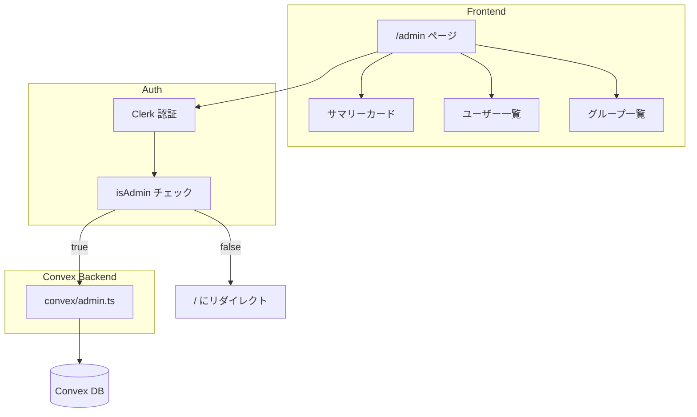
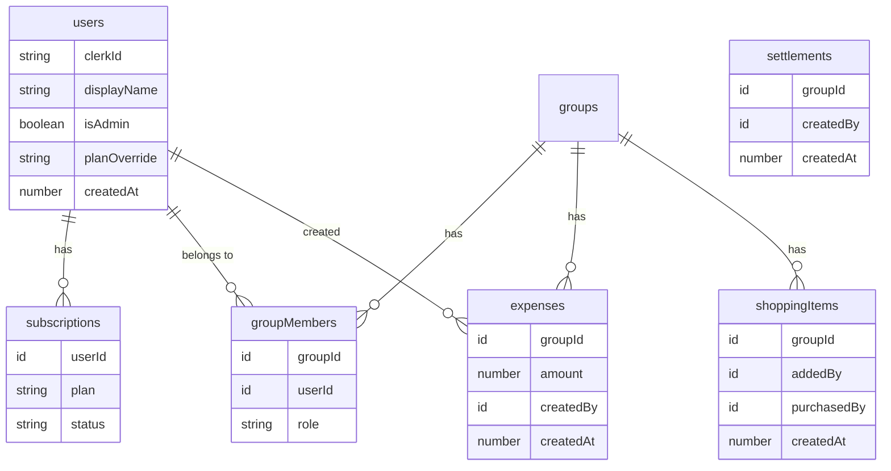
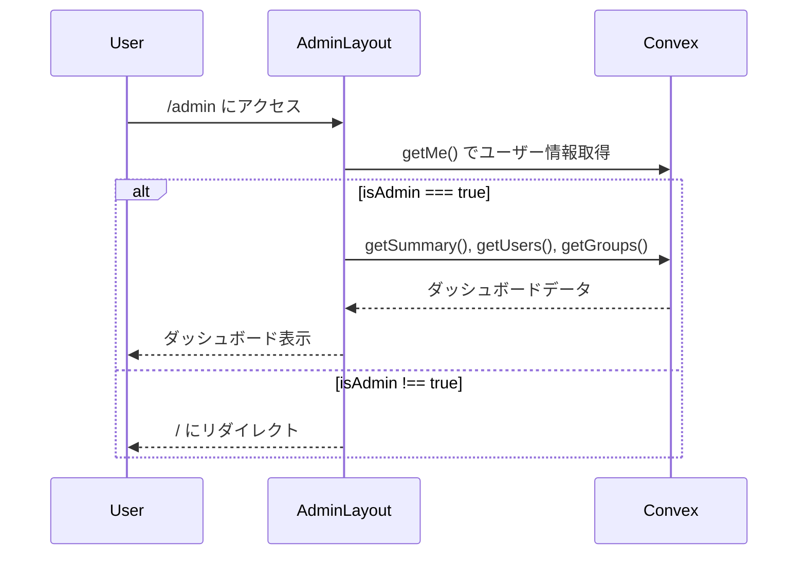
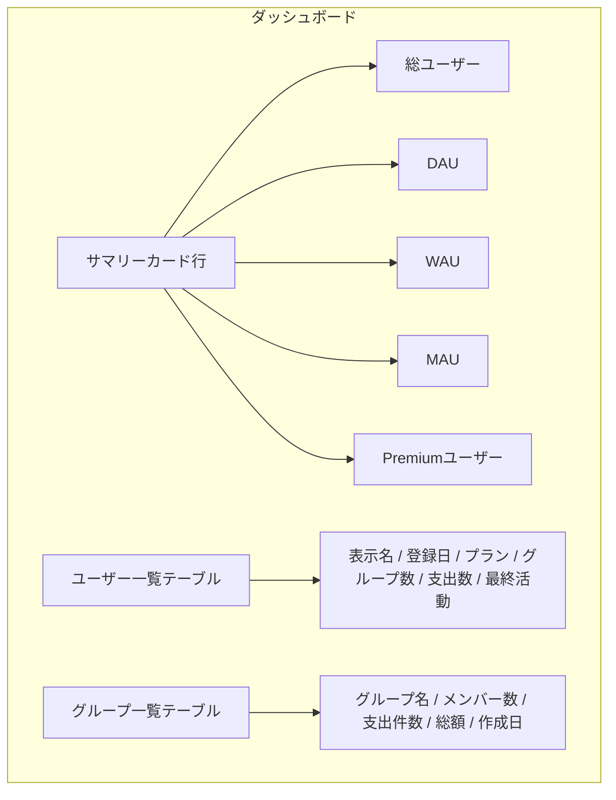
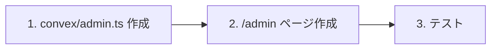

# 設計書: 管理者ダッシュボード

## Overview

運営者専用の管理画面（`/admin`）を作成する。
ユーザー一覧、DAU/WAU、支出統計、グループ情報など、アプリの成長に必要なメトリクスを一画面で確認できるダッシュボードを構築する。

## Purpose

### なぜ必要か

- ユーザーが増えてきており、**誰がどの程度使っているか**を把握する必要がある
- GAではページビューやイベント数は見られるが、**Convexのデータと紐づいたユーザー単位の詳細**は見えない
- アプリを成長させる上で、以下を把握したい:
  - アクティブユーザー数の推移（DAU/WAU）
  - ユーザーごとの利用状況（支出登録数、所属グループ）
  - Premium課金の状態
  - 機能の利用率

### 代替案

| アプローチ                 | メリット                             | デメリット                                                 |
| -------------------------- | ------------------------------------ | ---------------------------------------------------------- |
| **GA4で見る**              | 追加実装不要                         | ユーザー単位の詳細が見えない、ConvexのDBデータと紐づかない |
| **Convexダッシュボード**   | 追加実装不要                         | クエリを手動で叩く必要あり、UI不在                         |
| **管理画面を作る（採用）** | 全データを一画面で集約、DB直結で正確 | 実装コストが必要                                           |

## What to Do

### 機能要件

#### FR-1: 認証・認可

- 既存のClerk認証 + `users.isAdmin` フラグで制御
- `isAdmin !== true` のユーザーがアクセスした場合はリダイレクト

#### FR-2: サマリーカード

ダッシュボード上部に主要KPIを表示:

| メトリクス            | 定義                                                                                                                                |
| --------------------- | ----------------------------------------------------------------------------------------------------------------------------------- |
| 総ユーザー数          | `users` テーブルのレコード数                                                                                                        |
| DAU（日次アクティブ） | 過去24時間以内に `expenses` / `settlements` / `shoppingItems` を作成したユニークユーザー数                                          |
| WAU（週次アクティブ） | 過去7日以内に同上のユニークユーザー数                                                                                               |
| MAU（月次アクティブ） | 過去30日以内に同上のユニークユーザー数                                                                                              |
| 総グループ数          | `groups` テーブルのレコード数                                                                                                       |
| 総支出件数            | `expenses` テーブルのレコード数                                                                                                     |
| Premium ユーザー数    | `subscriptions` テーブルで `plan === "premium"` かつ `status === "active"` のレコード数 + `planOverride === "premium"` のユーザー数 |

#### FR-3: ユーザー一覧テーブル

| カラム             | 内容                                                            |
| ------------------ | --------------------------------------------------------------- |
| 表示名             | `users.displayName`                                             |
| 登録日             | `users.createdAt`                                               |
| プラン             | Free / Premium（subscriptions or planOverride）                 |
| 所属グループ数     | `groupMembers` から集計                                         |
| 支出登録数         | `expenses` の `createdBy` から集計                              |
| 最終アクティビティ | `expenses` / `settlements` / `shoppingItems` の最新 `createdAt` |

#### FR-4: グループ一覧テーブル

| カラム     | 内容                     |
| ---------- | ------------------------ |
| グループ名 | `groups.name`            |
| メンバー数 | `groupMembers` から集計  |
| 支出件数   | `expenses` から集計      |
| 総支出額   | `expenses.amount` の合計 |
| 作成日     | `groups.createdAt`       |

### 非機能要件

| 項目             | 要件                                                               |
| ---------------- | ------------------------------------------------------------------ |
| パフォーマンス   | ページロード時にデータ取得。リアルタイム更新不要                   |
| セキュリティ     | Clerk認証 + isAdmin チェック。管理画面のデータがフロントに漏れない |
| スケーラビリティ | 数千ユーザー規模で問題なく動作すること                             |

## How to Do It

### 設計方針: activityLogs テーブルは作らない

DAU/WAU/MAU は**既存テーブルの `createdAt` / `createdBy` から算出**する。

| メトリクス         | 算出方法                                                                                                                                 |
| ------------------ | ---------------------------------------------------------------------------------------------------------------------------------------- |
| DAU                | 過去24時間に `expenses`（createdBy）or `settlements`（createdBy）or `shoppingItems`（addedBy / purchasedBy）を作成したユニークユーザー数 |
| WAU                | 過去7日間の同上                                                                                                                          |
| MAU                | 過去30日間の同上                                                                                                                         |
| 最終アクティビティ | ユーザーごとの最新レコードの `createdAt`                                                                                                 |

**メリット**:

- 新規テーブル不要、既存コードの変更不要
- DB書き込み増加なし、ストレージ圧迫なし
- 「操作した＝アクティブ」は家計簿アプリとして妥当な定義

**デメリット**:

- 「ログインだけして何も操作しなかった」ユーザーはカウントされない（許容）

### システムアーキテクチャ



### データソース（既存テーブルのみ使用）



### バックエンド実装

#### `convex/admin.ts` — 管理者専用クエリ

```typescript
// パターン: authQuery + isAdmin チェック
export const getSummary = authQuery({
  args: {},
  handler: async (ctx) => {
    if (!ctx.user.isAdmin) throw new Error("管理者権限が必要です");

    const now = Date.now();
    const oneDayAgo = now - 24 * 60 * 60 * 1000;
    const oneWeekAgo = now - 7 * 24 * 60 * 60 * 1000;
    const oneMonthAgo = now - 30 * 24 * 60 * 60 * 1000;

    const users = await ctx.db.query("users").collect();
    const expenses = await ctx.db.query("expenses").collect();
    const settlements = await ctx.db.query("settlements").collect();
    const shoppingItems = await ctx.db.query("shoppingItems").collect();
    const groups = await ctx.db.query("groups").collect();
    const subscriptions = await ctx.db.query("subscriptions").collect();

    // DAU/WAU/MAU: 各テーブルから期間内のユニークユーザーを集計
    function getActiveUsers(since: number): Set<string> {
      const active = new Set<string>();
      for (const e of expenses) {
        if (e.createdAt >= since) active.add(e.createdBy);
      }
      for (const s of settlements) {
        if (s.createdAt >= since) active.add(s.createdBy);
      }
      for (const item of shoppingItems) {
        if (item.createdAt >= since) {
          active.add(item.addedBy);
          if (item.purchasedBy) active.add(item.purchasedBy);
        }
      }
      return active;
    }

    // Premium count
    const premiumFromSub = subscriptions.filter(
      (s) => s.plan === "premium" && s.status === "active"
    ).length;
    const premiumFromOverride = users.filter(
      (u) => u.planOverride === "premium"
    ).length;

    return {
      totalUsers: users.length,
      dau: getActiveUsers(oneDayAgo).size,
      wau: getActiveUsers(oneWeekAgo).size,
      mau: getActiveUsers(oneMonthAgo).size,
      totalGroups: groups.length,
      totalExpenses: expenses.length,
      premiumCount: premiumFromSub + premiumFromOverride,
    };
  },
});

export const getUsers = authQuery({ ... });
export const getGroups = authQuery({ ... });
```

### フロントエンド実装

#### ディレクトリ構成

```
app/admin/
  page.tsx          # ダッシュボードページ
  layout.tsx        # 管理画面レイアウト（isAdminチェック）
```

#### 認可フロー



#### UI構成



### セキュリティ

| 対策               | 詳細                                                             |
| ------------------ | ---------------------------------------------------------------- |
| **フロントエンド** | `layout.tsx` で `isAdmin` チェック → 非管理者はリダイレクト      |
| **バックエンド**   | 全クエリで `ctx.user.isAdmin` チェック。非管理者には例外を投げる |
| **二重チェック**   | フロントとバックエンドの両方でチェックし、フロントバイパスを防止 |
| **ルート公開**     | `/admin` は `isPublicRoute` に追加しない（Clerk認証必須）        |

`/admin` というパスの存在自体は外部から推測可能だが、Clerk認証 + isAdminチェックの二重防御があるため、セキュリティ上問題なし。

### 実装順序



| Phase | 内容                                       | 規模 |
| ----- | ------------------------------------------ | ---- |
| 1     | `convex/admin.ts` に管理者専用クエリを実装 | 中   |
| 2     | `app/admin/` にダッシュボードUIを作成      | 中   |
| 3     | テスト（admin クエリの権限チェック）       | 小   |

### コード変更箇所

| ファイル               | 変更内容                                            | 新規/変更 |
| ---------------------- | --------------------------------------------------- | --------- |
| `convex/admin.ts`      | 管理者専用クエリ（getSummary, getUsers, getGroups） | 新規      |
| `app/admin/page.tsx`   | ダッシュボードUI                                    | 新規      |
| `app/admin/layout.tsx` | 管理画面レイアウト + 認可チェック                   | 新規      |

既存ファイルの変更なし。スキーマ変更なし。

## What We Won't Do

| 項目                        | 理由                                                                |
| --------------------------- | ------------------------------------------------------------------- |
| activityLogs テーブルの新設 | 既存テーブルからDAU/WAU/MAUを算出可能。DB負荷・ストレージ圧迫を回避 |
| ユーザーの編集・削除機能    | 管理画面は閲覧専用。データ操作はConvex CLIで実施                    |
| グラフ・チャートの表示      | MVP ではテーブルとカード表示のみ。必要になったら追加                |
| ユーザーへのメール送信      | 通知機能は別スコープ                                                |
| ログのエクスポート          | Convexダッシュボードで代替可能                                      |
| ページネーション            | ユーザー数が数百を超えたら検討                                      |

## Concerns

### 懸念事項

| 懸念                         | リスク                                       | 対策                                                           |
| ---------------------------- | -------------------------------------------- | -------------------------------------------------------------- |
| `collect()` のパフォーマンス | 全レコードをメモリに読み込む                 | ユーザー数千規模までは問題なし。超えたらページネーション導入   |
| DAUの精度                    | 「ログインのみ」のユーザーがカウントされない | 家計簿アプリでは「操作した＝アクティブ」が妥当な定義として許容 |

## Reference Materials/Information

### 既存実装

- `convex/lib/auth.ts` — authQuery / authMutation パターン
- `convex/subscriptions.ts` — isAdmin チェックの既存実装（`setAdminPlanOverride`）
- `convex/users.ts` — `getMe` クエリ（isAdmin フラグ返却）

### Convex ドキュメント

- [Convex Queries](https://docs.convex.dev/functions/query-functions)
- [Convex Indexes](https://docs.convex.dev/database/indexes)
