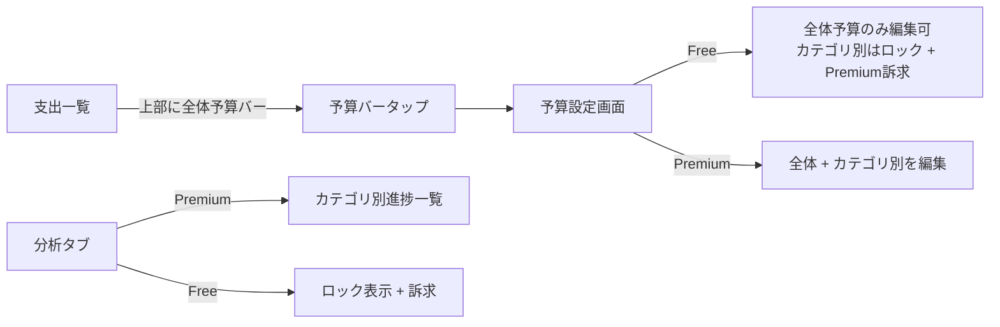

# 設計書: 予算機能

## Overview

グループの月次予算を設定し、当月の支出に対する進捗を可視化する機能。全体予算1つはFreeで開放し、カテゴリ別予算をPremium（グループ単位解放）とする。

## Purpose

### 背景

- 現行のPremium機能（傾斜折半・年次分析・タグ）は接触頻度が低く、日常的に課金価値を感じにくい
- 家計簿アプリにおいて予算管理は「記録する」から「管理する」への価値の段差であり、課金理由の定番
- 2人で予算を共有し一緒に進捗を見る体験は、カップル向けというプロダクト特性と一貫する

### 目的

1. 毎日開くたびに価値を感じる日常接触型の機能を追加し、継続率を上げる
2. Freeユーザーの毎日の視界に「ロック済みのカテゴリ別予算」を置き、自然な課金導線を作る
3. 支出記録に「使いすぎていないか」というフィードバックループを与える

## What to Do

### 機能要件

#### FR-1: 予算設定

| 機能           | プラン  | 説明                                          |
| -------------- | ------- | --------------------------------------------- |
| 全体予算の設定 | Free    | グループの月次予算を1つ設定・変更・削除       |
| カテゴリ別予算 | Premium | カテゴリごとの月次予算を設定・変更・削除      |
| 初期値の提案   | 共通    | 過去3ヶ月の平均支出額を初期値としてプリセット |

予算は常設値とする（毎月同じ額が適用され、変更したら以後の月に反映）。

#### FR-2: 進捗表示

| 表示場所     | 内容                                                           |
| ------------ | -------------------------------------------------------------- |
| 支出一覧上部 | 全体予算の進捗バー（当月使用額 / 予算、残額）                  |
| 分析タブ     | カテゴリ別予算の進捗一覧（Premium）。Freeにはロック表示 + 訴求 |

- 進捗バーの色: 〜79% 通常色、80〜99% 黄色、100%〜 赤
- 集計期間は既存の月次期間ロジック（`closingDay` 基準の精算期間）に合わせる

#### FR-3: 超過の扱い

- 予算超過してもアプリ内の色変化のみ。記録のブロックや警告モーダルは出さない

### 非機能要件

- 支出一覧の初期表示速度を悪化させない（進捗の集計は表示中の期間の支出合計のみ）

## How to Do It

### データ構造

`convex/schema.ts` に追加:

```
budgets: defineTable({
  groupId: v.id("groups"),
  categoryId: v.optional(v.id("categories")),  // 未設定 = 全体予算
  amount: v.number(),
  createdAt: v.number(),
  updatedAt: v.number(),
}).index("by_group", ["groupId"])
```

- 一意性（全体予算は1グループ1件、カテゴリ別は1カテゴリ1件）はmutationで担保
- カテゴリ削除時は対応する予算も削除（既存のカテゴリ削除mutationに追加）

### API

`convex/budgets.ts` を新規作成:

| 関数            | 種別     | 説明                                                                                                                               |
| --------------- | -------- | ---------------------------------------------------------------------------------------------------------------------------------- |
| `list`          | query    | グループの予算一覧（全体 + カテゴリ別）                                                                                            |
| `upsert`        | mutation | 予算の作成・更新。カテゴリ別は `isGroupPremium` でゲート                                                                           |
| `remove`        | mutation | 予算の削除                                                                                                                         |
| `getProgress`   | query    | 指定期間の進捗（全体 + カテゴリ別の使用額/予算）。Freeにはカテゴリ別を `isPremium: false` で返す（analytics.tsの既存パターン踏襲） |
| `suggestAmount` | query    | 過去3ヶ月平均からの提案値（全体・カテゴリ別）                                                                                      |

進捗集計は `expenses` の `by_group_and_date` インデックスで期間内支出を取得して合算する。期間計算は `getSettlementPeriod`（`convex/domain/settlement/calculator.ts`）を再利用する。

### 画面フロー



- 予算未設定のFreeユーザーには、支出一覧上部に控えめな「予算を設定する」導線を表示（設定して初めて毎日の接触が生まれるため、設定率が重要）
- 予算設定画面はグループ設定タブからも到達可能にする

### テスト・その他

- `convex/__tests__/` にユニットテスト: upsertの一意性、Premiumゲート、期間集計（closingDay境界）、提案値計算
- `lib/releases.ts` にリリースノート追加
- シードデータに全体予算 + カテゴリ別予算を追加（進捗80%超のカテゴリを1つ入れて色変化を確認可能にする）

## What We Won't Do

- 予算の月別履歴（過去月ごとに異なる予算額の保持）。過去月の進捗表示にも現在の予算値を使う
- 残額の翌月繰越
- プッシュ通知・アラート（通知基盤がないため。将来PWA通知で拡張）
- 予算超過時の記録ブロック
- タグ別予算

## Alternatives Considered

| 案                              | 概要                             | 不採用理由                                                                       |
| ------------------------------- | -------------------------------- | -------------------------------------------------------------------------------- |
| 月別予算レコード（YYYY-MM持ち） | 月ごとに予算を変えられ履歴も残る | 「前月コピー」等のUIが必要になり複雑。常設値なら設定は一度きりで、シンプルさ優先 |
| 予算機能まるごとPremium         | 転換圧が最大                     | Freeユーザーの日常価値が増えず、毎日視界に入るteaser導線も作れない               |
| 全体予算もPremium・表示のみFree | ゲート実装が単純                 | 同上。「自分で設定した予算」だからこそ毎日見る動機になる                         |
| 暦月固定（closingDay無視）      | 期間計算が単純                   | 精算・支出一覧が closingDay 基準なのに予算だけ暦月だと数字が合わず混乱する       |

## Concerns

- **設定率**: 予算は設定されて初めて価値が出る。設定導線の露出とオンボーディング（初期値提案）が効くかは計測が必要。`trackEvent` で設定率・バー表示接触を計測する
- **カテゴリ別予算のFree teaser の見せ方**: ロック表示が鬱陶しいと逆効果。分析タブでの控えめな表示から始め、反応を見る
- **傾斜折半との関係**: 予算はグループ全体の支出額に対するもの（個人負担額ではない）。「自分の負担分での予算」は要望が出たら検討

## Reference Materials/Information

- `docs/design-pair-plan.md` — Premium判定のグループ単位化（前提）
- `docs/design-expense-period-navigation.md` — 月次期間ナビゲーション
- `convex/domain/settlement/calculator.ts` — `getSettlementPeriod`（期間計算の再利用元）
- `convex/analytics.ts` — Freeへの `isPremium: false` 返却パターン
