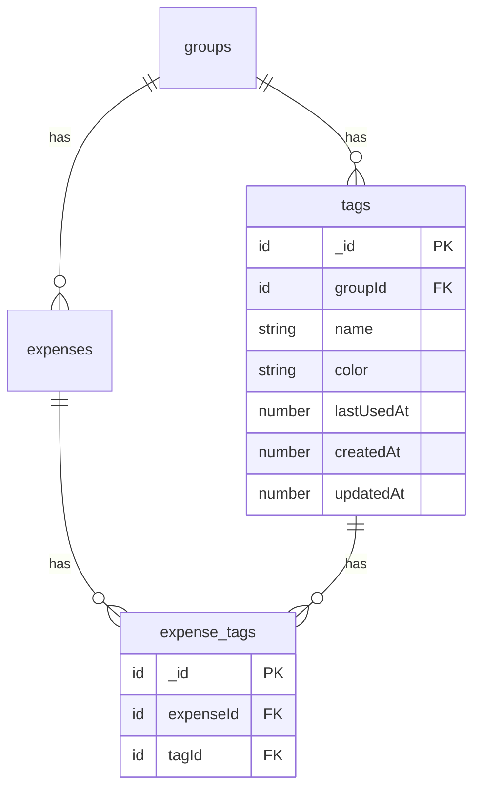
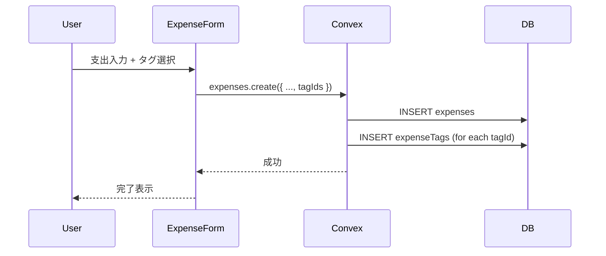
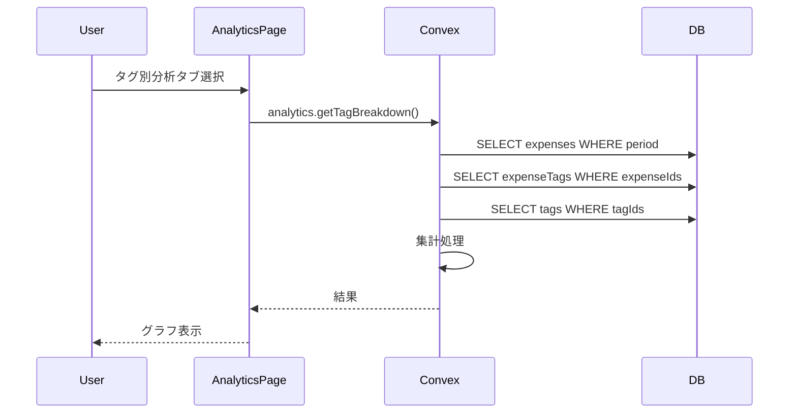

# 設計書: 支出タグ機能

## Overview

支出にタグを付けて分類・検索できる機能を追加する。
1つの支出に複数のタグを付けることができ、分析画面でタグ別の内訳を確認できる。

## Purpose

### 背景

現在、支出はカテゴリ（食費、交通費など）で分類されているが、より柔軟な分類ができない。

例えば:

- 「旅行」に関連する支出（食費、交通費、宿泊費）を横断的に集計したい
- 「結婚式準備」「引っ越し」などイベント単位で支出を追跡したい
- 同じカテゴリ内でも「定期的な支出」と「臨時の支出」を区別したい

### 目的

1. カテゴリとは別軸での支出分類を可能にする
2. イベント・プロジェクト単位での支出追跡を実現
3. 分析機能の価値を向上させ、Premium機能としての魅力を高める

### 代替案

| アプローチ       | メリット         | デメリット           |
| ---------------- | ---------------- | -------------------- |
| メモ欄で代用     | 実装不要         | 検索・集計が困難     |
| カテゴリを増やす | 実装不要         | 1支出1カテゴリの制限 |
| タグ機能追加     | 柔軟な分類が可能 | 実装コスト           |

→ タグ機能を実装することで、最も柔軟な分類を実現する

## What to Do

### 機能要件

#### FR-1: タグ管理

| 機能     | 説明                                       |
| -------- | ------------------------------------------ |
| タグ作成 | グループ内で新しいタグを作成               |
| タグ編集 | 名前・色の変更                             |
| タグ削除 | タグを削除（関連する支出との紐付けも削除） |
| タグ一覧 | グループ内のタグを一覧表示                 |
| タグ検索 | 名前で絞り込み                             |

#### FR-2: 支出へのタグ付け

| 機能       | 説明                                     |
| ---------- | ---------------------------------------- |
| タグ選択   | Combobox形式で0個以上のタグを選択        |
| 複数選択   | 1つの支出に複数のタグを付与可能          |
| タグ解除   | 選択中タグの×ボタンで解除                |
| 検索＋作成 | 入力で検索、一致なければそのまま新規作成 |
| 上位表示   | 入力なし時は最近使ったタグを候補表示     |

#### FR-3: タグ別分析

| 機能       | 説明                             |
| ---------- | -------------------------------- |
| タグ別内訳 | 指定期間内のタグ別支出額・割合   |
| タグ別推移 | 月別のタグ別支出推移（将来対応） |

#### FR-4: プラン制限

| 機能           | Free | Premium |
| -------------- | ---- | ------- |
| タグ作成・管理 | ❌   | ✅      |
| タグ付け       | ❌   | ✅      |
| タグ別分析     | ❌   | ✅      |

### 非機能要件

#### NFR-1: パフォーマンス

- タグ一覧取得: 100ms以内
- タグ別分析: 500ms以内

#### NFR-2: 制限

- タグ名: 1〜20文字
- グループあたりタグ数: 最大50個
- 支出あたりタグ数: 最大10個

## How to Do It

### データモデル



### スキーマ定義

```typescript
// convex/schema.ts に追加

tags: defineTable({
  groupId: v.id("groups"),
  name: v.string(),
  color: v.string(),           // Tailwind色名: "red", "blue", "green", etc.
  lastUsedAt: v.optional(v.number()),  // 最近使用日時（上位表示用）
  createdAt: v.number(),
  updatedAt: v.number(),
})
  .index("by_group", ["groupId"])
  .index("by_group_last_used", ["groupId", "lastUsedAt"]),

expenseTags: defineTable({
  expenseId: v.id("expenses"),
  tagId: v.id("tags"),
})
  .index("by_expense", ["expenseId"])
  .index("by_tag", ["tagId"]),
```

### タグの色定義

```typescript
// convex/domain/tag/types.ts

export const TAG_COLORS = [
  "red",
  "orange",
  "amber",
  "yellow",
  "lime",
  "green",
  "emerald",
  "teal",
  "cyan",
  "sky",
  "blue",
  "indigo",
  "violet",
  "purple",
  "fuchsia",
  "pink",
  "rose",
  "slate",
] as const;

export type TagColor = (typeof TAG_COLORS)[number];
```

### API設計

#### タグ管理

```typescript
// convex/tags.ts

// タグ一覧取得（lastUsedAt降順で最近使用タグを上位に）
tags.list({ groupId }) → Tag[]

// タグ作成（colorを省略するとランダム割り当て）
tags.create({ groupId, name, color? }) → Id<"tags">

// タグ更新
tags.update({ tagId, name?, color? }) → void

// タグ削除（関連するexpenseTagsも一括削除）
tags.remove({ tagId }) → { deletedExpenseTagsCount: number }

// タグ検索（名前の部分一致）
tags.search({ groupId, query }) → Tag[]
```

#### 支出のタグ操作

```typescript
// convex/expenses.ts（既存を拡張）

// 作成時: tagIds引数を追加（使用したタグのlastUsedAtを更新）
expenses.create({ ..., tagIds?: Id<"tags">[] })

// 更新時: tagIds引数を追加（使用したタグのlastUsedAtを更新）
expenses.update({ ..., tagIds?: Id<"tags">[] })

// 取得時: tagsを含めて返す
expenses.getById({ expenseId }) → { ..., tags: Tag[] }
```

#### 分析

```typescript
// convex/analytics.ts に追加

// タグ別内訳
analytics.getTagBreakdown({ groupId, year, month }) → {
  period: { startDate, endDate },
  totalAmount: number,
  breakdown: {
    tagId: Id<"tags">,
    tagName: string,
    tagColor: string,
    amount: number,
    percentage: number,
    count: number,
  }[],
  untaggedAmount: number,  // タグなし支出の合計
}
```

### 処理フロー

#### 支出作成時のタグ付け



#### タグ別分析の取得



### UI設計

#### ExpenseFormへのタグ選択追加

Combobox形式で検索と作成を統合。入力テキストに一致するタグがなければ新規作成オプションを表示。

```
┌─────────────────────────────────────┐
│ ¥ 3,500                             │
├─────────────────────────────────────┤
│ [タイトル入力    ] [2024-01-15]     │
├─────────────────────────────────────┤
│ カテゴリ                            │
│ [🍽️食費] [🚃交通] [🛒日用品] ...   │
├─────────────────────────────────────┤
│ タグ (Premium)                      │
│ 選択中: [#旅行 ×] [#結婚準備 ×]     │
│ ┌─────────────────────────────────┐ │
│ │ 引っ越し                        │ │
│ ├─────────────────────────────────┤ │
│ │ ● #引っ越し                     │ │ ← 一致するタグ
│ │ ＋「引っ越し」を作成            │ │ ← 完全一致なければ表示
│ └─────────────────────────────────┘ │
├─────────────────────────────────────┤
│ 支払者                              │
│ ...                                 │
└─────────────────────────────────────┘

※ 入力なし時は最近使用タグを候補として表示
```

#### タグ選択Comboboxの挙動

| 状態       | 表示内容                                              |
| ---------- | ----------------------------------------------------- |
| 入力なし   | 最近使用タグ（lastUsedAt降順、最大5件）               |
| 入力あり   | 部分一致するタグ + 完全一致なければ「作成」オプション |
| 作成選択時 | 即座にタグ作成 → 選択状態に追加                       |

#### 分析画面のタグ別タブ

```
┌─────────────────────────────────────┐
│ [月次] [年次] [タグ別]              │
├─────────────────────────────────────┤
│ 2024年1月分                         │
├─────────────────────────────────────┤
│     ┌──────┐                        │
│     │      │  #旅行      ¥45,000    │
│     │ 円   │  #結婚準備  ¥32,000    │
│     │ グラフ│  #日常      ¥28,000    │
│     │      │  タグなし   ¥15,000    │
│     └──────┘                        │
└─────────────────────────────────────┘
```

### 変更対象ファイル

| ファイル                                     | 変更内容                       | 規模 |
| -------------------------------------------- | ------------------------------ | ---- |
| `convex/schema.ts`                           | tags, expenseTagsテーブル追加  | 小   |
| `convex/tags.ts`                             | 新規作成（CRUD）               | 中   |
| `convex/domain/tag/`                         | 新規作成（型、バリデーション） | 中   |
| `convex/expenses.ts`                         | tagIds対応                     | 小   |
| `convex/analytics.ts`                        | getTagBreakdown追加            | 中   |
| `convex/groups.ts`                           | getDetailにtags追加            | 小   |
| `convex/lib/subscription.ts`                 | canUseTags追加                 | 小   |
| `components/expenses/ExpenseForm.tsx`        | タグ選択UI追加                 | 中   |
| `components/expenses/TagSelector.tsx`        | 新規作成                       | 中   |
| `components/tags/TagManager.tsx`             | 新規作成（タグ管理UI）         | 中   |
| `app/groups/[groupId]/analytics/page.tsx`    | タグ別タブ追加                 | 中   |
| `components/analytics/TagBreakdownChart.tsx` | 新規作成                       | 中   |
| `app/pricing/page.tsx`                       | タグ機能をPremium特典に追加    | 小   |

### 実装フェーズ

#### Phase 1: 基盤

1. スキーマ追加（tags, expenseTags）
2. tags.ts CRUD実装
3. domain/tag/ バリデーション実装

#### Phase 2: 支出連携

1. expenses.create/update にtagIds対応
2. expenses.getById にtags追加
3. ExpenseFormにタグ選択UI追加

#### Phase 3: 分析

1. analytics.getTagBreakdown実装
2. TagBreakdownChartコンポーネント作成
3. 分析画面にタグ別タブ追加

#### Phase 4: 管理UI

1. TagManagerコンポーネント作成
2. グループ設定画面にタグ管理追加

## What We Won't Do

### スコープ外

1. **タグのネスト/階層化**
   - タグは全てフラット構造
   - 親子関係は持たない

2. **タグの自動提案**
   - AI/MLによるタグ推薦は行わない
   - 手動選択のみ

3. **タグのインポート/エクスポート**
   - CSVなどでのタグ一括操作は対象外

4. **タグ別推移グラフ**
   - 初期リリースではタグ別内訳のみ
   - 推移グラフは将来対応

5. **タグのマージ/統合**
   - 複数タグを1つにまとめる機能は対象外

6. **タグの手動並び替え**
   - ドラッグ&ドロップでの並び順変更は対象外
   - lastUsedAtによる自動ソートのみ

## Concerns

### 解決済みの懸念

#### 1. タグ削除時の扱い

**問題**: 使用中のタグを削除しようとした場合の挙動

→ **解決**: 削除可能。関連するexpenseTagsも一括削除。確認ダイアログで「このタグは○件の支出で使用されています。削除しますか？」と表示

#### 2. 大量タグ時のUI

**問題**: タグが50個近くあると選択UIが使いづらい

→ **解決**: Combobox形式で検索可能。入力なし時は最近使用タグを上位表示

#### 3. 新規タグ作成時の色

**問題**: Comboboxから即作成する場合、色はどうするか

→ **解決**: ランダムに割り当て。後でタグ管理画面から変更可能

#### 4. 同名タグの扱い

**問題**: 既存タグと同じ名前を入力した場合

→ **解決**: 完全一致する既存タグがあれば「作成」オプションは表示せず、既存タグを選択させる

#### 5. タグの並び順

**問題**: 手動並び替えUIは必要か

→ **解決**: 自動ソート（lastUsedAt降順）のみ。手動並び替えは不要

#### 6. タグなし支出の分析表示

**問題**: タグが付いていない支出をどう表示するか

→ **解決**: 「タグなし」カテゴリとして灰色で表示

### 将来的な検討事項

1. **タグの共有テンプレート**
   - よく使うタグセットをテンプレート化

2. **タグフィルター検索**
   - 支出一覧をタグでフィルタリング

3. **タグ別予算設定**
   - タグごとの月間予算を設定

## Reference Materials/Information

### 既存設計書

- `docs/design-expense-feature.md` - 支出機能設計
- `docs/design-custom-category.md` - カテゴリ機能設計（実装パターン参考）
- `docs/design-analytics-feature.md` - 分析機能設計

### 参考サービス

- Notion - タグによる柔軟な分類
- Todoist - ラベル（タグ）機能
- MoneyForward - カスタムタグ機能

---

## 決定事項まとめ

| 項目         | 決定                                               |
| ------------ | -------------------------------------------------- |
| タグの多重度 | 1支出に複数タグ可（M:N）                           |
| プラン制限   | Premium限定                                        |
| タグ上限     | グループ50個、支出10個                             |
| タグ名文字数 | 1〜20文字                                          |
| 色指定       | 18色から選択                                       |
| 削除制約     | 使用中でも削除可（関連データも削除）               |
| 選択UI       | Combobox形式（検索＋作成を統合）                   |
| タグ表示順   | 入力なし時は最近使用タグを候補表示                 |
| 新規作成     | 検索で完全一致なければ入力テキストで即作成         |
| 色の割り当て | 新規作成時はランダム、後から変更可                 |
| 同名タグ     | 完全一致する既存タグがあれば作成不可（既存を使用） |
