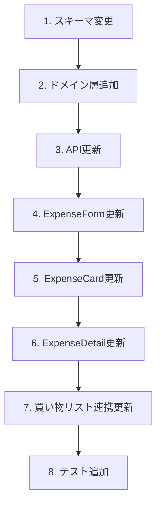

# 支出に名前（タイトル）を追加 設計ドキュメント

## 概要

支出にタイトル（名前）フィールドを追加し、カテゴリはサブ情報として扱うように変更する。

## 目的

現状、支出はカテゴリ名が主要な識別子として表示されているが、これには以下の問題がある：

1. **識別性が低い**: 「食費」「日用品」などのカテゴリ名では、具体的に何の支出かわかりにくい
2. **柔軟性がない**: 「スーパーで買い物」「友人との外食」など、具体的な内容を記録したい
3. **買い物リストとの不整合**: 買い物リストには名前があるが、連携した支出では名前が失われる

タイトルを追加することで、「牛乳、卵、パン」「居酒屋 花見」のように具体的な支出内容を記録できる。

## やること

### 機能要件

1. **支出にタイトルフィールドを追加**
   - 任意入力（既存データとの互換性維持）
   - 最大100文字

2. **表示優先度の変更**
   - タイトルがある場合: タイトルを主表示、カテゴリはアイコン+サブテキスト
   - タイトルがない場合: 従来通りカテゴリ名を表示（後方互換）

3. **買い物リスト連携**
   - 買い物アイテムから支出を作成する際、アイテム名を自動でタイトルに設定

### 非機能要件

- 既存データへの影響なし（タイトルは任意フィールド）
- 入力UXを損なわない（シンプルなまま）

## やり方

### 1. DBスキーマ変更

```typescript
// convex/schema.ts
expenses: defineTable({
  groupId: v.id("groups"),
  amount: v.number(),
  categoryId: v.id("categories"),
  paidBy: v.id("users"),
  date: v.string(),
  memo: v.optional(v.string()),
  title: v.optional(v.string()),  // 追加
  splitMethod: splitMethodValidator,
  createdBy: v.id("users"),
  createdAt: v.number(),
  updatedAt: v.number(),
}),
```

### 2. ドメイン層

```typescript
// convex/domain/expense/types.ts
export const EXPENSE_RULES = {
  // 既存...
  TITLE_MAX_LENGTH: 100,
} as const;

// convex/domain/expense/rules.ts
export function validateExpenseTitle(
  title: string | undefined,
): string | undefined {
  if (!title) return undefined;
  const trimmed = title.trim();
  if (trimmed.length === 0) return undefined;
  if (trimmed.length > EXPENSE_RULES.TITLE_MAX_LENGTH) {
    throw new ExpenseValidationError(
      `タイトルは${EXPENSE_RULES.TITLE_MAX_LENGTH}文字以内で入力してください`,
    );
  }
  return trimmed;
}
```

### 3. API変更

```typescript
// convex/expenses.ts - create mutation
args: {
  // 既存...
  title: v.optional(v.string()),  // 追加
},

// 買い物リスト連携時
if (args.shoppingItemIds && args.shoppingItemIds.length > 0) {
  // アイテム名をタイトルに設定（複数の場合はカンマ区切り）
  const itemNames = shoppingItems.map(item => item.name);
  title = itemNames.join(", ");
}
```

### 4. UI変更

#### ExpenseCard

```
変更前:
┌─────────────────────────────────┐
│ 🍚 食費                    ¥1,500 │
│ 田中が支払い                      │
│ 12/25 ・ スーパーで買い物         │
└─────────────────────────────────┘

変更後（タイトルあり）:
┌─────────────────────────────────┐
│ 🍚 牛乳、卵、パン           ¥1,500 │
│ 食費 ・ 田中が支払い              │
│ 12/25                            │
└─────────────────────────────────┘

変更後（タイトルなし = 後方互換）:
┌─────────────────────────────────┐
│ 🍚 食費                    ¥1,500 │
│ 田中が支払い                      │
│ 12/25                            │
└─────────────────────────────────┘
```

#### ExpenseForm

```
┌─────────────────────────────────┐
│ タイトル（任意）                 │
│ ┌─────────────────────────────┐ │
│ │ 例: スーパーで買い物         │ │
│ └─────────────────────────────┘ │
│                                  │
│ カテゴリ                         │
│ [🍚 食費 ▼]                      │
│                                  │
│ 金額                             │
│ ┌─────────────────────────────┐ │
│ │ ¥                            │ │
│ └─────────────────────────────┘ │
│ ...                              │
└─────────────────────────────────┘
```

### 5. 実装順序



## やらないこと

1. **既存データのマイグレーション**: タイトルは任意なので、既存支出は従来通りカテゴリ名で表示
2. **メモフィールドの削除**: タイトルとメモは用途が異なる（タイトル=概要、メモ=詳細）
3. **タイトルの必須化**: 入力の手間を増やさない

## 懸念事項

### 1. タイトルとメモの使い分け

**懸念**: ユーザーがタイトルとメモの違いを理解できるか

**対応**:

- タイトル: 「何を買ったか」（例: 牛乳、卵）
- メモ: 「補足情報」（例: 特売日だった、○○スーパーで購入）
- プレースホルダーで用途を示す

### 2. 買い物リスト連携時の長いタイトル

**懸念**: 複数アイテム選択時にタイトルが長くなりすぎる

**対応**:

- 最大3アイテムまでカンマ区切り、それ以上は「他○件」と省略
- 例: 「牛乳, 卵, パン 他2件」

## 参考資料

- 現在のExpenseCard実装: `components/expenses/ExpenseCard.tsx`
- 買い物リスト連携: `convex/expenses.ts` の shoppingItemIds 処理
