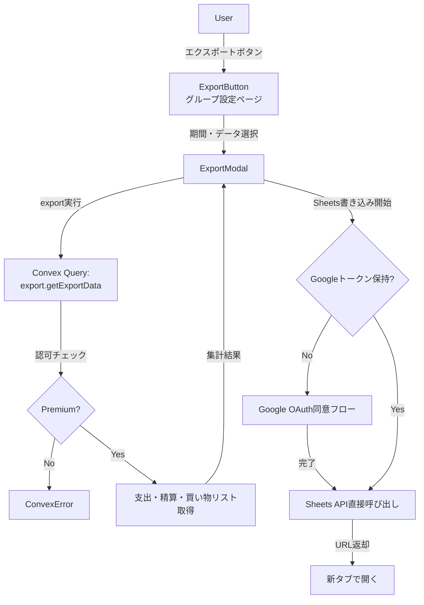
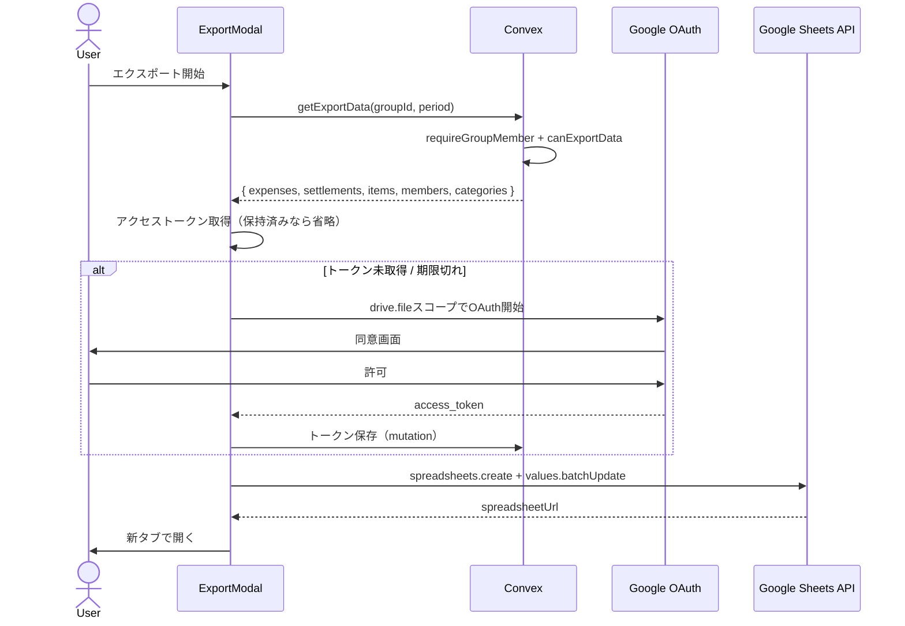
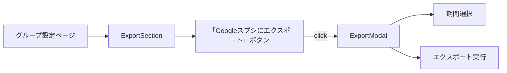

# Overview

Premium ユーザー向けに、Pairbo の支出・精算データを **Google スプレッドシートに直接書き込んでエクスポート** する機能を提供する。モバイル中心の利用が多いプロダクトのため、CSVダウンロードは採用せず、タップ1つで自分のGoogleドライブにスプシが作成される体験に集中する。

## Purpose

### 短期的な目的

- 現状3人のPremiumユーザーに対し、現Premiumプラン（傾斜折半・タグ・年次分析・広告非表示）の価値を補完する utility 機能を追加する
- HANDOVER.md の「Premium限定機能の実装（詳細分析、データエクスポート予定）」を実現する
- 「自分のデータを取り出せる」という所有感を提供し、データロックイン恐怖を取り除く（**逆説的にリテンションを高める効果**）

### 長期的な目的

- Premium ティアの機能完成度を上げ、後続の感情訴求型キラー機能（共有貯金ゴール、月次レビュー等）の土台を作る
- Google Sheets 直接書き込みという**他家計簿アプリにない差別化要素**を Premium に組み込む
- 確定申告・年末家計レビュー・引越し精算等のヘビーユーザー実需に答える

### このタイミングで実装する理由

- ユーザーが32人と少なく、設計の自由度が高い（後から大幅変更しても影響軽微）
- お知らせ機能（PR #183）がリリースされたので、新機能の告知導線が整った
- Premium キラー機能（感情訴求型）は時間がかかるため、その開発期間中の Premium 進化シグナルとして先行リリースしたい

## What to Do

### 機能要件

- グループ単位で支出データを Google スプレッドシートに書き出す
- 新規スプレッドシートを作成し、URLをユーザーに返す（新タブで開く）
- 既存のスプレッドシートへの追記は対象外（複雑化するため）
- 期間指定: 全期間 / 年指定 / 精算期間（年月）から選択
- エクスポート対象データ:
  - **支出**: 日付、タイトル、カテゴリ、金額、支払者、分割方法、メモ、タグ
  - **精算**: 精算期間、送金元、送金先、金額、支払い済みフラグ
  - 買い物リストは対象外（購入済みは支出に転記済み、未購入は転記価値なし）
- スプレッドシート名: `Pairbo - <groupName> - <period>`
- 動線: グループ設定ページ内の「データをエクスポート」セクション
- Premium 限定（既存 `canExportData()` ヘルパーに準拠）
- 初回利用時に Google Drive スコープ（`drive.file`）の追加同意を求める
- email/password認証ユーザーへの対応: 別途Google連携を促す（または非対応とする、後述）

### 非機能要件

- **生成方式**: クライアント側でSheets APIを直接呼び出す（サーバー負荷ゼロ）
- **データ量**: 月10〜100件の支出を想定。年間最大2000件程度の規模でも問題なく動作
- **パフォーマンス**: エクスポートボタン押下から3秒以内に Sheets URL 返却
- **エラーハンドリング**: Convex クエリ失敗時、Sheets API 失敗時のフォールバック明示
- **Premium ゲーティング**: バックエンドで `canExportData()` 強制チェック（フロント側のみのチェックは信用しない）
- **トークン管理**: アクセストークンの有効期限切れに対応（refresh または再認証フロー）

## How to Do It

### Architecture



### Data flow



### Convex side

#### New file: `convex/export.ts`

```ts
import { v } from "convex/values";
import { authQuery } from "./lib/auth";
import { requireGroupMember } from "./lib/authorization";
import { canExportData } from "./lib/subscription";
import { ConvexError } from "convex/values";

export const getExportData = authQuery({
  args: {
    groupId: v.id("groups"),
    periodStart: v.optional(v.string()), // "YYYY-MM-DD"
    periodEnd: v.optional(v.string()),
    includeSettlements: v.optional(v.boolean()),
    includeShoppingItems: v.optional(v.boolean()),
  },
  handler: async (ctx, args) => {
    await requireGroupMember(ctx, args.groupId);

    const canExport = await canExportData(ctx, ctx.user._id);
    if (!canExport) {
      throw new ConvexError(
        "エクスポート機能はPremiumプランでご利用いただけます",
      );
    }

    // 支出取得（期間フィルタ）
    // splits, categories, members, tags のエンリッチメント
    // settlements/shoppingItems もフラグに応じて取得
    // 整形済みデータを返却

    return { expenses, settlements, shoppingItems, members, categories, tags };
  },
});
```

ヘルパー: `convex/lib/exportHelper.ts` でデータ整形ロジックを分離（テスト容易性のため）。

#### Schema: トークン保存テーブルを追加（Option X 採用時）

```ts
// Option X（Clerk独立連携）採用時
googleSheetsTokens: defineTable({
  userId: v.id("users"),
  accessToken: v.string(),
  refreshToken: v.optional(v.string()),
  expiresAt: v.number(),
  createdAt: v.number(),
  updatedAt: v.number(),
}).index("by_user", ["userId"]);
```

Option Y（Clerk経由）採用時はスキーマ変更不要（Clerk が token を保持）。**最終決定は検証ステップ後**。

エクスポート履歴は記録しない（プライバシー観点）。

### Frontend side

#### New components

- `components/settings/ExportSection.tsx`: グループ設定ページ内のセクション
- `components/settings/ExportModal.tsx`: エクスポート設定モーダル（期間選択）
- `lib/export/sheetsExport.ts`: Sheets API 呼び出し + データ整形

#### Sheet structure

スプレッドシート1つを作成し、2つのシートタブで構成:

| シート名 | 内容                                                         |
| -------- | ------------------------------------------------------------ |
| 支出     | 日付・タイトル・カテゴリ・金額・支払者・分割方法・メモ・タグ |
| 精算     | 精算期間・送金元・送金先・金額・支払い済み                   |

#### UI placement



### Authentication strategy (Option X vs Option Y)

検証ステップで最終決定する。両方の概要を記載。

#### Option X: Clerk認証とは独立した Google Sheets 連携

Pairboのユーザー認証はClerkのまま。Sheets用にGoogle OAuthを別フローで実装:

- 「Googleと連携してエクスポート」ボタンから自前OAuth起動
- `drive.file` スコープのみリクエスト
- アクセストークン・リフレッシュトークンを Convex DB に保存
- Sheets API呼び出し時に保存トークンを使用、必要なら refresh

**メリット**: Clerk credential 移行不要 = 既存32ユーザーへの影響ゼロ。  
**デメリット**: 自前OAuth実装（refresh含む）が必要。実装行数増。

#### Option Y: Clerk経由のincremental authorization

Clerk-managed → custom Google credentialsに切り替え + `additionalOAuthScopes` で追加同意:

- Google Cloud Console で OAuth クライアント新規作成
- Clerk Dashboard の Google connection で custom credentials に切替、`drive.file` scope追加
- `<UserButton additionalOAuthScopes={{ google: ["https://www.googleapis.com/auth/drive.file"] }} />` で追加同意
- `getUserOauthAccessToken()` でアクセストークン取得

**メリット**: 既にGoogleログイン済みのユーザーはスムーズ。実装軽め。  
**デメリット**: credential 切替で既存セッションが無効化される可能性。`additionalOAuthScopes` の挙動が未検証。

#### Verification needed before deciding

検証項目（Concerns 参照）:

- Clerk Dashboard で managed → custom credential 切替時、既存セッションが維持されるか
- `additionalOAuthScopes` で incremental auth が想定通り動くか

#### Sheets API 呼び出し

```ts
async function exportToSheets(accessToken: string, data: ExportData): Promise<string> {
  // 1. 新規スプレッドシート作成
  const createRes = await fetch("https://sheets.googleapis.com/v4/spreadsheets", {
    method: "POST",
    headers: { Authorization: `Bearer ${accessToken}`, "Content-Type": "application/json" },
    body: JSON.stringify({
      properties: { title: `Pairbo - ${groupName} - ${period}` },
      sheets: [
        { properties: { title: "支出" } },
        { properties: { title: "精算" } },
        { properties: { title: "買い物リスト" } },
      ],
    }),
  });
  const { spreadsheetId, spreadsheetUrl } = await createRes.json();

  // 2. 各シートに値を書き込み（batchUpdate）
  await fetch(`https://sheets.googleapis.com/v4/spreadsheets/${spreadsheetId}/values:batchUpdate`, {
    method: "POST",
    headers: { Authorization: `Bearer ${accessToken}`, "Content-Type": "application/json" },
    body: JSON.stringify({ valueInputOption: "USER_ENTERED", data: [...] }),
  });

  return spreadsheetUrl;
}
```

`drive.file` スコープなのでアプリ作成ファイルのみ操作可能 = 既存スプレッドシートには触れない安全設計。

### Testing strategy

- `lib/export/sheetsExport.ts` のデータ整形ロジックをユニットテスト（純粋関数として切り出し）
  - 様々な支出パターン（傾斜・均等・全額負担）の出力検証
  - タグ・分割の集約ロジック
- `convex/export.ts` の認可テスト（Premium / 非Premium / 非メンバー）
- E2E: ローカルでSheets作成 → 開いて表示確認

## What We Won't Do

- **既存のGoogleスプレッドシートへの追記**: 「どこに追記？」「列マッピングは？」等の複雑化。新規作成のみに絞る
- **エクスポート履歴の保存**: いつ誰が何を出したかの記録。プライバシー観点でもメタデータを増やしたくない
- **複数グループの一括エクスポート**: グループ単位に絞る（Pairboの利用パターン上、1ユーザー1グループが大半）
- **PDF出力**: HTML/CSSのレイアウト設計コストが見合わない、CSV/Sheetsで分析可能なため
- **定期エクスポート**（cronで毎月自動）: 今回は手動トリガーのみ
- **暗号化エクスポート**: パスワード保護等。家計簿データのセンシティビティとUXコストのバランス上、現段階では不要
- **メール送信**: 「ダウンロードリンクをメールで」等。Convex から SMTP 連携を新規構築するコスト見合わない
- **Free プランへの部分開放**: 「直近1ヶ月のみFree」等の出し分け。設計が複雑化、Premium価値が薄まる

## Alternatives Considered

### Server-side CSV 生成

Convex Action で CSV を生成し、URLとして返す方式。

不採用理由: クライアント側生成で十分高速・軽量。サーバー側生成は、メール送信や大規模データには有効だが今回のスコープ外。クライアント側ならConvex負荷ゼロ。

### Excel (.xlsx) 形式

CSV ではなく直接 .xlsx を生成。

不採用理由: ExcelJS 等のライブラリでバンドルサイズが数百KB増える割に、CSV → Excel の手間は「ダブルクリック」だけ。CSV + Google Sheets で十分。

### Sheets ではなく Notion / Airtable 連携

Notion API / Airtable API で同様の連携。

不採用理由: ユーザーベースが Notion / Airtable 利用者に限定される。Google Sheets は最大公約数。

### `drive.full` スコープ（広範な権限）

`drive` (full Drive access) スコープで全ファイル操作。

不採用理由: 過剰権限。`drive.file` で自アプリ作成ファイルのみ操作で十分。Google verification も簡素化。

### Premium 機能としない（Free 開放）

全ユーザーに無料でエクスポート提供。

不採用理由: HANDOVER.md 上の Premium 設計に従う。Premium の utility 価値を増やす狙いと矛盾。データ所有権の観点で議論余地あるが、現段階では Premium 価値構築を優先。

## Concerns

### 検証が必要な事項

1. **Clerk: managed → custom credentials 切替時の既存ユーザー影響**
   - Clerk の credential 切替で既存セッションが無効化されるか？
   - 再ログインを強制される場合、ユーザー全員に告知が必要
   - 影響: 大（全ユーザーに影響）。**Phase 1b 着手前に Clerk サポートに確認、または検証環境で実機テスト**
2. **`additionalOAuthScopes` の実装パターン**
   - Clerk の `<UserButton additionalOAuthScopes>` で incremental authorization が完全に動くか
   - 動かない場合、`user.createExternalAccount()` 等で代替実装
   - Clerk ドキュメントが薄いので、コード書いて検証する必要あり
3. **Sheets API のレート制限**
   - 個人ユーザーで100リクエスト/100秒/ユーザー（標準）。通常使用では問題ないが、大量データのbatch時に注意
   - エラーハンドリング: 429 Rate Limit Exceeded のフォールバック設計

### 設計上の悩み

4. **CSV のセクション構成**
   - 1ファイル内に「支出」「精算」「買い物リスト」を含めるか
   - 別ファイル（zip）にするか
   - 案: **デフォルトは1ファイル**（複数セクションを `[支出]` 等のヘッダーで区切る）。Excelで開いた時の自動セクション分割は期待しない。シンプルさ優先
5. **期間指定UIの粒度**
   - 「全期間 / 年単位 / 精算期間単位」の3択で十分か
   - カスタム範囲（2024-01-15〜2024-08-30 等）が必要か
   - 案: **3択でスタート、要望出てから拡張**
6. **タグの扱い**
   - 支出ごとに付いた複数タグをどう CSV カラムに表現するか
   - 案: **カンマ区切りで1セルに集約**（`タグ` カラムに `食費,デート` 等）。エスケープ注意
7. **Google verification の所要時間**
   - `drive.file` は non-sensitive なので軽量だが、verification には1〜数週間かかる場合あり
   - Phase 1b リリース前提条件として早めに着手

### スケーラビリティ

8. **将来の大量データ**
   - クライアント側で1万件超の支出をCSV化するとフリーズ可能性
   - 現状32人で大量データユーザーはいないが、将来ストリーミング生成を検討
   - 現段階: **2000件想定で問題なし、その規模に達したら対策**

## Reference Materials/Information

- [HANDOVER.md](../HANDOVER.md) — Premium 限定機能としてのデータエクスポートの位置づけ
- [convex/lib/subscription.ts](../convex/lib/subscription.ts) — `canExportData()` ヘルパー（既存）
- [docs/design-monetization.md](./design-monetization.md) — Premium プランの全体像
- [docs/design-release-notifications.md](./design-release-notifications.md) — リリース告知の仕組み（本機能リリース時に活用）
- [Clerk: Google as a social connection](https://clerk.com/docs/guides/configure/auth-strategies/social-connections/google) — Custom credentials の設定方法
- [Clerk: per-user OAuth scopes](https://clerk.com/blog/implement-per-user-oauth-with-clerk) — Incremental authorization のパターン
- [Google: Choose Drive API scopes](https://developers.google.com/workspace/drive/api/guides/api-specific-auth) — `drive.file` スコープの安全性
- [Google: Sheets API reference](https://developers.google.com/sheets/api/reference/rest) — `spreadsheets.create`, `values.batchUpdate`
