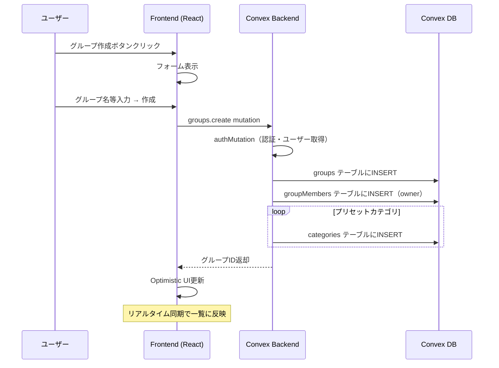
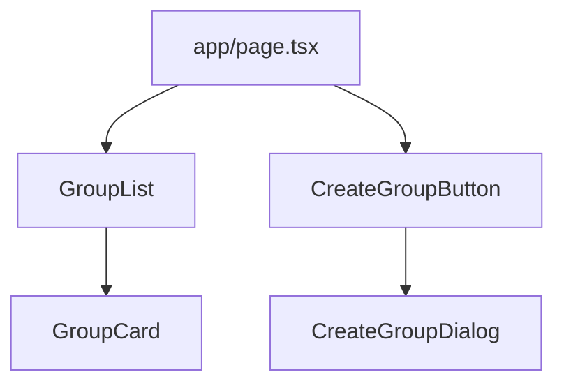
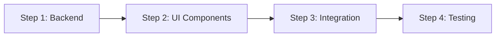

# グループ機能設計書

> 作成日: 2024-12-30
> ステータス: 承認済み

---

## 概要

Oaikoの基盤となるグループ機能を実装する。ユーザーがグループを作成し、一覧表示できるようにする。これにより、支出記録などの後続機能の土台が整う。

---

## 目的

### なぜこの開発が必要か

1. **MVPの基盤構築**
   - グループがないと支出記録ができない
   - すべての機能はグループを前提に動作する

2. **動作確認可能な最小単位**
   - グループ作成 → 一覧表示のフローで、バックエンド・フロントエンド連携を検証できる
   - 認証ミドルウェア（authMutation, authQuery）の実動作確認

3. **ユーザー体験の起点**
   - ログイン後、最初に行うアクションが「グループ作成」
   - グループがあることで、アプリの価値が見え始める

---

## やること（機能要件・非機能要件）

### 機能要件

#### 1. グループ作成

| 項目     | 詳細                                                               |
| -------- | ------------------------------------------------------------------ |
| 入力項目 | グループ名（必須）、説明（任意）、締め日（デフォルト25日）         |
| 処理     | グループ作成 + 作成者をオーナーとして追加 + プリセットカテゴリ作成 |
| 出力     | 作成されたグループID                                               |

#### 2. グループ一覧表示

| 項目     | 詳細                                               |
| -------- | -------------------------------------------------- |
| 表示内容 | ユーザーが所属するグループの一覧                   |
| 表示項目 | グループ名、メンバー数、自分の役割（owner/member） |
| 並び順   | 参加日時の新しい順                                 |

#### 3. UI画面

| 画面                          | 説明                                   |
| ----------------------------- | -------------------------------------- |
| ホーム画面                    | グループ一覧を表示、グループ作成ボタン |
| グループ作成モーダル/フォーム | グループ名・説明・締め日を入力         |

### 非機能要件

| 項目               | 要件                                  |
| ------------------ | ------------------------------------- |
| レスポンス         | グループ作成は即座にOptimistic UI反映 |
| リアルタイム同期   | 他端末でも作成したグループが自動反映  |
| モバイルファースト | スマホで快適に操作できるUI            |

---

## どうやるか（実装詳細）

### データフロー



### Convex関数設計

#### 1. `convex/groups.ts`

```typescript
// グループ作成
export const create = authMutation({
  args: {
    name: v.string(),
    description: v.optional(v.string()),
    closingDay: v.optional(v.number()), // デフォルト25
  },
  returns: v.id("groups"),
  handler: async (ctx, args) => { ... }
});

// ユーザーのグループ一覧取得
export const listMyGroups = authQuery({
  args: {},
  returns: v.array(v.object({
    _id: v.id("groups"),
    name: v.string(),
    description: v.optional(v.string()),
    closingDay: v.number(),
    memberCount: v.number(),
    myRole: memberRoleValidator,
    joinedAt: v.number(),
  })),
  handler: async (ctx, args) => { ... }
});
```

### フロントエンド設計

#### コンポーネント構成



#### ファイル構成

```
app/
├── page.tsx              # ホーム画面（グループ一覧）
components/
├── groups/
│   ├── GroupList.tsx     # グループ一覧コンポーネント
│   ├── GroupCard.tsx     # 個別グループカード
│   └── CreateGroupDialog.tsx  # グループ作成ダイアログ
├── ui/
│   ├── Button.tsx        # 汎用ボタン
│   ├── Dialog.tsx        # モーダルダイアログ
│   └── Input.tsx         # 入力フィールド
```

### UIデザイン（ワイヤーフレーム）

```
┌─────────────────────────────────┐
│  Oaiko                    [👤]  │  ← ヘッダー
├─────────────────────────────────┤
│                                 │
│  ┌─────────────────────────┐   │
│  │ 🏠 我が家              │   │  ← グループカード
│  │ メンバー: 2人 | owner   │   │
│  └─────────────────────────┘   │
│                                 │
│  ┌─────────────────────────┐   │
│  │ 🏢 シェアハウス        │   │
│  │ メンバー: 4人 | member  │   │
│  └─────────────────────────┘   │
│                                 │
│  ┌─────────────────────────┐   │
│  │     ＋ グループを作成     │   │  ← 作成ボタン
│  └─────────────────────────┘   │
│                                 │
└─────────────────────────────────┘
```

### グループ作成ダイアログ

```
┌─────────────────────────────────┐
│  グループを作成          [✕]   │
├─────────────────────────────────┤
│                                 │
│  グループ名 *                   │
│  ┌─────────────────────────┐   │
│  │ 例: 我が家              │   │
│  └─────────────────────────┘   │
│                                 │
│  説明（任意）                   │
│  ┌─────────────────────────┐   │
│  │                         │   │
│  └─────────────────────────┘   │
│                                 │
│  ┌─────────────────────────┐   │
│  │       作成する           │   │
│  └─────────────────────────┘   │
│                                 │
└─────────────────────────────────┘

※ 締め日はデフォルト25日。グループ設定画面で変更可能（将来実装）
```

### 実装ステップ



#### Step 1: Backend（Convex関数）

1. `convex/groups.ts` 作成
   - `create` mutation
   - `listMyGroups` query

#### Step 2: UI Components

1. 汎用UIコンポーネント作成
   - Button, Dialog, Input
2. グループ関連コンポーネント作成
   - GroupList, GroupCard, CreateGroupDialog

#### Step 3: Integration

1. `app/page.tsx` を更新
   - グループ一覧表示
   - 作成ボタン・ダイアログ連携

#### Step 4: Testing

1. ローカル動作確認
   - グループ作成
   - 一覧表示
   - リアルタイム同期確認

---

## やらないこと

### 今回のスコープ外

| 機能             | 理由                                |
| ---------------- | ----------------------------------- |
| グループ編集     | 作成・表示の動作確認を優先          |
| グループ削除     | MVPでは削除機能なし（設計書どおり） |
| メンバー招待     | 別機能として実装                    |
| グループ詳細画面 | 次フェーズで実装                    |
| グループ切り替え | 支出記録機能と合わせて実装          |

### 意図的に含めない実装

| 項目                 | 理由                           |
| -------------------- | ------------------------------ |
| 複雑なバリデーション | シンプルに文字列長チェックのみ |
| アニメーション       | 基本機能の動作確認を優先       |
| エラーリトライ       | Convexのデフォルト動作に任せる |

---

## 懸念事項

### 1. 初回ログイン時のユーザー作成タイミング

**問題**: `authQuery`は初回ログイン時にユーザーが存在しないためエラーになる

**解決策**:

- グループ一覧取得前に「初期化mutation」を呼び出す
- または、ページ読み込み時に`authMutation`でユーザー存在を保証

**採用案**: ホーム画面で`useMutation`を使い、初回アクセス時にユーザー初期化mutationを呼び出す

```typescript
// convex/users.ts
export const ensureUser = authMutation({
  args: {},
  handler: async (ctx) => {
    // authMutationMiddlewareがユーザー自動作成済み
    return ctx.user._id;
  },
});
```

### 2. グループが0件の場合のUI

**問題**: 初回ユーザーはグループがない

**解決策**: 空状態（Empty State）を魅力的に表示し、グループ作成を促す

### 3. 締め日のバリデーション

**問題**: 1〜28の範囲チェックが必要

**解決策**:

- バックエンドで範囲チェック
- フロントエンドはセレクトボックスで1〜28のみ選択可能に

---

## 参考資料・情報

### Convex公式ドキュメント

- [Mutations](https://docs.convex.dev/functions/mutation-functions)
- [Queries](https://docs.convex.dev/functions/query-functions)
- [React Hooks](https://docs.convex.dev/client/react)

### 既存コード

| ファイル                         | 参照内容                 |
| -------------------------------- | ------------------------ |
| `convex/lib/auth.ts`             | 認証ミドルウェアの使い方 |
| `convex/schema.ts`               | テーブル定義             |
| `convex/lib/presetCategories.ts` | プリセットカテゴリ定数   |

### UIライブラリ

- Tailwind CSS: スタイリング
- shadcn/ui: UIコンポーネント（Button, Dialog, Input）
  - Radixベースでアクセシビリティ担保
  - コピペ式でカスタマイズ自由
  - `components/ui/` に配置

---

## 変更履歴

| 日付       | 変更内容                                                      | 変更者 |
| ---------- | ------------------------------------------------------------- | ------ |
| 2024-12-30 | 初版作成                                                      | Claude |
| 2024-12-30 | UIライブラリをshadcn/uiに決定、締め日をデフォルト非表示に変更 | Claude |
