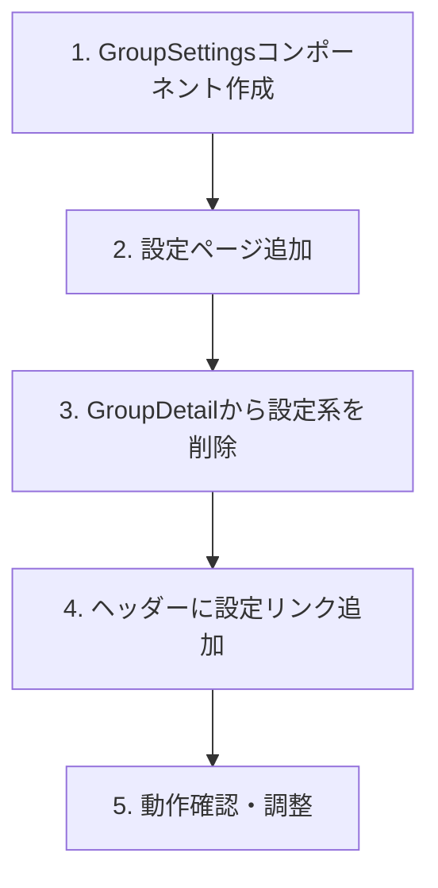

# ホーム画面リデザイン 設計ドキュメント

## 概要

グループ詳細画面（現在のホーム的役割）を整理し、シンプルで使いやすいホーム画面を実現する。

## 目的

現状のGroupDetail画面は情報過多で、本当に必要な情報にアクセスしにくい：

- 締め日、メンバー一覧、カテゴリ管理など設定系の情報が目立つ
- 日常的に使う「支出記録」「精算確認」へのアクセスが埋もれている
- モバイルファーストの観点で、スクロールが多い

### 現状の問題点

```
現在のGroupDetail:
┌──────────────────────────────────┐
│ グループ名                        │
├──────────────────────────────────┤
│ 📅 締め日: 毎月25日              │  ← 設定情報（毎日見る必要なし）
│ [カテゴリ管理] [買い物リスト]     │
├──────────────────────────────────┤
│ メンバー (3人)         [招待]    │  ← 設定情報
│ 田中, 佐藤, 山田                 │
├──────────────────────────────────┤
│ [支出] [精算] [分析]             │
│ ...コンテンツ...                 │
└──────────────────────────────────┘
```

## やること

### 機能要件

1. **ホーム画面のシンプル化**
   - 締め日、メンバー一覧、カテゴリ管理を削除
   - 支出一覧・精算・分析のみに集中

2. **設定画面の新設**
   - グループ設定を別画面に分離
   - 締め日、メンバー管理、カテゴリ管理を配置

3. **ナビゲーション改善**
   - 下部タブバーまたはヘッダー内設定アイコンでアクセス

### 非機能要件

- 既存機能の損失なし（設定画面に移動するだけ）
- ワンタップで支出記録可能を維持

## やり方

### 1. 新しい画面構成

```
変更後:
┌──────────────────────────────────┐
│ グループ名              [⚙️]    │  ← 設定は⚙️から
├──────────────────────────────────┤
│ [支出] [精算] [分析]             │
│ 期間ナビゲーター                 │
│                                  │
│ ...コンテンツ...                 │
│                                  │
│                                  │
│                                  │
│                          [➕]    │  ← 支出追加FAB
└──────────────────────────────────┘
```

### 2. 設定画面

新規ページ: `/groups/[groupId]/settings`

```
┌──────────────────────────────────┐
│ ← グループ設定                   │
├──────────────────────────────────┤
│                                  │
│ 📅 締め日                        │
│ 毎月 25 日                  [>]  │
│                                  │
├──────────────────────────────────┤
│                                  │
│ 👥 メンバー (3人)                │
│ 田中, 佐藤, 山田            [>]  │
│ [招待リンクを作成]               │
│                                  │
├──────────────────────────────────┤
│                                  │
│ 🏷️ カテゴリ                      │
│ 7個のカテゴリ               [>]  │
│                                  │
├──────────────────────────────────┤
│                                  │
│ 🛒 買い物リスト              [>] │
│                                  │
└──────────────────────────────────┘
```

### 3. ファイル構成

```
app/groups/[groupId]/
├── page.tsx              # ホーム（変更）
├── settings/
│   └── page.tsx          # 設定画面（新規）
├── expenses/
├── settlements/
└── shopping/
```

```
components/groups/
├── GroupDetail.tsx       # ホーム用にシンプル化
├── GroupSettings.tsx     # 設定画面（新規）
├── MemberList.tsx        # 設定画面で使用
└── InviteDialog.tsx      # 設定画面で使用
```

### 4. GroupDetailの変更

```tsx
// 変更後のGroupDetail（シンプル版）
export function GroupDetail({ group, members, categories, myRole }: Props) {
  return (
    <div className="space-y-4">
      {/* ヘッダー */}
      <div className="flex items-center justify-between">
        <h1 className="text-xl font-bold">{group.name}</h1>
        <Link href={`/groups/${group._id}/settings`}>
          <Settings className="h-5 w-5 text-slate-500" />
        </Link>
      </div>

      {/* タブ */}
      <div className="flex border-b">
        <TabButton active={tab === "expenses"}>支出</TabButton>
        <TabButton active={tab === "settlement"}>精算</TabButton>
        <TabButton active={tab === "analytics"}>分析</TabButton>
      </div>

      {/* 期間ナビゲーター */}
      <PeriodNavigator ... />

      {/* コンテンツ */}
      {tab === "expenses" && <PeriodExpenseList ... />}
      {tab === "settlement" && <SettlementContent ... />}
      {tab === "analytics" && <AnalyticsSection ... />}

      {/* FAB */}
      <FloatingActionButton href={`/groups/${group._id}/expenses/new`} />
    </div>
  );
}
```

### 5. 実装順序



### 6. ルーティング

| パス                         | 内容                               |
| ---------------------------- | ---------------------------------- |
| `/groups/[groupId]`          | ホーム（支出・精算・分析）         |
| `/groups/[groupId]/settings` | 設定（締め日・メンバー・カテゴリ） |
| `/groups/[groupId]/shopping` | 買い物リスト（既存）               |

## やらないこと

1. **下部タブバーの実装**: まずはシンプルに設定アイコンで対応
2. **締め日の編集機能**: 表示のみ（編集は将来対応）
3. **グループ名の編集**: 表示のみ
4. **グループ削除/退出**: 今回は対応しない

## 懸念事項

### 1. 買い物リストへのアクセス

**懸念**: 設定画面に移動すると、買い物リストへのアクセスが深くなる

**対応**:

- 選択肢A: ホームのヘッダーに買い物リストアイコンも配置
- 選択肢B: 設定画面からアクセス（設定というより機能だが）
- **推奨: 選択肢A**（買い物リストは日常的に使う機能）

### 2. メンバー数の把握

**懸念**: ホームからメンバー数がわからなくなる

**対応**:

- 精算タブで「誰が誰にいくら」が見えるので問題なし
- 必要なら設定アイコンの横にメンバー数バッジを表示

### 3. 新規ユーザーの初期設定

**懸念**: 初めて使う人が設定画面の存在に気づかない

**対応**:

- グループ作成直後は設定画面へ誘導するトースト表示
- ただし、デフォルト値で十分使えるので必須ではない

## UI詳細

### ホーム画面ヘッダー

```
┌──────────────────────────────────┐
│ 同棲家計簿          🛒  ⚙️      │
└──────────────────────────────────┘
```

- グループ名: 左寄せ、太字
- 買い物リスト: カートアイコン（日常利用）
- 設定: 歯車アイコン（たまに使う）

### 設定画面

セクション分けでわかりやすく：

1. **グループ情報**: 締め日
2. **メンバー**: 一覧 + 招待
3. **カテゴリ**: 一覧 + 追加/編集
4. **リンク**: 買い物リストへのショートカット

## 参考資料

- 現在のGroupDetail: `components/groups/GroupDetail.tsx`
- MemberList: `components/groups/MemberList.tsx`
- CategoryManager: `components/categories/CategoryManager.tsx`
