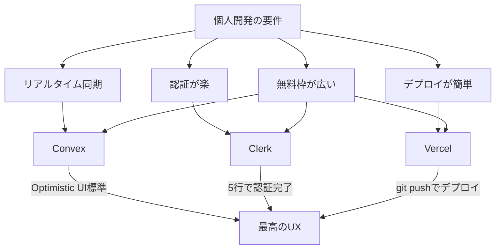
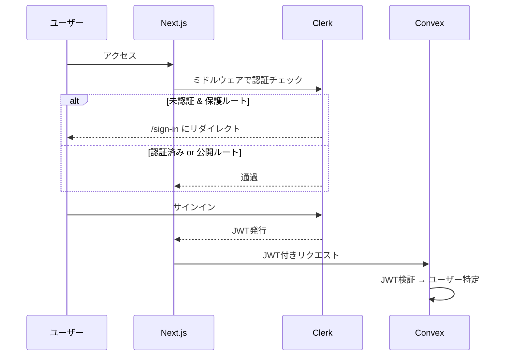
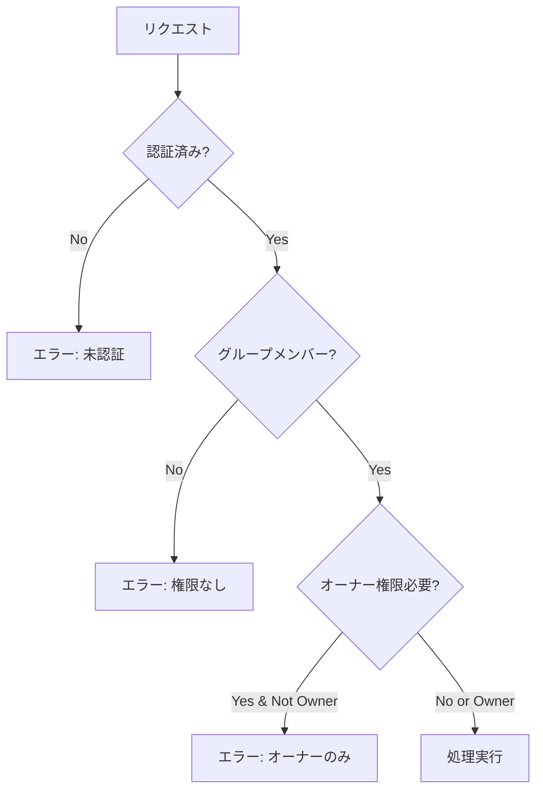
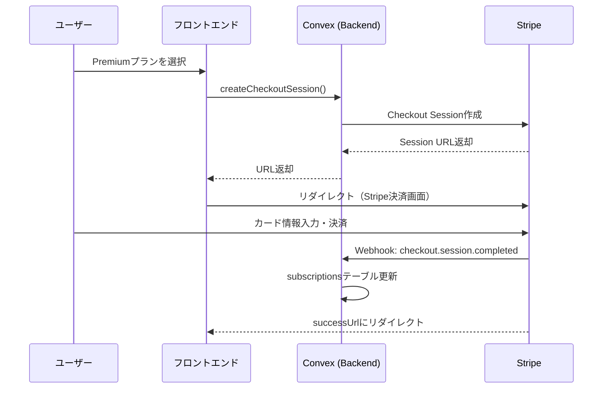
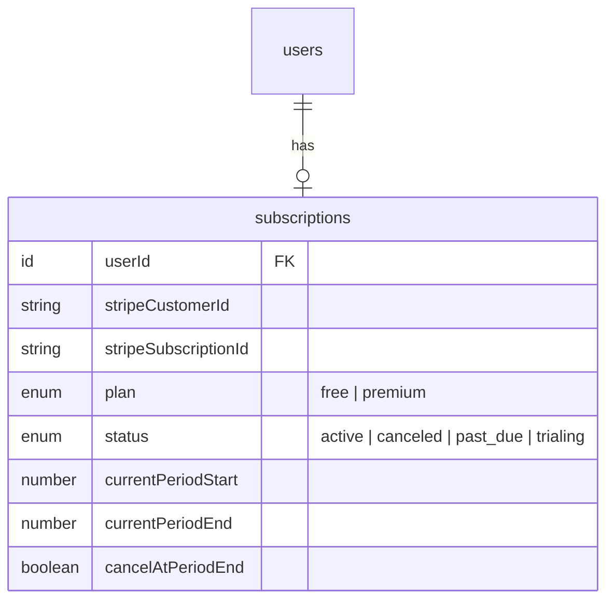
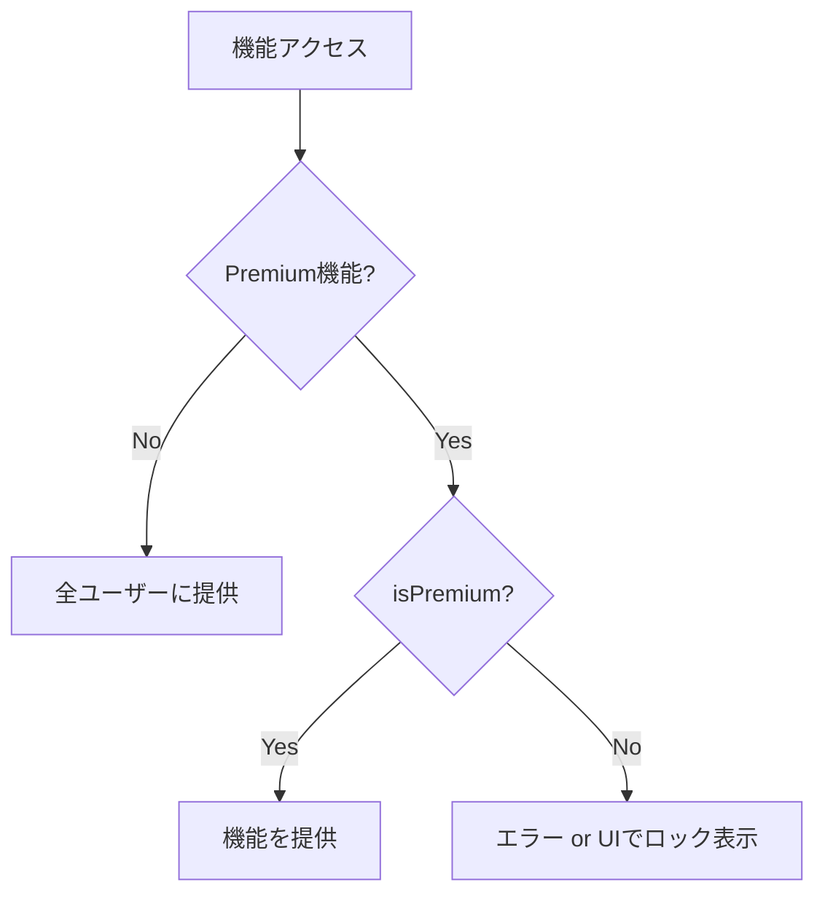
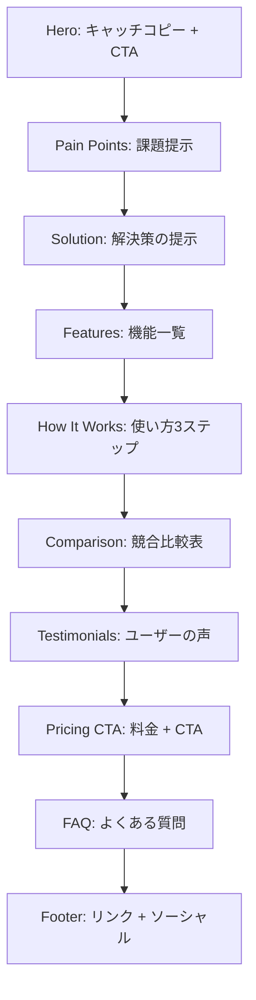
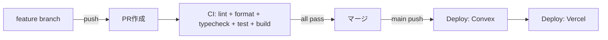
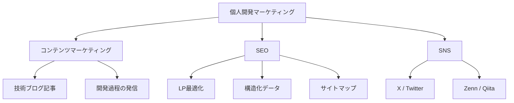
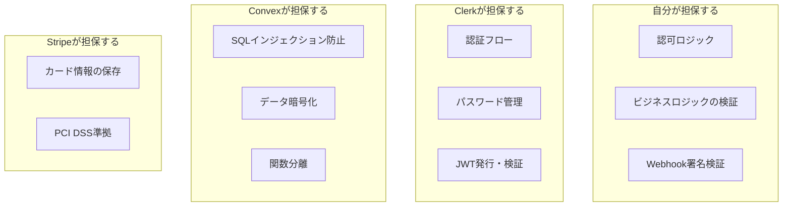

# 設計書: 個人開発プレイブック — Pairboから抽出した再利用可能な知見

## Overview

Pairbo（共有家計簿アプリ）の開発を通じて得た知見を、**次の個人開発プロダクトでそのまま再利用できるプレイブック**として整理する。
技術選定・認証・決済・LP・マーケティング・CI/CD・PWA・アイコン/OGP・テスト・セキュリティなど、プロダクト開発に必要な全領域をカバーする。

## Purpose

### なぜ必要か

個人開発では「前に一度やったことをもう一度調べ直す」コストが大きい。
Pairboで確立したパターンを体系化しておくことで、次のプロダクトでは**調査フェーズを大幅にスキップ**し、実装に集中できる。

### この文書の使い方

- 新しい個人開発を始めるときに、セクションごとにチェックリストとして参照する
- 各セクションは独立しているので、必要な部分だけ拾い読みできる
- 「Pairboでの実装例」を具体的に示しているので、コードの書き方に迷ったら参照元ファイルを確認する

---

## What to Do

以下の領域ごとに、やるべきことと具体的なパターンを整理する。

### タスク担当の凡例

各セクションのタスクには以下のアイコンで担当を明示する:

| アイコン | 担当                     | 説明                                                       |
| -------- | ------------------------ | ---------------------------------------------------------- |
| **🤖**   | **Claude（自動化可能）** | コード実装、CLI操作、API呼び出し、ファイル生成など         |
| **👤**   | **開発者（手動操作）**   | ブラウザUIでの操作、アカウント作成、ダッシュボード設定など |
| **🤝**   | **共同作業**             | 開発者が情報を取得し、Claudeが実装に反映                   |

---

## 0. 全タスク俯瞰: Claude vs 開発者

新プロジェクト立ち上げ時に、何を自分でやり何をClaudeに任せるかを一覧で把握するためのセクション。

### 開発者が手動でやること（ブラウザ/ダッシュボード操作）

| #   | タスク                                 | サービス                | タイミング         | 備考                           |
| --- | -------------------------------------- | ----------------------- | ------------------ | ------------------------------ |
| 1   | Clerkプロジェクト作成                  | Clerk Dashboard         | プロジェクト開始時 | APIキー取得                    |
| 2   | Clerk本番キー発行                      | Clerk Dashboard         | リリース前         | Live mode有効化                |
| 3   | Stripeアカウント作成・本人確認         | Stripe Dashboard        | 決済実装前         | ビジネス情報・銀行口座登録     |
| 4   | Stripe商品・価格作成                   | Stripe Dashboard        | 決済実装時         | Price ID を控える              |
| 5   | Stripe Webhook エンドポイント登録      | Stripe Dashboard        | 決済実装時         | Signing Secret を控える        |
| 6   | Stripe Customer Portal 有効化          | Stripe Dashboard        | 決済実装時         | 解約・プラン変更許可           |
| 7   | Convexプロジェクト作成                 | Convex Dashboard        | プロジェクト開始時 | Deploy Key 取得                |
| 8   | Convex環境変数設定                     | Convex Dashboard or CLI | 随時               | `npx convex env set` でもCLI可 |
| 9   | Vercelプロジェクト作成・リポジトリ連携 | Vercel Dashboard        | プロジェクト開始時 | Deploy Hook URL 取得           |
| 10  | Vercel環境変数設定                     | Vercel Dashboard        | 随時               | `NEXT_PUBLIC_*` 系             |
| 11  | Sentryプロジェクト作成                 | Sentry Dashboard        | 開発初期           | DSN, Auth Token 取得           |
| 12  | GA4プロパティ作成                      | Google Analytics        | リリース前         | Measurement ID 取得            |
| 13  | Google Search Console サイト登録       | Search Console          | リリース前         | 所有権確認コード取得           |
| 14  | Google AdSense申請                     | AdSense Dashboard       | リリース後         | 審査通過が必要                 |
| 15  | GitHub Secrets設定                     | GitHub Settings         | CI/CD構築時        | リポジトリ Settings → Secrets  |
| 16  | OGP画像作成                            | デザインツール          | リリース前         | Figma/Canva等で1200x630px      |
| 17  | アプリアイコン・ロゴ作成               | デザインツール          | 開発初期           | 1024x1024以上の元画像          |
| 18  | スクリーンショット撮影                 | ブラウザ                | LP制作時           | 実際のアプリ画面をキャプチャ   |
| 19  | ドメイン取得・DNS設定                  | レジストラ/Vercel       | リリース前         | カスタムドメイン               |
| 20  | Lighthouseスコア確認                   | Chrome DevTools         | リリース前         | Performance, A11y, SEO         |

### Claudeが自動でできること（コード/CLI/API）

| #   | タスク                         | カテゴリ     | 備考                                             |
| --- | ------------------------------ | ------------ | ------------------------------------------------ |
| 1   | プロジェクト雛形生成           | セットアップ | `create-next-app` + 設定ファイル一式             |
| 2   | Convexスキーマ定義             | バックエンド | `convex/schema.ts`                               |
| 3   | 認証統合コード                 | 認証         | ConvexClientProvider, middleware, auth.config.ts |
| 4   | authQuery/authMutation実装     | 認証         | 認証ラッパー関数                                 |
| 5   | サインイン/サインアップページ  | 認証         | Clerkコンポーネント配置                          |
| 6   | Stripe Checkout Session実装    | 決済         | Convex action                                    |
| 7   | Stripe Webhook Handler実装     | 決済         | convex/http.ts                                   |
| 8   | サブスクリプション管理ロジック | 決済         | isPremium, 機能ゲーティング                      |
| 9   | Pricing Page実装               | 決済         | フロントエンド                                   |
| 10  | LP全セクション実装             | LP           | LandingPage.tsx                                  |
| 11  | SEOメタデータ設定              | SEO          | layout.tsx metadata                              |
| 12  | 構造化データ（JSON-LD）        | SEO          | WebApplication, FAQPage                          |
| 13  | sitemap.ts / robots.txt        | SEO          | Next.js標準                                      |
| 14  | PWA Manifest / Service Worker  | PWA          | manifest.ts, sw.ts                               |
| 15  | オフラインページ               | PWA          | /offline                                         |
| 16  | GA4コンポーネント              | 分析         | GoogleAnalytics.tsx, analytics.ts                |
| 17  | Sentry設定                     | 監視         | sentry.\*.config.ts, next.config.ts              |
| 18  | CI/CDワークフロー              | DevOps       | .github/workflows/\*.yml                         |
| 19  | Pre-commit hooks               | DevOps       | Husky + lint-staged                              |
| 20  | ESLint/Prettier/TypeScript設定 | DevOps       | 設定ファイル一式                                 |
| 21  | テスト実装                     | テスト       | Vitest + convex-test                             |
| 22  | プライバシーポリシーページ     | 法務         | /privacy                                         |
| 23  | 利用規約ページ                 | 法務         | /terms                                           |
| 24  | 特定商取引法ページ             | 法務         | /legal/tokushoho（内容は開発者が確認）           |
| 25  | 404ページ                      | UX           | app/not-found.tsx                                |
| 26  | 環境変数テンプレート           | セットアップ | .env.example                                     |
| 27  | Convex環境変数設定             | セットアップ | `npx convex env set`（CLI経由）                  |
| 28  | PWAアイコンリサイズ            | PWA          | sharpやCLIツールで元画像から全サイズ生成         |
| 29  | AdSenseコンポーネント          | 収益化       | GoogleAdSense.tsx, ads.txt                       |
| 30  | お問い合わせフォーム           | UX           | InquiryDialog + Convex mutation                  |

### 共同作業（開発者が情報提供 → Claudeが実装）

| #   | タスク                 | 開発者がやること               | Claudeがやること                            |
| --- | ---------------------- | ------------------------------ | ------------------------------------------- |
| 1   | 環境変数の反映         | ダッシュボードからキーをコピー | `.env.local`や設定ファイルに反映            |
| 2   | Stripe Price ID反映    | Dashboardで作成してIDを伝える  | コードと環境変数に設定                      |
| 3   | OGP画像配置            | 画像を作成して渡す             | `public/og-image.png`に配置、metadataに設定 |
| 4   | アイコン配置           | ロゴの元画像を渡す             | 全サイズ生成、manifest登録                  |
| 5   | スクリーンショット配置 | 画面キャプチャを撮影して渡す   | `public/screenshots/`に配置、LPに組み込み   |
| 6   | 特定商取引法の内容     | 事業者情報を伝える             | ページに実装                                |
| 7   | GA Measurement ID      | GA4で取得して伝える            | コンポーネントに設定                        |
| 8   | ドメイン設定           | DNS設定を行う                  | sitemap/metadataのURLを更新                 |

---

## 1. 技術選定

### 1.1 判断軸

| 軸                           | 説明                                            |
| ---------------------------- | ----------------------------------------------- |
| **個人開発に現実的か**       | 学習コスト・運用コスト・無料枠の広さ            |
| **ユーザー体験に直結するか** | リアルタイム同期、Optimistic UI、初期ロード速度 |
| **スケール時に破綻しないか** | 無料枠超過時のコスト曲線、移行パスの有無        |

### 1.2 Pairboで選んだスタック（推奨構成）

```
Frontend:  Next.js (App Router)
Backend:   Convex (DB + API + リアルタイム同期)
Auth:      Clerk
Deploy:    Vercel (Frontend) + Convex (Backend)
Payment:   Stripe
Monitor:   Sentry
Analytics: Google Analytics 4
PWA:       Serwist (Service Worker)
UI:        shadcn/ui + Radix UI + Tailwind CSS v4
Test:      Vitest + convex-test
```

### 1.3 この構成を選ぶ理由



### 1.4 各サービスの無料枠（2026年3月時点）

| サービス | 無料枠            | 超過時    | 目安              |
| -------- | ----------------- | --------- | ----------------- |
| Convex   | 1M関数呼び出し/月 | 従量課金  | 〜数千MAUまで無料 |
| Clerk    | 10,000 MAU        | $0.02/MAU | 小〜中規模は無料  |
| Vercel   | 100GB帯域幅/月    | 従量課金  | 個人開発なら十分  |
| Stripe   | 取引額の3.6%      | —         | 固定費なし        |
| Sentry   | 5K errors/月      | 従量課金  | 小規模は無料      |
| GA4      | 実質無制限        | —         | 無料              |

### 1.5 フロントエンドフレームワーク比較（Pairboで検討した結果）

| FW                          | Pros                                | Cons           | 向いているケース       |
| --------------------------- | ----------------------------------- | -------------- | ---------------------- |
| **Next.js (App Router)**    | エコシステム最大、RSC、Vercel最適化 | 複雑化傾向     | 堅実に行きたい（推奨） |
| **Remix / React Router v7** | Web標準、Form/Loader明確            | 情報少ない     | フォーム多いアプリ     |
| **Vite + React (SPA)**      | シンプル、軽量                      | SSR/SEO弱い    | 管理画面系             |
| **SvelteKit**               | 記述量最少、軽量高速                | エコシステム小 | シンプルさ重視         |

### 1.6 UI コンポーネント戦略

**推奨: shadcn/ui + Radix UI + Tailwind CSS**

- shadcn/ui はコードをコピーして自分のプロジェクトに置く方式 → カスタマイズ自由
- Radix UI がアクセシビリティを担保
- Tailwind CSS でスタイリング（v4からPostCSS @plugin方式）
- CVA (Class Variance Authority) でコンポーネントバリアント管理

```
components/ui/          ← shadcn/ui ベースのプリミティブ
  button.tsx
  dialog.tsx
  input.tsx
  select.tsx
  ...
```

---

## 2. 認証（Authentication）

### 2.1 全体アーキテクチャ



### 2.2 やるべきこと一覧

| #   | 担当 | タスク                         | 詳細                                                         |
| --- | ---- | ------------------------------ | ------------------------------------------------------------ |
| 1   | 👤   | **Clerkプロジェクト作成**      | dashboard.clerk.comで新規作成、APIキー取得                   |
| 2   | 🤝   | **環境変数設定**               | 👤キー取得 → 🤖`.env.local`に反映                            |
| 3   | 🤖   | **ConvexClientProvider**       | `ClerkProvider` + `ConvexProviderWithClerk` でラップ         |
| 4   | 🤖   | **Convex auth.config.ts**      | Clerk Issuer URLをプロバイダーとして登録                     |
| 5   | 🤖   | **ミドルウェア**               | 公開ルートの定義、保護ルートの設定                           |
| 6   | 🤖   | **サインインページ**           | `/sign-in/[[...sign-in]]/page.tsx` にClerkコンポーネント配置 |
| 7   | 🤖   | **ユーザーテーブル**           | Convex DBにusersテーブル、`by_clerk_id`インデックス          |
| 8   | 🤖   | **authQuery / authMutation**   | 認証済みコンテキストを提供するラッパー関数                   |
| 9   | 🤖   | **初回ログイン時ユーザー作成** | authMutation内で自動作成                                     |
| 10  | 🤖   | **日本語化**                   | `@clerk/localizations` の `jaJP` を適用                      |

### 2.3 キーファイルと実装パターン

**ConvexClientProvider（フロントエンド統合の要）:**

```typescript
// components/ConvexClientProvider.tsx
<ClerkProvider localization={jaJP}>
  <ConvexProviderWithClerk client={convex} useAuth={useAuth}>
    {children}
  </ConvexProviderWithClerk>
</ClerkProvider>
```

**Convex Auth Config:**

```typescript
// convex/auth.config.ts
export default {
  providers: [
    {
      domain: process.env.CLERK_ISSUER_URL,
      applicationID: "convex",
    },
  ],
};
```

**認証ミドルウェア:**

```typescript
// middleware.ts（公開ルートの定義）
const publicRoutes = createRouteMatcher([
  "/",
  "/sign-in(.*)",
  "/sign-up(.*)",
  "/pricing",
  "/privacy",
  "/terms",
  "/invite/(.*)", // 招待リンクは認証不要
  "/offline",
]);
```

**authQuery / authMutation パターン:**

```typescript
// convex/lib/auth.ts
// authQuery: ユーザーが存在しなければエラー（読み取り用）
// authMutation: ユーザーが存在しなければ自動作成（書き込み用）

export const getMe = authQuery({
  args: {},
  handler: async (ctx) => {
    // ctx.user は認証済みユーザー（保証済み）
    return ctx.user;
  },
});
```

### 2.4 認可（Authorization）

グループベースのアクセス制御が必要な場合:



**実装ヘルパー:**

- `requireGroupMember(ctx, groupId)` — メンバーでなければエラー
- `requireGroupOwner(ctx, groupId)` — オーナーでなければエラー

### 2.5 環境変数一覧

```bash
# .env.local（フロントエンド）
NEXT_PUBLIC_CLERK_PUBLISHABLE_KEY=pk_test_xxx
CLERK_SECRET_KEY=sk_test_xxx
NEXT_PUBLIC_CLERK_SIGN_IN_URL=/sign-in
NEXT_PUBLIC_CLERK_SIGN_UP_URL=/sign-up
NEXT_PUBLIC_CLERK_AFTER_SIGN_IN_URL=/
NEXT_PUBLIC_CLERK_AFTER_SIGN_UP_URL=/

# Convex環境変数（convex env set）
CLERK_ISSUER_URL=https://xxx.clerk.accounts.dev
```

---

## 3. 決済（Stripe）

### 3.1 全体アーキテクチャ



### 3.2 やるべきこと一覧

| #   | 担当 | タスク                      | 詳細                                                      |
| --- | ---- | --------------------------- | --------------------------------------------------------- |
| 1   | 👤   | **Stripeアカウント作成**    | ビジネス情報・銀行口座を登録（本人確認あり）              |
| 2   | 👤   | **商品・価格作成**          | Stripeダッシュボードで商品と価格（月額/年額）を作成       |
| 3   | 👤   | **Webhook設定**             | ダッシュボードでエンドポイントURL登録、Signing Secret取得 |
| 4   | 👤   | **Customer Portal有効化**   | ダッシュボードで解約・プラン変更を許可                    |
| 5   | 🤖   | **subscriptionsテーブル**   | userId, stripeCustomerId, plan, status等のスキーマ定義    |
| 6   | 🤖   | **Checkout Session Action** | Convex actionでStripe APIを呼び出し                       |
| 7   | 🤖   | **Webhook Handler**         | HTTP endpointで署名検証 → イベント処理                    |
| 8   | 🤖   | **Premium判定ヘルパー**     | `isPremium(ctx, userId)` で機能ゲーティング               |
| 9   | 🤖   | **Pricing Page**            | フロントエンドの料金表示・チェックアウトUI                |
| 10  | 🤝   | **特定商取引法ページ**      | 👤事業者情報を提供 → 🤖ページ実装                         |

### 3.3 データモデル



### 3.4 Webhook で処理すべきイベント

| イベント                        | 処理内容                           |
| ------------------------------- | ---------------------------------- |
| `checkout.session.completed`    | サブスクリプション作成/更新        |
| `customer.subscription.updated` | ステータス・期間・解約フラグ更新   |
| `customer.subscription.deleted` | freeプランに戻す（ソフトデリート） |
| `invoice.payment_failed`        | ステータスを`past_due`に           |

### 3.5 フリーミアムの機能ゲーティング



**Premium判定ロジック（優先順位）:**

1. `users.planOverride` があればそれを使用（管理者/テスト用）
2. subscriptionsテーブルで `active` or `trialing` → premium
3. `canceled` だが `currentPeriodEnd` が未来 → premium（期間終了まで利用可）
4. それ以外 → free

**サーバーサイドでブロック（重要）:**

```typescript
// convex/expenses.ts（例）
if (splitMethod !== "equal" && splitMethod !== "full") {
  const canUse = await canUseSlopedSplit(ctx, ctx.user._id);
  if (!canUse) {
    throw new ConvexError("この機能はPremiumプランでご利用いただけます");
  }
}
```

### 3.6 価格設計の考え方

| 項目   | Pairboの設定          | 考え方                               |
| ------ | --------------------- | ------------------------------------ |
| 月額   | ¥300                  | コーヒー1杯以下 → 心理的ハードル低い |
| 年額   | ¥2,400 (月あたり¥200) | 月額の約33%割引 → 年額への誘導       |
| 無料枠 | 基本機能すべて        | 無料でも十分使える → 信頼獲得        |

### 3.7 環境変数

```bash
# Convex環境変数（npx convex env set）
STRIPE_SECRET_KEY=sk_live_xxx          # Stripe秘密鍵
STRIPE_WEBHOOK_SECRET=whsec_xxx        # Webhook署名検証用
STRIPE_PRICE_MONTHLY=price_xxx         # 月額Price ID
STRIPE_PRICE_YEARLY=price_xxx          # 年額Price ID
```

---

## 4. LP（ランディングページ）

### 4.1 セクション構成（推奨パターン）



### 4.2 各セクションのポイント

| セクション       | ポイント                                 | Pairboの例                                     |
| ---------------- | ---------------------------------------- | ---------------------------------------------- |
| **Hero**         | 感情に訴えるコピー、デバイスモックアップ | 「ふたりの支出を、もっとフェアに。」           |
| **Pain Points**  | ターゲットの課題を3-4個                  | 負担割合、共同口座、アプリインストール…        |
| **Solution**     | 課題→解決の1対1マッピング                | 問題→Pairboならこう解決                        |
| **Features**     | アイコン付きカード6個程度                | URL招待、傾斜折半、PWA…                        |
| **How It Works** | スクリーンショット付き3ステップ          | グループ作成→支出記録→精算                     |
| **Comparison**   | 競合との○×表                             | Pairbo vs ネイティブアプリ vs スプレッドシート |
| **Testimonials** | ペルソナベースでOK（初期は架空でも可）   | 同棲カップル、共働き夫婦、シェアハウス         |
| **Pricing CTA**  | ダーク背景で目立たせる                   | 無料で始められる + Premiumの特典               |
| **FAQ**          | 5-6個、折りたたみ式                      | 料金、インストール、セキュリティ…              |
| **Sticky CTA**   | モバイルで常時表示の固定ボタン           | 画面下部に固定CTA                              |

### 4.3 LP競合分析テンプレート

新しいプロダクトを作るとき、競合のLPを分析してから自分のLPを作る:

| アプリ | Heroメッセージ | 特徴的な手法         |
| ------ | -------------- | -------------------- |
| 競合A  | 「xxx」        | 感情訴求、ペルソナ別 |
| 競合B  | 「xxx」        | 定量的成果証明       |
| 競合C  | 「xxx」        | 問題→解決パターン    |

### 4.4 コピーライティングの原則

- **機能説明ではなく感情に訴える**: ✗「かんたん支出記録」→ ✓「収入差があっても、フェアに」
- **差別化を Hero レベルで打ち出す**: 埋もれさせない
- **具体的な数字を入れる**: 「3タップで記録完了」「月額¥300」

---

## 5. SEO・OGP・構造化データ

### 5.1 やるべきこと一覧

| #   | 担当 | タスク                    | ファイル                                    |
| --- | ---- | ------------------------- | ------------------------------------------- |
| 1   | 🤖   | **メタデータ設定**        | `app/layout.tsx` の `metadata`              |
| 2   | 👤   | **OGP画像作成**           | デザインツールで1200x630pxの画像を作成      |
| 3   | 🤖   | **OGP画像設定**           | `public/og-image.png`配置 + metadata反映    |
| 4   | 🤖   | **Twitter Card**          | `metadata.twitter` に `summary_large_image` |
| 5   | 🤖   | **sitemap.xml**           | `app/sitemap.ts`（Next.js標準）             |
| 6   | 🤖   | **robots.txt**            | `public/robots.txt`                         |
| 7   | 🤖   | **構造化データ**          | JSON-LD（WebApplication, FAQPage）          |
| 8   | 👤   | **Google Search Console** | サイト登録・所有権確認（ブラウザ操作）      |
| 9   | 🤖   | **Search Console反映**    | `verification` メタタグをlayout.tsxに設定   |

### 5.2 OGP画像の要件

- サイズ: **1200x630px**（推奨、これ以下だとSNSでぼやける）
- 内容: プロダクト名 + キャッチコピー + ブランドカラー
- フォーマット: PNG
- 配置: `public/og-image.png`

### 5.3 構造化データ（JSON-LD）

Webアプリの場合、以下の2つを`<script type="application/ld+json">`で埋め込む:

1. **WebApplication** — アプリ情報、価格、カテゴリ
2. **FAQPage** — FAQセクションの内容（Google検索でリッチリザルト表示）

### 5.4 sitemap.ts テンプレート

```typescript
// app/sitemap.ts
export default function sitemap() {
  return [
    {
      url: "https://yourapp.com",
      lastModified: new Date(),
      priority: 1.0,
      changeFrequency: "weekly",
    },
    {
      url: "https://yourapp.com/pricing",
      priority: 0.8,
      changeFrequency: "monthly",
    },
    {
      url: "https://yourapp.com/privacy",
      priority: 0.3,
      changeFrequency: "yearly",
    },
    {
      url: "https://yourapp.com/terms",
      priority: 0.3,
      changeFrequency: "yearly",
    },
  ];
}
```

---

## 6. PWA（Progressive Web App）

### 6.1 やるべきこと一覧

| #   | 担当 | タスク               | 詳細                                                     |
| --- | ---- | -------------------- | -------------------------------------------------------- |
| 1   | 🤖   | **Web App Manifest** | `app/manifest.ts` でアプリ名・アイコン・テーマカラー定義 |
| 2   | 🤖   | **Service Worker**   | Serwist (`@serwist/next`) でキャッシュ + オフライン対応  |
| 3   | 🤝   | **アプリアイコン**   | 👤元ロゴ作成 → 🤖全サイズ生成(sharp等) + manifest登録    |
| 4   | 🤖   | **Apple Touch Icon** | `public/icons/apple-touch-icon.png` 配置                 |
| 5   | 🤖   | **オフラインページ** | `/offline` にフォールバックページ                        |
| 6   | 🤖   | **メタタグ**         | `apple-mobile-web-app-capable`, `theme-color`            |

### 6.2 必要なアイコンサイズ

| サイズ           | 用途                      |
| ---------------- | ------------------------- |
| 72x72            | Android (ldpi)            |
| 96x96            | Android (mdpi)            |
| 128x128          | Chrome Web Store          |
| 144x144          | Windows タイル            |
| 152x152          | iPad                      |
| 192x192          | Android ホーム画面        |
| 384x384          | Android スプラッシュ      |
| 512x512          | Android スプラッシュ (HD) |
| 512x512 maskable | アダプティブアイコン      |
| apple-touch-icon | iOS ホーム画面            |

### 6.3 アイコン作成のコツ

- **1つの高解像度ロゴ（1024x1024以上）から全サイズを生成**する
- maskableアイコンは中央に余白を持たせる（セーフゾーン = 中心の80%円内）
- ツール: [maskable.app](https://maskable.app/) でプレビュー確認
- favicon.icoは別途16x16/32x32のマルチサイズICOファイルを用意

### 6.4 Manifest テンプレート

```typescript
// app/manifest.ts
export default function manifest() {
  return {
    name: "アプリ名 - キャッチコピー",
    short_name: "アプリ名",
    start_url: "/",
    scope: "/",
    display: "standalone",
    background_color: "#ffffff",
    theme_color: "#3b82f6",
    categories: ["finance", "productivity"],
    orientation: "portrait",
    icons: [
      { src: "/icons/icon-192x192.png", sizes: "192x192", type: "image/png" },
      { src: "/icons/icon-512x512.png", sizes: "512x512", type: "image/png" },
      {
        src: "/icons/icon-maskable-512x512.png",
        sizes: "512x512",
        type: "image/png",
        purpose: "maskable",
      },
    ],
  };
}
```

---

## 7. アナリティクス・モニタリング

### 7.1 導入すべきツール

| ツール                    | 目的                           | 必須度 | セットアップ担当    | 実装担当                |
| ------------------------- | ------------------------------ | ------ | ------------------- | ----------------------- |
| **Google Analytics 4**    | ユーザー行動分析               | 必須   | 👤 プロパティ作成   | 🤖 コンポーネント実装   |
| **Sentry**                | エラー監視・パフォーマンス     | 必須   | 👤 プロジェクト作成 | 🤖 設定ファイル実装     |
| **Google Search Console** | SEO監視                        | 必須   | 👤 サイト登録       | 🤖 verificationメタタグ |
| **Google AdSense**        | 広告収益（フリーミアムの場合） | 任意   | 👤 申請・審査       | 🤖 コンポーネント実装   |

### 7.2 GA4 導入パターン

```typescript
// components/GoogleAnalytics.tsx
// Next.js Script componentでafterInteractiveで読み込み
<Script src={`https://www.googletagmanager.com/gtag/js?id=${GA_ID}`} strategy="afterInteractive" />
```

**カスタムイベント追跡:**

```typescript
// lib/analytics.ts
export function trackEvent(
  eventName: string,
  params?: Record<string, unknown>,
) {
  if (typeof window !== "undefined" && window.gtag) {
    window.gtag("event", eventName, params);
  }
}

// 使用例: trackEvent("upgrade_premium", { price_type: "monthly", value: 300, currency: "JPY" })
```

**追跡すべきイベント:**

- `upgrade_premium` — 課金コンバージョン
- `submit_inquiry` — お問い合わせ送信
- サインアップ完了（Clerkのイベント連携）

### 7.3 Sentry 設定のポイント

- **tracesSampleRate: 0.2**（本番環境では1.0にしない → コスト爆発する）
- `sentry.server.config.ts` と `sentry.edge.config.ts` の両方を設定
- `next.config.ts` を `withSentryConfig()` でラップ
- ソースマップは CI でアップロード（`SENTRY_AUTH_TOKEN`を設定）

---

## 8. CI/CD

### 8.1 全体フロー



### 8.2 CI ワークフロー（PR時）

並列で実行して高速化:

| Job              | コマンド                | 目的           |
| ---------------- | ----------------------- | -------------- |
| lint             | `pnpm lint`             | ESLint         |
| format           | `pnpm format:check`     | Prettier       |
| typecheck        | `pnpm typecheck`        | TypeScript     |
| test-unit        | `pnpm test:unit`        | ユニットテスト |
| test-integration | `pnpm test:integration` | 結合テスト     |
| build            | `next build`            | ビルド確認     |

### 8.3 Deploy ワークフロー（main push時）

**重要: Convex → Vercel の順に実行（順次）**

```yaml
# 理由: ConvexのスキーマがVercelのビルドより先に反映される必要がある
jobs:
  deploy-convex:
    runs-on: ubuntu-latest
    steps:
      - run: pnpm dlx convex deploy --yes
    env:
      CONVEX_DEPLOY_KEY: ${{ secrets.CONVEX_DEPLOY_KEY }}

  deploy-vercel:
    needs: deploy-convex # Convex完了後に実行
    runs-on: ubuntu-latest
    steps:
      - run: curl -X POST ${{ secrets.VERCEL_DEPLOY_HOOK }}
```

### 8.4 ローカル開発の品質ゲート

**Pre-commit hook (Husky + lint-staged):**

```json
// package.json
"lint-staged": {
  "*.{js,jsx,ts,tsx}": ["eslint --fix", "prettier --write"],
  "*.{json,md,yml,yaml,css}": ["prettier --write"]
}
```

**PR作成前のローカルチェック（必須）:**

```bash
pnpm format      # フォーマット
pnpm lint        # ESLint
pnpm typecheck   # 型チェック
pnpm test:run    # テスト
```

### 8.5 GitHub Actions 再利用可能セットアップ

```yaml
# .github/actions/setup/action.yml
# pnpm + Node.js + キャッシュ付きインストール
- uses: pnpm/action-setup@v4
  with:
    version: 10
- uses: actions/setup-node@v4
  with:
    node-version: "20"
    cache: "pnpm"
- run: pnpm install --frozen-lockfile
```

---

## 9. テスト

### 9.1 テスト戦略

| レイヤー       | ツール               | テスト対象                   |
| -------------- | -------------------- | ---------------------------- |
| ユニットテスト | Vitest + convex-test | Convex関数、ドメインロジック |
| 結合テスト     | Vitest + convex-test | 複数関数をまたぐシナリオ     |
| E2Eテスト      | （未導入）           | ユーザーフロー全体           |

### 9.2 Vitest 設定

```typescript
// vitest.config.mts
export default defineConfig({
  test: {
    globals: true,
    testTimeout: 10000,
    environment: "edge-runtime", // Convex関数のテストに必要
    include: ["convex/**/*.test.ts", "lib/**/*.test.ts"],
  },
});
```

### 9.3 テストファイル配置規約

```
convex/__tests__/
  users.test.ts
  expenses.test.ts
  subscriptions.test.ts
  ...
  settledExpense.integration.test.ts  ← 結合テストは .integration.test.ts
```

---

## 10. マーケティング

### 10.1 個人開発のマーケティング戦略



### 10.2 やるべきこと一覧

| #   | タスク | 詳細               |
| --- | ------ | ------------------ | --------------------------------------- |
| 1   | 👤     | **ターゲット定義** | プライマリターゲット + ペルソナ作成     |
| 2   | 🤖     | **競合分析**       | Web検索で競合を調査、機能比較表を作成   |
| 3   | 🤝     | **差別化の言語化** | 👤方向性決定 → 🤖コピー案作成           |
| 4   | 🤖     | **LP制作**         | セクション4参照                         |
| 5   | 🤖     | **SEO対策**        | セクション5参照                         |
| 6   | 🤝     | **GA4導入**        | 👤プロパティ作成 → 🤖コンポーネント実装 |
| 7   | 👤     | **SNSアカウント**  | X, Zenn等のプロフィール整備             |
| 8   | 👤     | **技術ブログ**     | 開発過程の発信（Zenn / Qiita）          |
| 9   | 👤     | **ソフトローンチ** | 公開だが未告知の状態で品質確認          |
| 10  | 👤     | **本告知**         | SNS、ブログ、コミュニティで告知         |

### 10.3 フッターに必要なリンク

- プライバシーポリシー (`/privacy`)
- 利用規約 (`/terms`)
- 特定商取引法に基づく表記 (`/legal/tokushoho`) — 有料サービスの場合
- お問い合わせ先（X / メール）
- SNSリンク（X, Zenn等）

---

## 11. 法務・コンプライアンス

### 11.1 必要なページ

| ページ                       | 必須条件                                     | 内容                                         |
| ---------------------------- | -------------------------------------------- | -------------------------------------------- |
| **プライバシーポリシー**     | 個人情報を扱う場合（ほぼ必須）               | 収集情報、利用目的、第三者提供、セキュリティ |
| **利用規約**                 | サービス提供する場合（ほぼ必須）             | 適用範囲、禁止事項、免責事項                 |
| **特定商取引法に基づく表記** | 有料サービスを提供する場合（**法律上必須**） | 事業者名、連絡先、価格、返品/解約条件        |

### 11.2 特定商取引法ページの必須項目

```
- 事業者名
- 連絡先（メールアドレス）
- 住所・電話番号（請求があれば遅滞なく開示）
- 販売価格（税込）
- 支払方法
- 支払時期
- サービス提供時期
- 返品/キャンセル条件
```

---

## 12. セキュリティ

### 12.1 チェックリスト

| カテゴリ          | チェック項目                                                                   |
| ----------------- | ------------------------------------------------------------------------------ |
| **認証**          | ctx.auth.getUserIdentity()でサーバーサイド認証、userIdをargs経由で受け取らない |
| **認可**          | グループメンバーシップを全mutation/queryで検証                                 |
| **入力検証**      | Convex validatorで全argsをバリデーション                                       |
| **Webhook**       | Stripe署名検証を必ず実施                                                       |
| **環境変数**      | 秘密鍵はConvex環境変数に保存、フロントエンドに露出させない                     |
| **CORS**          | Convex HTTP endpointのCORSヘッダー設定                                         |
| **Rate Limiting** | 公開APIにレートリミット検討                                                    |
| **依存関係**      | `npm audit` で脆弱性を定期チェック                                             |

### 12.2 技術スタックのセキュリティ責任分担



---

## 13. プロジェクト構成テンプレート

### 13.1 ディレクトリ構成

```
project-root/
├── app/                        # Next.js App Router
│   ├── (public-pages)/         # 公開ページ（LP, pricing, legal...）
│   ├── (protected-pages)/      # 認証必要ページ
│   ├── sign-in/[[...sign-in]]/ # Clerk認証
│   ├── sign-up/[[...sign-up]]/
│   ├── layout.tsx              # ルートレイアウト（メタデータ、プロバイダー）
│   ├── globals.css             # Tailwind + CSS変数
│   ├── manifest.ts             # PWA
│   ├── sitemap.ts              # SEO
│   └── sw.ts                   # Service Worker
│
├── components/
│   ├── ui/                     # shadcn/uiベースのプリミティブ
│   ├── landing/                # LPコンポーネント
│   ├── [feature]/              # 機能別コンポーネント
│   ├── ConvexClientProvider.tsx
│   ├── GoogleAnalytics.tsx
│   └── GoogleAdSense.tsx
│
├── convex/                     # バックエンド（Convex）
│   ├── __tests__/              # テスト
│   ├── domain/                 # ドメインロジック（DDD風）
│   ├── lib/                    # 共有ユーティリティ
│   ├── schema.ts               # DBスキーマ
│   ├── auth.config.ts          # 認証設定
│   └── http.ts                 # HTTP endpoints（Webhook等）
│
├── hooks/                      # カスタムReact hooks
├── lib/                        # フロントエンド共有ユーティリティ
├── public/
│   ├── icons/                  # PWAアイコン
│   ├── screenshots/            # LPスクリーンショット
│   ├── og-image.png            # OGP画像
│   └── robots.txt
│
├── docs/                       # 設計ドキュメント
├── .github/
│   ├── workflows/ci.yml
│   ├── workflows/deploy.yml
│   └── actions/setup/action.yml
│
└── 設定ファイル群
    ├── package.json
    ├── tsconfig.json
    ├── eslint.config.mjs
    ├── vitest.config.mts
    ├── next.config.ts
    ├── postcss.config.mjs
    ├── .prettierrc
    ├── .env.example
    └── .husky/pre-commit
```

### 13.2 package.json scripts テンプレート

```json
{
  "dev": "npm-run-all --parallel dev:frontend dev:backend",
  "dev:frontend": "next dev",
  "dev:backend": "convex dev",
  "build": "next build",
  "lint": "eslint .",
  "format": "prettier --write .",
  "format:check": "prettier --check .",
  "typecheck": "tsc --noEmit",
  "test": "vitest",
  "test:run": "vitest run",
  "test:unit": "vitest run",
  "test:integration": "vitest run **/*.integration.test.ts --passWithNoTests",
  "test:coverage": "vitest run --coverage",
  "prepare": "husky"
}
```

---

## 14. リリースチェックリスト

### 14.1 リリース前（必須）

| 担当 | チェック項目                                                    |
| ---- | --------------------------------------------------------------- |
| 👤   | Clerk: テストキー → 本番キー（ダッシュボードで発行）            |
| 👤   | Stripe: 本番モードの商品・価格・Webhook（ダッシュボードで設定） |
| 🤝   | Convex環境変数: 👤キー取得 → 🤖 or CLIで設定                    |
| 👤   | Vercel環境変数: `NEXT_PUBLIC_*` 系をダッシュボードで設定        |
| 👤   | GitHub Secrets: CI/CDに必要な全キーをSettings画面で設定         |
| 👤   | OGP画像作成（1200x630px、デザインツール）                       |
| 🤝   | favicon + PWAアイコン一式: 👤元ロゴ作成 → 🤖全サイズ生成        |
| 🤖   | sitemap.xml + robots.txt                                        |
| 🤖   | プライバシーポリシー・利用規約ページ                            |
| 🤝   | 特定商取引法ページ: 👤事業者情報提供 → 🤖ページ実装             |
| 🤖   | Sentry tracesSampleRate を下げる（1.0→0.2）                     |
| 🤖   | console.log の整理                                              |
| 🤖   | 依存パッケージの脆弱性チェック（npm audit）                     |
| 🤖   | カスタム404ページ                                               |

### 14.2 リリース前（推奨）

| 担当 | チェック項目                                        |
| ---- | --------------------------------------------------- |
| 👤   | Google Analytics プロパティ作成・Measurement ID取得 |
| 🤖   | GA4コンポーネント実装・動作確認                     |
| 👤   | Google Search Console サイト登録                    |
| 👤   | Lighthouse スコア確認（Chrome DevToolsで実行）      |
| 👤   | ソフトローンチ（公開・未告知で品質確認）            |

### 14.3 リリース後

| 担当 | チェック項目                                                |
| ---- | ----------------------------------------------------------- |
| 👤   | Google Analytics でイベント計測確認（ダッシュボードで確認） |
| 👤   | Sentry でエラー監視確認（ダッシュボードで確認）             |
| 👤   | SNS告知                                                     |
| 👤   | 技術ブログ記事投稿                                          |

---

## How to Do It

### このプレイブックの使い方

1. **新プロジェクト開始時**: セクション1（技術選定）→ セクション13.1（ディレクトリ構成）を参考に雛形作成
2. **認証実装時**: セクション2を順にチェック
3. **決済実装時**: セクション3を順にチェック
4. **LP制作時**: セクション4のセクション構成に従う
5. **リリース前**: セクション14のチェックリストを使う

### Pairboのコードを参照する場合

各セクションで示したファイルパスは、`/Users/ron/Dev/oaiko/` 配下のPairboリポジトリを指している。
具体的な実装に迷ったら、対応するファイルを直接確認する。

---

## What We Won't Do

- **特定のプロダクトに依存する内容**: ドメインモデルやビジネスロジックの詳細は含まない（プロダクトごとに異なるため）
- **E2Eテスト**: Pairboでは未導入のため、知見がない
- **ネイティブアプリ化**: Capacitor等のラッパーは未検証
- **多言語対応(i18n)**: Pairboでは設計書のみで未実装
- **A/Bテスト**: 未導入
- **CI/CDのブランチ保護設定**: GitHub側の設定は手動で行う

---

## Concerns

| 懸念事項                | 詳細                                                                             | 対策                                   |
| ----------------------- | -------------------------------------------------------------------------------- | -------------------------------------- |
| **サービスの価格改定**  | Clerk, Convex等の無料枠が将来縮小する可能性                                      | 代替サービスへの移行パスを把握しておく |
| **Clerk → Convex Auth** | Convex公式認証への移行を検討する可能性                                           | 現時点ではClerkが安定しているため推奨  |
| **Tailwind CSS v4**     | v3からの移行は破壊的変更あり                                                     | 新規プロジェクトではv4推奨             |
| **Next.js App Router**  | 複雑化が進んでいる                                                               | 代替としてSvelteKit等も検討            |
| **法務面**              | プライバシーポリシー等はテンプレートで対応しているが、法的レビューは受けていない | 収益が大きくなったら弁護士に相談       |

---

## Reference Materials/Information

### Pairboリポジトリ内の設計ドキュメント

| ドキュメント                        | 内容                               |
| ----------------------------------- | ---------------------------------- |
| `docs/tech-selection.md`            | 技術選定の比較検討                 |
| `docs/design-monetization.md`       | マネタイズ設計（フリーミアム戦略） |
| `docs/design-authentication.md`     | 認証設計                           |
| `docs/design-authorization.md`      | 認可設計                           |
| `docs/design-pwa.md`                | PWA対応設計                        |
| `docs/design-lp-brushup.md`         | LPブラッシュアップ設計             |
| `docs/design-ogp-lp-screenshots.md` | OGP・スクリーンショット設計        |
| `docs/design-security-checklist.md` | セキュリティチェックリスト         |
| `docs/marketing-strategy.md`        | マーケティング戦略                 |
| `docs/release-checklist.md`         | リリースチェックリスト             |
| `docs/design-free-ads.md`           | 広告設計                           |
| `docs/design-domain-model.md`       | ドメインモデル設計                 |
| `docs/design-testing.md`            | テスト戦略設計                     |

### 外部リソース

- [Convex Docs](https://docs.convex.dev/)
- [Clerk Docs](https://clerk.com/docs)
- [Stripe Docs](https://docs.stripe.com/)
- [Next.js Docs](https://nextjs.org/docs)
- [shadcn/ui](https://ui.shadcn.com/)
- [Serwist (PWA)](https://serwist.pages.dev/)
- [Sentry for Next.js](https://docs.sentry.io/platforms/javascript/guides/nextjs/)
