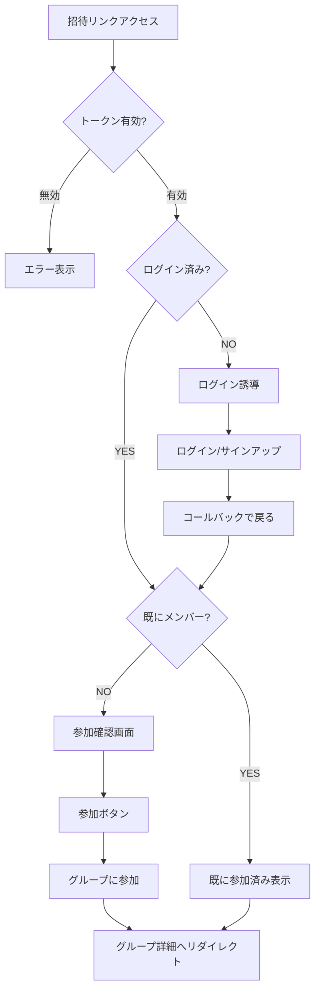
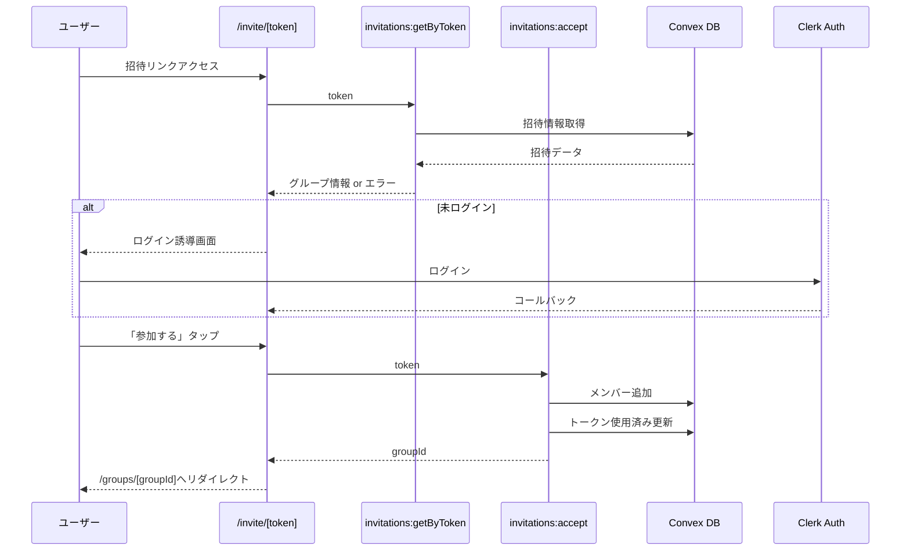
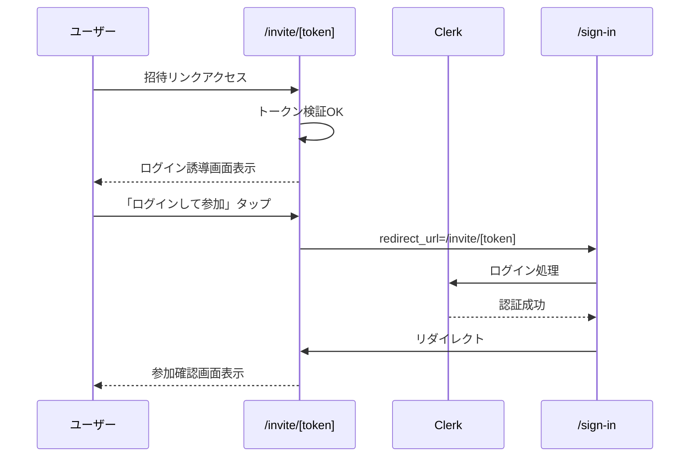

# 招待受け入れページ 設計書

## Overview

招待リンク（`/invite/[token]`）にアクセスしたユーザーがグループに参加するためのページ。ログイン状態に応じた適切なフローを提供する。

## Purpose

### なぜ必要か

1. **招待フローの完結**: 招待リンク作成機能は実装済みだが、リンク先のページが未実装
2. **シームレスな参加体験**: ログイン済み/未ログインに関わらずスムーズにグループ参加できる
3. **セキュリティ**: トークンの検証、有効期限チェック、既参加チェックを行う

### ユーザーストーリー

- 招待されたユーザーとして、招待リンクをタップしてグループに参加したい
- ログインしていない状態でも、招待リンクから参加フローを開始したい

## What to Do

### 機能要件

#### 1. トークン検証

- トークンの存在確認
- 有効期限チェック（7日間）
- 使用済みチェック（同一トークンの再利用防止）

#### 2. グループ情報表示

- グループ名
- メンバー数
- 招待者名（誰からの招待か）

#### 3. ログイン状態による分岐



#### 4. 参加処理

- groupMembersテーブルにレコード追加
- 招待トークンを使用済みに更新
- グループ詳細ページへリダイレクト

### 非機能要件

- モバイルファースト
- ローディング状態の表示
- エラーハンドリング（期限切れ、無効なトークン）
- 未ログイン時のリダイレクト保持

## How to Do It

### 画面構成（ワイヤーフレーム）

#### 参加確認画面（ログイン済み）

```
┌─────────────────────────────────┐
│                                 │
│           🏠                    │
│                                 │
│    「テスト家計簿グループ」     │
│      への招待                   │
│                                 │
│    ──────────────────────────   │
│                                 │
│    👤 パートナーAさんからの招待 │
│    👥 メンバー: 2人             │
│                                 │
│    ──────────────────────────   │
│                                 │
│    [  グループに参加する  ]     │
│                                 │
│    キャンセルして戻る           │
│                                 │
└─────────────────────────────────┘
```

#### ログイン誘導画面（未ログイン）

```
┌─────────────────────────────────┐
│                                 │
│           🏠                    │
│                                 │
│    「テスト家計簿グループ」     │
│      への招待                   │
│                                 │
│    ──────────────────────────   │
│                                 │
│    グループに参加するには       │
│    ログインが必要です           │
│                                 │
│    ──────────────────────────   │
│                                 │
│    [  ログインして参加  ]       │
│                                 │
│    アカウントをお持ちでない方は │
│    [  新規登録  ]               │
│                                 │
└─────────────────────────────────┘
```

#### エラー画面

```
┌─────────────────────────────────┐
│                                 │
│           ⚠️                    │
│                                 │
│    招待リンクが無効です         │
│                                 │
│    ・有効期限が切れている       │
│    ・既に使用済み               │
│    ・リンクが間違っている       │
│                                 │
│    ──────────────────────────   │
│                                 │
│    [  ホームに戻る  ]           │
│                                 │
└─────────────────────────────────┘
```

### URL設計

```
/invite/[token]  - 招待受け入れページ
```

### データフロー



### ファイル構成

```
app/
└── invite/
    └── [token]/
        └── page.tsx           # 招待受け入れページ

components/
└── invite/
    └── InviteAcceptCard.tsx   # 招待受け入れカード

convex/
└── invitations.ts             # 招待関連の関数（新規作成）
```

### Convex関数

#### invitations:getByToken

```typescript
// 認証不要（未ログインでもグループ情報を表示するため）
export const getByToken = query({
  args: { token: v.string() },
  handler: async (ctx, args) => {
    // 1. トークンで招待情報取得
    const invitation = await ctx.db
      .query("groupInvitations")
      .withIndex("by_token", (q) => q.eq("token", args.token))
      .unique();

    if (!invitation) {
      return { error: "invalid_token" };
    }

    // 2. 有効期限チェック
    if (invitation.expiresAt < Date.now()) {
      return { error: "expired" };
    }

    // 3. 使用済みチェック
    if (invitation.usedAt) {
      return { error: "already_used" };
    }

    // 4. グループ情報取得
    const group = await ctx.db.get(invitation.groupId);
    const inviter = await ctx.db.get(invitation.createdBy);
    const memberCount = await ctx.db
      .query("groupMembers")
      .withIndex("by_group_and_user", (q) =>
        q.eq("groupId", invitation.groupId),
      )
      .collect();

    return {
      invitation: {
        groupId: invitation.groupId,
        groupName: group?.name,
        inviterName: inviter?.displayName,
        memberCount: memberCount.length,
        expiresAt: invitation.expiresAt,
      },
    };
  },
});
```

#### invitations:accept

```typescript
export const accept = authMutation({
  args: { token: v.string() },
  handler: async (ctx, args) => {
    // 1. トークン検証（再度）
    const invitation = await ctx.db
      .query("groupInvitations")
      .withIndex("by_token", (q) => q.eq("token", args.token))
      .unique();

    if (!invitation || invitation.expiresAt < Date.now() || invitation.usedAt) {
      throw new Error("無効な招待リンクです");
    }

    // 2. 既にメンバーかチェック
    const existingMember = await ctx.db
      .query("groupMembers")
      .withIndex("by_group_and_user", (q) =>
        q.eq("groupId", invitation.groupId).eq("userId", ctx.user._id),
      )
      .unique();

    if (existingMember) {
      return { alreadyMember: true, groupId: invitation.groupId };
    }

    // 3. メンバー追加
    await ctx.db.insert("groupMembers", {
      groupId: invitation.groupId,
      userId: ctx.user._id,
      role: "member",
      joinedAt: Date.now(),
    });

    // 4. 招待を使用済みに更新
    await ctx.db.patch(invitation._id, {
      usedAt: Date.now(),
      usedBy: ctx.user._id,
    });

    return { success: true, groupId: invitation.groupId };
  },
});
```

### 認証フロー（未ログイン時）



### Clerkのリダイレクト設定

ログイン後に招待ページに戻るため、`redirect_url`パラメータを使用：

```typescript
// ログインボタンのリンク
const loginUrl = `/sign-in?redirect_url=${encodeURIComponent(`/invite/${token}`)}`;
```

## What We Won't Do

### 今回のスコープ外

1. **招待トークンの複数回使用**: 1トークン1人のみ（シンプルさ優先）
2. **招待の承認フロー**: オーナーの承認なしで即参加（MVP）
3. **招待人数の制限**: 制限なし（MVP）
4. **招待の取り消し**: 後回し
5. **招待履歴の表示**: 後回し
6. **QRコード生成**: 後回し

### シードデータ更新

今回の実装でシードデータの更新は**不要**。

- 招待フローはUI操作で確認可能
- テスト用に招待レコードを作る必要なし

## Concerns

### 懸念事項と対策

| 懸念                       | 対策                                         |
| -------------------------- | -------------------------------------------- |
| 未ログイン時のUX           | ログイン後に自動で招待ページに戻る           |
| トークン漏洩リスク         | 7日間の有効期限、1回限り使用                 |
| 同一ユーザーの重複参加     | メンバーシップ確認後、既参加なら詳細ページへ |
| 無効なトークンへのアクセス | 明確なエラーメッセージ表示                   |

### 設計判断

1. **トークン使用回数**: 1回限り（セキュリティ優先）
2. **未ログイン時の情報表示**: グループ名・招待者名は表示（参加意思決定に必要）
3. **参加後のリダイレクト先**: グループ詳細ページ（すぐに活動開始できる）

## Reference Materials/Information

- 既存実装: `convex/groups.ts` - createInvitation
- 既存実装: `components/groups/InviteDialog.tsx` - 招待リンク生成UI
- スキーマ: `convex/schema.ts` - groupInvitations テーブル
- Clerk Docs: [Redirect URLs](https://clerk.com/docs/guides/custom-redirects)
- 前フェーズ: `docs/design-group-detail.md`
