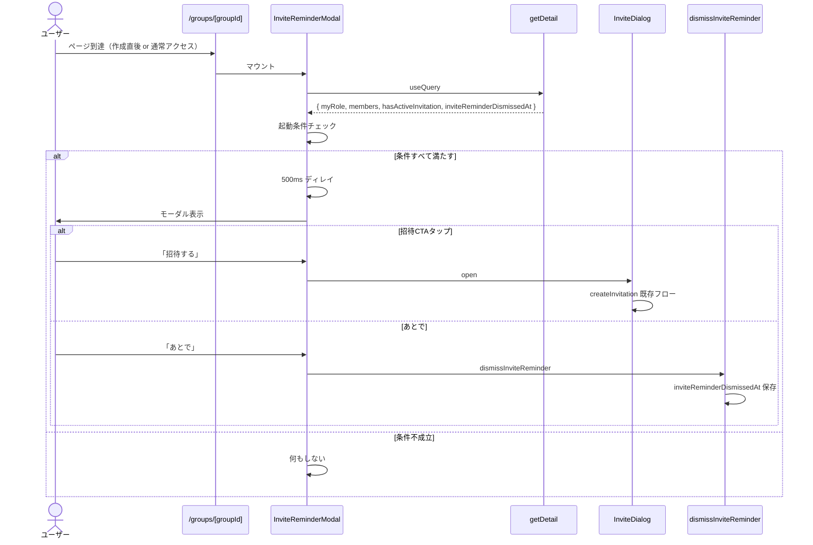
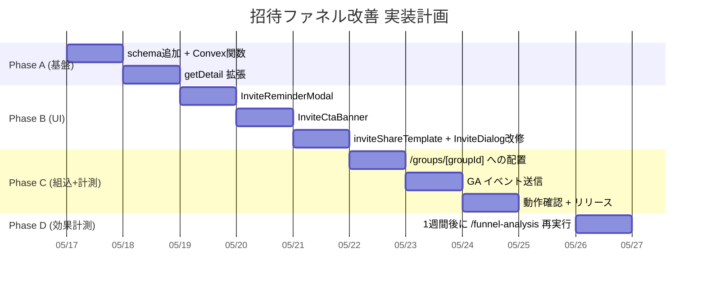

# Overview

Pairbo の招待ファネル詰まりを解消するための施策設計。`/funnel-analysis` の分析結果（2026-05-16 時点）から、最大の詰まりが「グループ作成 → 招待発行」段階にあることが分かった（39 グループ中、招待発行は 17 件＝ **43.6%**、1 人グループ 27 件中 **22 件が招待を一度も発行していない**）。本設計では新規グループ作成直後と既存 1 人グループ両方に対して、招待発行を促進する 3 つの施策を一体で組む。

対象スコープ:

1. **F1. グループ作成直後の招待リマインダーモーダル** — 作成成功 → 自動でグループ詳細に遷移 → 直後にモーダル表示
2. **F2. 招待文面テンプレート + 招待 CTA の強化** — `navigator.share` の文面充実、グループ詳細トップの目立つ位置に CTA バナー追加
3. **F3. 既存 1 人グループへの遡及リマインダー** — 既に作成済みの 22 件の 1 人グループに対しても、グループ詳細到達時にリマインダー表示

## Purpose

`/funnel-analysis` で判明したファネル詰まりは次のとおり:

| ステージ        |  件数 |                      通過率 |
| --------------- | ----: | --------------------------: |
| グループ作成    |    39 |                           – |
| 招待発行        |    17 | **43.6%**（← 最大の詰まり） |
| 2 人到達        |    12 |  70.6%（招待発行 → 2 人化） |
| 総合 2 人到達率 | 12/39 |                       30.8% |

1 人グループ 27 件のうち **22 件（81%）が招待を一度も発行していない**。さらに 1 人グループの 96% は支出ゼロで、「1 人で家計簿として継続利用」のパターンはほぼ存在しない。つまり「グループ作成後、招待発行という次の一歩が踏み出せず離脱」している。

招待発行に踏み出せれば 2 人到達率は 70% と高い。発行さえできれば中央値 1.7 時間で相棒が参加する。**招待発行率を上げることが、現時点で最も ROI の高いリテンション施策**。

仮に F1+F2+F3 で 22 件の招待未発行グループのうち半数の 11 件が招待を発行し、既存の 70% で参加すれば +7 件の 2 人グループ。現状 12 件 → 19 件で **+58%** のインパクト。

## What to Do

### 機能要件

**F1. グループ作成直後の招待リマインダーモーダル**

- 既存の動線（グループ作成 → useEffect で 1 件なら `/groups/[groupId]` に自動遷移）をそのまま維持
- 遷移先 `/groups/[groupId]` でグループ条件を満たす場合、500ms 程度ディレイ後にリマインダーモーダル自動表示
- モーダルから「招待リンクを作成」CTA で既存 `InviteDialog` の流れに直結
- 「あとで」スキップで `groups.inviteReminderDismissedAt` に時刻保存 → 以後そのグループでは出さない
- 既に PWA オンボーディングツアーが表示される条件と重なる場合、PWA ツアーを優先（招待リマインダーは PWA ツアー閉じた後 + 次回再訪時に表示）

**F2. 招待文面テンプレート + 招待 CTA 強化**

- F2a. `navigator.share` の text を「これ私が使ってる二人用の家計簿アプリ。一緒に始めませんか？」相当の自然文面に変更
- F2b. グループ詳細の支出タブ上部に「相棒を招待」CTA バナーを追加（1 人グループかつ未スキップのときのみ）。タップで `InviteDialog` を開く
- F2c. `InviteDialog` 内のコピー対象を「URL のみ」から「テンプレ付き文面 + URL」に切り替えるオプションを追加（ボタン 2 つ「URL のみ」「文面ごと」）

**F3. 既存 1 人グループへの遡及リマインダー**

- F1 のモーダル / F2b のバナーは、グループの作成日時に関係なく「条件を満たせば表示」する設計にする
- 既存の 22 件にも次回グループ詳細到達時にリマインダーが効く
- 一度スキップしたら以後出ない（F1 と同じ `inviteReminderDismissedAt` フラグ）

### 起動条件（F1/F3 共通）

下記すべてを満たすとき、モーダル / バナーを表示:

- 自分がそのグループのオーナー（`myRole === "owner"`）
- メンバー数が 1
- `groups.inviteReminderDismissedAt` が未設定
- そのグループの有効な招待リンクが存在しない（`groupInvitations` で `usedAt == null && expiresAt > now` が 0 件）

**条件解除タイミング**:

- メンバー数が 2 以上になった → 自動的に対象外（フラグ操作不要）
- ユーザーが「あとで」スキップ → `inviteReminderDismissedAt` セット
- 招待リンクを発行 → アクティブ招待ありの判定で対象外（フラグ更新不要）

### 計測（F4 として小さく付随）

GA カスタムイベント:

- `invite_reminder_shown`（モーダル or バナー表示時）
- `invite_reminder_dismissed`（「あとで」スキップ）
- `invite_reminder_cta_clicked`（モーダル / バナーから InviteDialog 起動）
- `invite_share_with_template`（テンプレ付き文面シェア）
- `invite_share_url_only`（URL のみシェア）

### 非機能要件

- モーダル UI は既存 `@radix-ui/react-dialog` を使用
- バナーは目立つが邪魔にならない高さ（48-56px）
- リマインダー判定の query は既存の `groups.getDetail` 戻り値に必要情報を含めて 1 リクエストで完結させる
- スキーマ追加は破壊的変更を避ける（`v.optional(v.number())` のみ）

## How to Do It

### 全体アーキテクチャ

```mermaid
graph TB
    subgraph "クライアント"
        A[/groups/page.tsx]
        B[CreateGroupDialog]
        C[/groups/groupId/page.tsx]
        D[GroupDetail]
        E[InviteReminder]
        F[InviteDialog 既存]
        G[InviteCtaBanner]
    end

    subgraph "Convex"
        H[groups.inviteReminderDismissedAt]
        I[mutation: dismissInviteReminder]
        J[query: getDetail 拡張]
        K[mutation: createInvitation 既存]
    end

    A --> B
    B -->|作成| K2[mutation: groups.create]
    A -->|自動遷移| C
    C --> D
    D --> E
    D --> G
    E -->|招待CTA| F
    G -->|タップ| F
    E -->|あとで| I
    F -->|発行| K
    I --> H
    J --> H
```

### コンポーネント / フック設計

**新規作成**

| パス                                        | 役割                                                                 |
| ------------------------------------------- | -------------------------------------------------------------------- |
| `components/groups/InviteReminderModal.tsx` | F1/F3 用モーダル。条件チェック + `InviteDialog` の trigger + dismiss |
| `components/groups/InviteCtaBanner.tsx`     | F2b バナー。グループ詳細の支出タブ上部に表示                         |
| `lib/inviteShareTemplate.ts`                | F2a/F2c のテンプレ文面を生成する純粋関数                             |

**変更**

| パス                                 | 内容                                                                                                                               |
| ------------------------------------ | ---------------------------------------------------------------------------------------------------------------------------------- |
| `convex/schema.ts`                   | `groups` テーブルに `inviteReminderDismissedAt: v.optional(v.number())` 追加                                                       |
| `convex/groups.ts`                   | `getDetail` 戻り値に `hasActiveInvitation: boolean` と `inviteReminderDismissedAt` を含める。`dismissInviteReminder` mutation 新設 |
| `components/groups/GroupDetail.tsx`  | `<InviteCtaBanner />` を支出タブ上部に配置                                                                                         |
| `app/groups/[groupId]/page.tsx`      | `<InviteReminderModal />` を配置（PWA ツアーと並列）                                                                               |
| `components/groups/InviteDialog.tsx` | F2c のテンプレ付きコピー対応                                                                                                       |
| `lib/analytics.ts`（任意）           | 新規イベント名を型で定義                                                                                                           |

### Convex データモデル追加

```typescript
// convex/schema.ts （差分のみ）
groups: defineTable({
  // 既存フィールド…
  inviteReminderDismissedAt: v.optional(v.number()),
}),
```

### Convex 関数

```typescript
// convex/groups.ts 追記
export const dismissInviteReminder = authMutation({
  args: { groupId: v.id("groups") },
  handler: async (ctx, args) => {
    await requireGroupMember(ctx, args.groupId);
    await ctx.db.patch(args.groupId, {
      inviteReminderDismissedAt: Date.now(),
      updatedAt: Date.now(),
    });
  },
});
```

`getDetail` の戻り値拡張:

```typescript
// 既存戻り値 + 以下
hasActiveInvitation: boolean; // usedAt=null かつ expiresAt > now が 1 件以上
inviteReminderDismissedAt: number | undefined;
```

### 起動フロー（F1/F3 共通）



### モーダル UI 案

タイトル: 「相棒を招待してみる？」（カジュアル寄り）

本文: 「Pairbo は二人で使うと記録が共有できて、月末の精算も自動でできるアプリ。今のままだと一人用メモになってます。相棒に招待リンクを送ってみよう。」

CTA: 「招待リンクを作る」（プライマリ）/「あとで」（ゴースト）

### バナー UI 案（F2b）

グループ詳細の支出タブ上部、目立つが圧迫しない高さ:

```
┌──────────────────────────────────────┐
│ 👥 相棒を招待してアプリを完成させよう  →│
└──────────────────────────────────────┘
```

タップで `InviteDialog` を open。

### F2a/F2c シェア文面テンプレート

`lib/inviteShareTemplate.ts`:

```typescript
export function buildInviteShareText(
  groupName: string,
  inviteUrl: string,
): string {
  return `これ最近使ってる二人用の家計簿アプリ「${groupName}」、よかったら一緒に使わない？\n\n${inviteUrl}\n\n（リンクの有効期限は7日です）`;
}
```

InviteDialog のシェアボタンで `navigator.share({ text: buildInviteShareText(...) })` に渡す。コピーボタンも同テキストをコピー対象にする。

### 実装ロードマップ



Phase ごとに独立 PR。Phase C 完了で staging → main → prod の流れ。

## What We Won't Do

- **招待 URL 側（`/invite/[token]`）の計測**: 設計書 `design-pwa-install-push.md` 系の議論で出ていた `invite_link_visited` 等の計測。本設計の効果が出てから別途追加（招待発行率が上がってから受諾段階の計測の優先度が上がる）
- **Premium 訴求の強化**: 招待発行率が上がり 2 人グループの母数が増えてから検討。現状 Premium 転換ゼロは「定着してない」が主因
- **既存 1 人グループへのメール/Push リマインダー**: スコープ外。本設計はあくまでアプリ内のリマインダー。Web Push は別ドキュメント
- **招待方法の追加（QR コード生成 / カスタム URL / 直接 LINE 連携）**: Web Share API 経由のシェアで十分カバー。複雑化を避ける
- **複数招待リンクの管理 UI**: 現状 1 グループ複数招待は発行可能だが、UI 上では「最後の招待」だけ気にする
- **「あとで」のスヌーズ（◯日後に再表示）**: シンプルさ優先で「あとで＝以後表示しない」。複雑な再表示ルールは作らない

## Alternatives Considered

### A1. 招待モーダルではなくフルスクリーンウェルカム

**内容**: グループ作成完了後にフルスクリーンの「次に何をする？」画面を出し、招待・最初の支出記録など複数のアクションから選ばせる。

**不採用の理由**:

- 選択肢が多いと結局何もしない確率が上がる
- 「招待発行」だけが圧倒的にレバーが効くので、選択肢を増やすメリットがない
- フルスクリーン UI は実装コスト高

### A2. 招待発行 → 完了モーダルを廃止し、グループ作成と同時に自動で招待リンク作成

**内容**: グループを作るだけで自動的に招待リンクが生成され、ユーザーは作成完了画面で URL をシェアするだけ。

**不採用の理由**:

- 「招待リンクが勝手に作られて、有効期限 7 日で期限切れになる」のは紛らわしい
- ユーザーが「とりあえずグループだけ作ってみたい」場合のオプションを奪う
- 招待リンクの管理（再発行 / 期限延長）の UX が複雑化

### A3. 1 人グループは「招待発行するまでロックする」（強制）

**内容**: 1 人グループでは支出記録 UI を表示せず、招待発行しないと先に進めない。

**不採用の理由**:

- ユーザーをロックインする UX は離脱率を上げる
- 「とりあえず触ってみたい」探索的ユーザーをすべて切り捨てる
- A/B テストで効果は不明、リスク高い

### A4. メール / Push 通知でリマインダーを送る

**内容**: グループ作成後 24 時間経っても招待発行されなければメール or Push でリマインダー。

**不採用の理由**:

- メール基盤（Resend 等）が未整備、Push 基盤も未整備
- 招待発行率を上げる目的に対しては「アプリ内モーダル」の方が即効性高い
- 別フェーズで追加検討

### A5. 招待リンクの有効期限を 7 日 → 30 日に延長

**内容**: 招待発行はしているが受諾されない 5 件のドロップオフを救うため期限延長。

**不採用の理由**:

- 数値分析では「招待発行 → 2 人化率 70.6%」「中央値 1.7 時間で参加」と、刺さるときは早い
- 期限切れ未使用招待 8 件は、相棒に送ったが参加されなかったケースが大半（期限ではなく送信側 or 受信側の意思の問題）
- 期限延長はマージナルな効果しか期待できない、本質的でない

## Concerns

### C1. PWA オンボーディングツアーとの表示順【確定: 同セッション連続表示】

`/groups/[groupId]` には先日リリースした `PwaOnboardingTour` も自動表示される。新規ユーザーの初回グループ作成時、両方が同時に開こうとする。

**決定**: PWA ツアーが閉じた**同セッション内で続けて**招待リマインダーを表示する。

**理由**:

- 現状の WAU 14/59 = 24% で再訪率が低い。「次回再訪時に表示」だと 76% のユーザーが招待リマインダーを一度も見ずに離脱する
- 招待発行は Pairbo の最大レバー。初回流入の 1 回で確実に見せる価値がある
- UX 摩擦は「あとで」スキップ（永久 dismiss）で救済可能

**実装**:

- `InviteReminderModal` の起動条件に `me.pwaOnboardingCompletedAt != null` を含める
- PWA ツアーが閉じた瞬間に即座に出すのではなく、**500-800ms ディレイ**で「次のステップ感」を演出
- モーダル文言を PWA ツアーと差別化（「Pairbo は 2 人で使うと…」と明確に意味分け）

### C2. 「あとで」スキップ後の挙動【確定: 永久 dismiss】

ユーザーが「あとで」を選んだら以後そのグループでは出さない。スヌーズ（1 週間後に再表示）等は持たない。

**理由**: シンプルさ優先。スヌーズ管理ロジックは複雑化要因かつ「同じモーダル繰り返し出される」体験悪化のリスク。

### C3. 1 人グループの 22 件への遡及表示量

既存ユーザーが次回ログイン時に一斉にモーダルが出る。アクティブな WAU 14 のうち、この 22 件のオーナーが何人いるかは不明だが、複数いれば SNS 等で「またモーダルかよ」とネガ反応が出る可能性。

**緩和策**: モーダルは控えめなトーン（「相棒を招待してみる？」）でユーザーに圧をかけない。「あとで」を目立たせる。

### C4. 招待文面テンプレの内容【確定】

シェアテンプレ文面: **「これ最近使ってる二人用の家計簿アプリ「${groupName}」、よかったら一緒に使わない？\n\n${inviteUrl}\n\n（リンクの有効期限は7日です）」**

**理由**: シェアする側 → 受け取る側で**人間ベースの文脈共有が事前にある前提**（カップル・夫婦への送信が大半）。これ以上のセールス調はむしろ違和感を生むため、軽い紹介トーンで止める。

### C5. F2b バナーが永続的に表示されるか / dismiss できるか

招待発行されるまで支出タブのバナーが残り続けると、UI 圧迫感がある。

**現状案**: モーダルで「あとで」を選ぶとバナーも消える（同じ `inviteReminderDismissedAt` フラグで制御）。それ以外はメンバー 2 人以上 or 招待発行で自動的に消える。

### C6. オーナー以外への露出

メンバーが既に 2 人以上いるグループには表示されない。メンバーが 1 人だが「自分はオーナーではない」(外部から自動的に追加されるパターン) は現状想定なし。万一の場合のためにオーナー判定を必須化。

### C7. 効果測定の閾値【確定】

- リリース 1 週間後: `/funnel-analysis` で招待発行率を再測定
- **目標: 招待発行率 43.6% → 60% 以上**
- **副指標**: 総合 2 人到達率 30.8% → 40% 以上
- 未達なら F2a/F2c の文面再検討 or F2b バナーのデザイン強化を Phase 2 として実施
- 1 週間という期間: Pairbo の招待 → 2 人化は中央値 1.7 時間と早いので、1 週間あれば施策後グループの結果が出る

## Reference Materials/Information

- [`docs/design-pwa-onboarding-tour.md`](./design-pwa-onboarding-tour.md) — PWA オンボーディングツアー設計（表示順の干渉理由）
- [`analytics/queries/funnel.js`](../analytics/queries/funnel.js) — ファネル分析クエリ
- [`.claude/commands/funnel-analysis.md`](../.claude/commands/funnel-analysis.md) — 分析スキル
- 2026-05-16 ファネル分析結果（チャットログ）— 招待発行率 43.6% / 1 人グループ 27 件中 22 件未発行 / 招待 → 2 人化率 70.6%
- [Web Share API (MDN)](https://developer.mozilla.org/docs/Web/API/Navigator/share)
- [`components/groups/InviteDialog.tsx`](../components/groups/InviteDialog.tsx) — 既存招待ダイアログ実装
- [`components/groups/CreateGroupDialog.tsx`](../components/groups/CreateGroupDialog.tsx) — 既存作成ダイアログ実装
