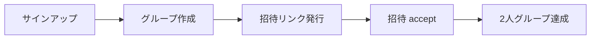
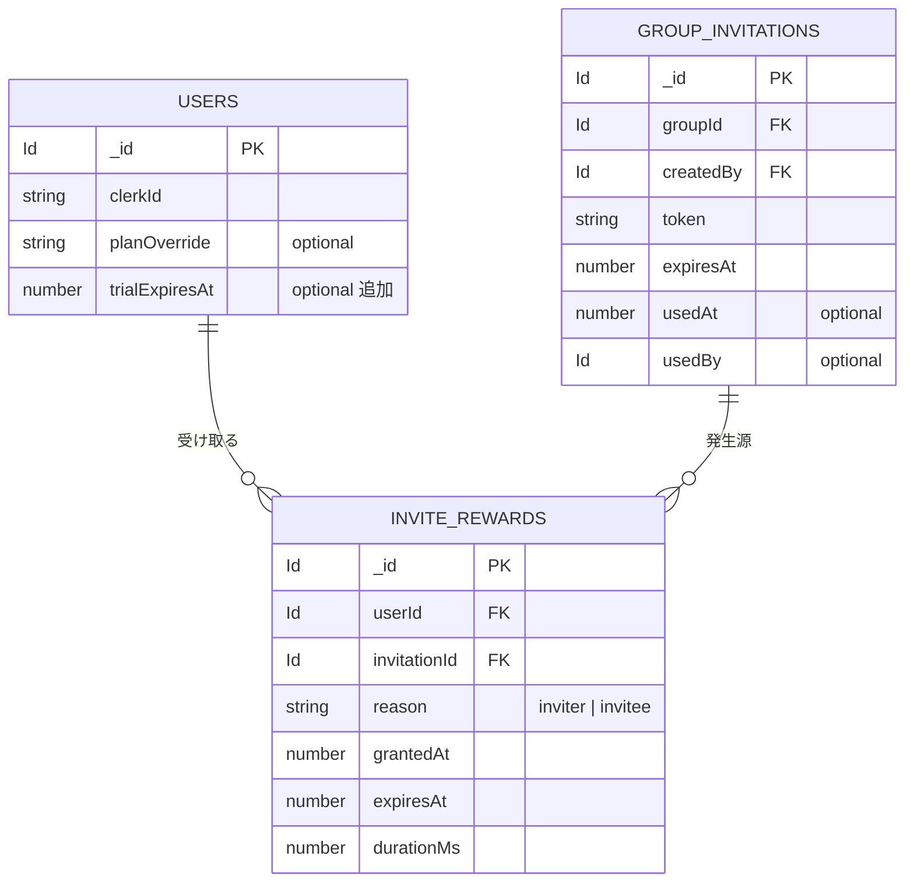
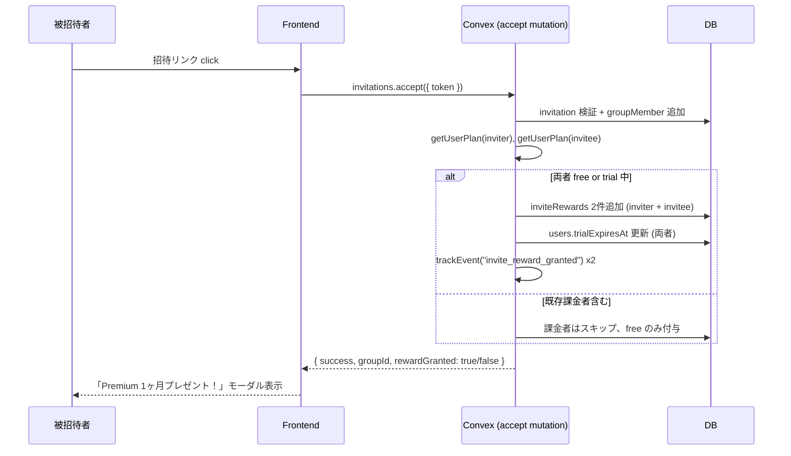
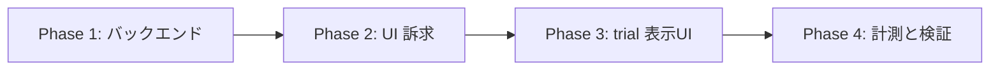

# 設計書: 招待報酬 Premium トライアル（招待 → 双方 1ヶ月無料）

## Overview

グループへの招待が成立（accept）した時点で、**招待主と参加者の両方** に Premium プラン 30日間無料トライアルを付与する仕組みを追加する。

バイラル係数（招待発行率 × 招待成立率）を底上げしつつ、無料ユーザーに Premium 機能を体験させて課金転換率を上げるための施策。

## Purpose

### 背景

PR #206 (PWA オンボーディングツアー) と PR #207 (招待ファネル改善) を経て、以下のファネルが整った:



しかし課題が残る:

| 指標               | 現状               | 課題                                             |
| ------------------ | ------------------ | ------------------------------------------------ |
| 招待発行率         | 43.6% → 改善見込み | バナー・モーダル導線追加で底上げ中               |
| 招待→2人達成率     | 70.6%              | リンク発行後のフォローが弱い                     |
| **Premium 課金率** | **5/60 (8.3%)**    | **Premium 機能に触れる機会が無料ユーザーに無い** |
| バイラル係数 K     | < 1.0 推定         | 招待主に「招待するインセンティブ」が薄い         |

### 目的

1. **バイラル係数 K > 1.0 を狙う**: 招待主・参加者の両方にメリットを与え、招待行動を加速
2. **Premium 体験率の向上**: 全ユーザーが少なくとも30日 Premium を体験 → 解約後の課金転換を狙う
3. **「2人で使うほど価値が出る」プロダクト特性との整合**: ペアで価値が増す構造に、報酬もペアで設計

### Pairbo の特性との相性

Pairbo は「1人では本来の価値が出ない」プロダクト。招待行動が成功の鍵を握る。
**「招待主・被招待者の双方が報酬を得る」設計** は Pairbo のコア体験と一致する。

### 想定インパクト

- 既存ファネルの招待発行率 43.6% → 60%+（PR #207 + 本施策）
- Premium 体験率 8.3% → 50%+（trial 含む）
- trial → 課金転換率 10%〜20% を仮置きすると、Premium 課金者数の 1.5〜2倍化が目標

## What to Do

### 機能要件

#### FR-1: 招待 accept 成功時の trial 付与

招待リンクから新メンバーがグループに参加した時点で、**招待主と参加者の両方** に Premium 30日間トライアルを付与する。

#### FR-2: 既存 Premium ユーザーへの加算

既に Premium 課金中のユーザーが対象になった場合の挙動:

- **Subscription 課金中**: trial は付与しない（既に Premium 享受中、メリット薄い）。代わりに「ありがとう」的なメッセージを表示
- **planOverride で Premium**: trial は付与しない（admin による恒久付与のため）
- **既存 trial 期間中**: 期限を30日延長

#### FR-3: trial 期間中の Premium 機能フル開放

trial 中は通常の Premium と同等の機能利用可能:

- 傾斜折半
- タグ機能
- 詳細分析（年間分析、タグ別分析）
- データエクスポート
- 広告非表示

#### FR-4: trial 期限切れ後の自動降格

trial 期限が切れたら自動的に free プランへ戻る。バッチジョブは使わず、`getUserPlan()` のクエリ時判定で実現。

#### FR-5: trial 状態の UI 表示

- 設定画面の Premium ステータス: 「Premium トライアル中（残り X日）」
- 残り3日以下: 通知バナーで課金導線
- 招待リンク作成 UI: 「招待が成立すると2人とも Premium 1ヶ月無料」と明示
  - **既存 Premium 課金者（active / trialing）には訴求を非表示** — 自分にはメリットがないため、誤情報を出さない
  - planOverride で Premium 扱いの admin ユーザーにも非表示

#### FR-6: 悪用対策

- 同一招待 (`groupInvitations._id`) に対して、招待主・参加者それぞれ報酬は1回まで
- 同一被招待者（Clerk メール）は、過去90日以内に同一招待主からの trial 報酬を受けていない（簡易チェック）
- 招待主側は招待回数に比例して延長されるが、上限 = 累計 365日（およそ 1年）

#### FR-7: イベント計測

GA4 イベントとして以下を追加:

| イベント                       | 発火タイミング                          | プロパティ                                          |
| ------------------------------ | --------------------------------------- | --------------------------------------------------- |
| `invite_reward_granted`        | trial 付与時                            | `reason`: "inviter" / "invitee", `durationDays`: 30 |
| `trial_expired`                | クエリ判定で初めて expired を検知       | -                                                   |
| `trial_to_paid`                | trial 中ユーザーが Stripe checkout 完了 | `daysIntoTrial`                                     |
| `trial_remaining_banner_shown` | 残り3日バナー表示                       | `daysLeft`                                          |

### 非機能要件

#### NFR-1: 既存課金者への影響ゼロ

既存 5 件の Premium subscription には触らない。本施策の trial は完全に Pairbo 内部管理。

#### NFR-2: Stripe と非連携

Stripe Trial 機能は使わない。Pairbo 内部で `users.trialExpiresAt` を管理し、Stripe checkout 開始時点で trial 終了扱いとする。

#### NFR-3: 期限管理は遅延評価

定期バッチによる降格処理は不要。`getUserPlan()` のクエリ時に `trialExpiresAt > Date.now()` で動的判定。

#### NFR-4: 監査・分析の容易さ

各 trial 付与の出所（どの招待で、誰から、誰へ）を後から追跡できるよう、ログテーブル `inviteRewards` を残す。

## How to Do It

### データモデル

#### スキーマ変更



`convex/schema.ts` に以下を追加:

```typescript
// users テーブルに追加
users: defineTable({
  // ...existing
  trialExpiresAt: v.optional(v.number()), // Premium trial 期限（実効キャッシュ）
}),

// 新規テーブル
inviteRewards: defineTable({
  userId: v.id("users"),
  invitationId: v.id("groupInvitations"),
  reason: v.union(v.literal("inviter"), v.literal("invitee")),
  grantedAt: v.number(),
  expiresAt: v.number(),
  durationMs: v.number(),
})
  .index("by_user", ["userId"])
  .index("by_invitation_user", ["invitationId", "userId"]),
```

#### 設計判断: なぜ二重持ち（users.trialExpiresAt + inviteRewards テーブル）か

- `inviteRewards` だけだと `getUserPlan()` の判定で複数レコードを集計が必要 → クエリコスト
- `users.trialExpiresAt` だけだと、報酬の出所が分からない → 分析・監査・悪用検知に不利
- 両方持つ:
  - `inviteRewards` = 監査ログ（append-only, 完全な履歴）
  - `users.trialExpiresAt` = 実効期限のキャッシュ（最大値）
- 整合性: `trialExpiresAt = max(inviteRewards.expiresAt where userId = self)` を grant 時に再計算

### 主要処理フロー

#### Trial 付与シーケンス



#### Plan 判定の修正

`convex/lib/subscription.ts` の `getUserPlan` を以下に変更:

```typescript
export async function getUserPlan(
  ctx: QueryCtx,
  userId: Id<"users">,
): Promise<"free" | "premium"> {
  const user = await ctx.db.get(userId);
  if (!user) return "free";

  // 1. admin override が最優先
  if (user.planOverride) return user.planOverride;

  // 2. trial 期間中かチェック ← 追加
  if (user.trialExpiresAt && user.trialExpiresAt > Date.now()) {
    return "premium";
  }

  // 3. 既存の subscription チェック
  const subscription = await ctx.db
    .query("subscriptions")
    .withIndex("by_user", (q) => q.eq("userId", userId))
    .unique();

  if (subscription) {
    const now = Date.now();
    if (
      subscription.plan === "premium" &&
      (subscription.status === "active" || subscription.status === "trialing")
    ) {
      return "premium";
    }
    if (
      subscription.plan === "premium" &&
      subscription.status === "canceled" &&
      subscription.currentPeriodEnd > now
    ) {
      return "premium";
    }
  }

  return "free";
}
```

#### grantInviteReward ヘルパー（新規）

`convex/lib/inviteReward.ts`:

```typescript
const TRIAL_DURATION_MS = 30 * 24 * 60 * 60 * 1000;
const MAX_ACCUMULATED_TRIAL_MS = 365 * 24 * 60 * 60 * 1000;

export async function grantInviteReward(
  ctx: MutationCtx,
  args: {
    userId: Id<"users">;
    invitationId: Id<"groupInvitations">;
    reason: "inviter" | "invitee";
  },
): Promise<{ granted: boolean; reason?: string }> {
  // 既課金者はスキップ
  const subscription = await ctx.db
    .query("subscriptions")
    .withIndex("by_user", (q) => q.eq("userId", args.userId))
    .unique();
  if (
    subscription?.plan === "premium" &&
    (subscription.status === "active" || subscription.status === "trialing")
  ) {
    return { granted: false, reason: "already_paying" };
  }

  // 同一招待×同一ユーザーの重複防止
  const existing = await ctx.db
    .query("inviteRewards")
    .withIndex("by_invitation_user", (q) =>
      q.eq("invitationId", args.invitationId).eq("userId", args.userId),
    )
    .unique();
  if (existing) return { granted: false, reason: "duplicate" };

  // 累計上限チェック
  const user = await ctx.db.get(args.userId);
  if (!user) return { granted: false, reason: "user_not_found" };

  const now = Date.now();
  const base = Math.max(user.trialExpiresAt ?? now, now);
  const newExpiresAt = Math.min(
    base + TRIAL_DURATION_MS,
    now + MAX_ACCUMULATED_TRIAL_MS,
  );

  await ctx.db.insert("inviteRewards", {
    userId: args.userId,
    invitationId: args.invitationId,
    reason: args.reason,
    grantedAt: now,
    expiresAt: newExpiresAt,
    durationMs: TRIAL_DURATION_MS,
  });

  await ctx.db.patch(args.userId, {
    trialExpiresAt: newExpiresAt,
  });

  return { granted: true };
}
```

#### accept mutation の拡張

`convex/invitations.ts` の `accept` mutation の最後（L122 後）に追加:

```typescript
// 既存処理: groupMembers 挿入、invitation を used に
await ctx.db.insert("groupMembers", {...});
await ctx.db.patch(invitation._id, { usedAt: now, usedBy: userId });

// 追加: trial 付与
const inviterReward = await grantInviteReward(ctx, {
  userId: invitation.createdBy,
  invitationId: invitation._id,
  reason: "inviter",
});
const inviteeReward = await grantInviteReward(ctx, {
  userId,
  invitationId: invitation._id,
  reason: "invitee",
});

ctx.logger.info("INVITATION", "rewards_granted", {
  invitationId: invitation._id,
  inviter: { id: invitation.createdBy, ...inviterReward },
  invitee: { id: userId, ...inviteeReward },
});

return {
  success: true,
  groupId: invitation.groupId,
  rewardGranted: inviteeReward.granted,
};
```

### UI 影響

#### 1. 招待リンク作成画面（既存改修）

`InviteShareActions.tsx` または `InviteReminderModal.tsx`:

```
招待リンクを作る ボタンの近くに（free ユーザーのみ表示）:

  📢 招待が成立すると、あなたとお相手の両方が
     Premium プラン 1ヶ月無料で使えます
```

**表示条件:**

- `getMyPlan()` が `"free"` のユーザーにのみ表示
- 既存 Premium 課金者（active / trialing / canceled-but-active）には非表示
- planOverride で Premium 扱いのユーザーにも非表示

理由: 既存 Premium 課金者は trial を受け取らないため、誤訴求を避ける。
表示する場合は被招待者向けの「お相手は Premium を試せます」訴求のみに留める案もあるが、初期実装ではシンプルに非表示で統一。

#### 2. 招待 accept 後の祝福モーダル

`/groups/[groupId]` への遷移後に1度だけ表示。

**表示条件:** `accept` mutation のレスポンス `rewardGranted === true` の場合のみ。
既存 Premium 課金者はサーバー側で trial がスキップされるため自動的にモーダルも出ない。

```
🎉 Pairbo へようこそ！

招待ありがとうございます。
今日から30日間、Premium プランを
無料で体験できます。

[使ってみる]
```

#### 3. 設定画面の Premium ステータス

`components/settings/SubscriptionSection.tsx`（既存）に分岐追加:

- trial 中: 「Premium トライアル中（残り X日）」+ 「Premium に切り替える」ボタン
- trial 残り3日以下: 警告色で表示
- trial 期限切れ後の初回アクセス: 「Premium 体験ありがとうございました。継続するには課金へ」モーダル

#### 4. trial 残り日数バナー（残り3日以下）

ヘッダー直下またはタブナビ上に:

```
⏰ Premium トライアルが残り 2日 で終わります
   [継続する]
```

### イベント計測

既存の `trackEvent` ヘルパー (`lib/analytics.ts`) を経由:

```typescript
// invitations.accept 内
trackEvent("invite_reward_granted", { reason: "inviter", durationDays: 30 });
trackEvent("invite_reward_granted", { reason: "invitee", durationDays: 30 });

// 設定画面で trial 期限切れ検知
trackEvent("trial_expired");

// Stripe checkout 完了
trackEvent("trial_to_paid", { daysIntoTrial: 22 });

// バナー表示
trackEvent("trial_remaining_banner_shown", { daysLeft: 2 });
```

### 変更対象ファイル

| ファイル                                      | 変更内容                                              | 規模 |
| --------------------------------------------- | ----------------------------------------------------- | ---- |
| `convex/schema.ts`                            | users.trialExpiresAt 追加、inviteRewards テーブル新設 | 小   |
| `convex/lib/subscription.ts`                  | getUserPlan に trial 判定追加                         | 小   |
| `convex/lib/inviteReward.ts`                  | 新規ヘルパー grantInviteReward                        | 中   |
| `convex/invitations.ts`                       | accept mutation に grant 呼び出し追加                 | 小   |
| `convex/subscriptions.ts`                     | getMySubscription レスポンスに trialExpiresAt 追加    | 小   |
| `convex/__tests__/invitations.test.ts`        | trial 付与のテスト追加                                | 中   |
| `convex/__tests__/subscription.test.ts`       | getUserPlan の trial 判定テスト                       | 小   |
| `components/groups/InviteShareActions.tsx`    | 報酬訴求テキスト追加                                  | 小   |
| `components/groups/InviteReminderModal.tsx`   | 報酬訴求テキスト追加                                  | 小   |
| `components/invite/InviteAcceptCard.tsx`      | accept 後の祝福モーダル誘発                           | 小   |
| `app/invite/[token]/page.tsx`                 | rewardGranted フラグ受け取り                          | 小   |
| `components/onboarding/TrialWelcomeModal.tsx` | 新規: 祝福モーダル                                    | 中   |
| `components/settings/SubscriptionSection.tsx` | trial 状態表示                                        | 中   |
| `components/ui/TrialRemainingBanner.tsx`      | 新規: 残り日数バナー                                  | 中   |
| `convex/seed.ts`, `convex/lib/seedData.ts`    | trial データのシード                                  | 小   |
| `lib/releases.ts`                             | リリースノート追加                                    | 小   |

### 実装フェーズ分割



| Phase | 内容                                    | デプロイ可能            |
| ----- | --------------------------------------- | ----------------------- |
| 1     | schema, helper, accept mutation, テスト | ◯ (UI 訴求なしでも動作) |
| 2     | 招待 UI に報酬訴求、祝福モーダル        | ◯                       |
| 3     | 設定画面の trial 表示、残り日数バナー   | ◯                       |
| 4     | イベント計測、ダッシュボード、A/B 検証  | ◯                       |

各 Phase は独立して PR 化可能。Phase 1 だけでも機能は動く（UI なくても trial は付与される）。

## What We Won't Do

1. **Stripe Trial との連携**
   - Stripe の trial_period_days は使わない
   - 理由: クレカ登録不要で trial 開始したいため

2. **既存 Premium 課金者への遡及付与**
   - 過去に課金した人へのお礼 trial は対象外（決定）
   - 理由: 課金中ユーザーには trial を上乗せしてもメリットが薄い、UX が複雑化
   - もしフィードバックが来た場合は admin による個別対応で十分（5名規模）

3. **招待主以外のメンバーへの報酬**
   - 例: 3人目のメンバーが招待した場合、招待主のみが報酬対象
   - 理由: シンプルさ優先、3人グループ以上はレアケース

4. **trial の解約・取り消し**
   - 一度付与した trial は途中で取り消せない（admin 操作除く）
   - 理由: ユーザー体験を損なう、悪用検知のフローは別途

5. **A/B テスト基盤**
   - 報酬期間（30日 vs 14日）の A/B テストは行わない
   - 理由: ユーザー数が少なすぎて有意差が出ない、初期は固定値で開始

6. **多段階の招待報酬**
   - 「3人招待で2ヶ月、5人招待で3ヶ月」のようなティアは作らない
   - 理由: 同一招待主が複数招待した場合の累積延長で代替

7. **被招待者側のみ報酬を高くする等の非対称設計**
   - 招待主・被招待者は同一の30日固定
   - 理由: シンプルさと公平感

8. **Push 通知での trial 期限リマインド**
   - 残り日数バナー（in-app）のみ
   - 理由: Push 通知基盤がまだない（別設計書）

## Alternatives Considered

### Alternative 1: 招待主のみに報酬

**概要**: 招待主だけに Premium 1ヶ月、被招待者には何もなし

**不採用理由**:

- 被招待者側のインセンティブがない → 招待を受けるモチベが弱い
- バイラル係数の片側のみ強化、効果半減
- 「2人で Premium を体験」という訴求が崩れる

### Alternative 2: Stripe Trial 連携（クレカ登録必須）

**概要**: Stripe Checkout を経由してクレカ登録 → 30日 trial → 自動課金開始

**不採用理由**:

- クレカ登録の心理障壁が高く、招待 → 報酬の体験が損なわれる
- 「気軽に試せる」という本施策の核が消える
- 自動課金開始は炎上リスク（ユーザーが忘れていて課金される）

### Alternative 3: Premium 限定機能を期間限定で全員開放

**概要**: 期間中（例: 1ヶ月）すべての無料ユーザーに Premium 機能開放

**不採用理由**:

- 招待行動を促す効果がゼロ（誰でも体験できる）
- バイラル係数に効かない
- ただし「年末キャンペーン」等の単発施策として将来活用可能

### Alternative 4: 月額永久 100円割引（招待数連動）

**概要**: 招待1人成立で月額が100円ずつ永久割引

**不採用理由**:

- 永続的な売上減コスト
- 計算が複雑（既存 subscription への適用、Stripe Coupon との連携）
- 「招待が増えるほど無料化」の悪用リスク

### Alternative 5: ポイント制（招待でポイント、ポイントで Premium 購入）

**概要**: 招待でポイント獲得、ポイントを Premium 月数と交換

**不採用理由**:

- 実装が重い（ポイント残高管理、交換 UI）
- ユーザー認知コストが高い（「ポイントで何ができる？」が伝わりにくい）

## Concerns

### 1. 既存課金者の不公平感

**懸念**: 5名の既存 Premium 課金者から「先に課金した自分は損」のフィードバックが来る可能性

**判定: 遡及付与しない（決定）**

理由:

- 既存課金者は「本来の Premium 価値」を既に享受中、trial 上乗せのメリットが薄い
- 仕組みを単純に保つ（招待 → 新規加入者ペアに付与、で完結）
- 5名規模なら、もしフィードバックが来た場合は個別対応（admin から planOverride 延長等）で十分カバー可能

### 2. 悪用（self-invite ループ）

**懸念**: 1人で複数アカウント作って自分招待 → 無限 trial 取得

**対応案**:

- Clerk のメール認証必須により、メールアドレスはユニーク（仮アカウント乱造はコスト要）
- `inviteRewards` への記録で、同一招待×同一ユーザーは重複防止
- 累計上限 12ヶ月で歯止め
- それでも検知ロジックは欲しい → 後日「同一 IP・同一デバイスから多数招待」検知（別タスク）

**判定**: 初期実装の3層（メール一意・重複防止・累計上限）で十分。検知ダッシュボードは Phase 4

### 3. trial → 解約率の悪化リスク

**懸念**: 「trial で十分機能を体験 → free に戻して継続」が大半なら、課金転換に繋がらない

**対応案**:

- 残り日数バナー、期限切れモーダルで課金導線を強化
- trial 中の利用データから「タグを実際に使った」「年間分析を見た」等の Premium 機能利用率を計測
- 課金転換率が低ければ Phase 4 で訴求改善

**判定**: 計測を入れて4週間のデータを見て判断

### 4. 既存課金者が招待した場合の trial 加算なし

**懸念**: 既課金者が招待しても自分にメリットなし → 招待行動が減るかも

**対応案**:

- 「招待した側の友人が Premium を試せる」という訴求は維持
- 既課金者向け別途インセンティブ（例: 招待で月額割引）は将来検討

**判定**: 初期はシンプル設計。フィードバック次第で検討

### 5. trial 期限切れ時のサイレント降格

**懸念**: ユーザーが気付かないうちに free に降格 → 体験悪化

**対応案**:

- 残り3日でバナー表示（FR-5）
- 期限切れ翌日にモーダル「Premium 体験ありがとう、継続する？」
- Premium 限定機能を使おうとした時に「trial 終了。Premium に切り替える？」UI

**判定**: UI設計で十分カバー可能

### 6. trial 中ユーザーの精算 UI 等での扱い

**懸念**: 「Premium バッジ」の表示や、メンバー間で「あなただけ trial」のような不整合が出るか

**対応案**:

- 機能ゲートは「Premium かどうか」のみ判定 → trial 中も Premium 扱いで統一
- メンバー間に「trial か否か」の差は見えない（個人の課金状態は他者に非公開）

**判定**: 既存の Premium 判定統一化で問題なし

### 7. inviteRewards テーブルのレコード増加

**懸念**: 招待が増えるとレコード数が線形増加。インデックス効率

**対応案**:

- `by_user` インデックスで個人のレコードのみアクセス（数十件レベル）
- 古い expired レコードは保持（監査・分析のため）
- 1年後にレコード数が問題化したら archival テーブルへ移行検討

**判定**: 数年スケールでは問題なし

## Reference Materials/Information

### 関連設計書

- `docs/design-monetization.md` — Premium プランの全体設計
- `docs/design-invite-funnel-improvement.md` — 招待ファネル F1+F2+F3
- `docs/design-pwa-onboarding-tour.md` — PWA ツアー（前段の onboarding 改善）
- `docs/design-i18n.md` — 多言語対応（並行検討中だが今回は実装しない判断）

### 既存コードの参照箇所

- `convex/invitations.ts` — accept mutation (L60-124)
- `convex/lib/subscription.ts` — getUserPlan, isPremium, 機能ゲートヘルパー
- `convex/subscriptions.ts` — getMySubscription, Stripe 連携
- `convex/http.ts` — Stripe webhook
- `convex/schema.ts` — users, subscriptions, groupInvitations の既存スキーマ

### 関連分析

- 2026-05 時点のデータ: 60 users / 5 Premium subscriptions / 招待発行率 43.6% / 招待→2人達成率 70.6%
- 分析スクリプト: `analytics/queries/funnel.js`
- 定期分析スキル: `.claude/commands/funnel-analysis.md`

### 業界事例

- Dropbox: 紹介で 500MB 容量プレゼント（双方）→ バイラル係数 1.6 達成
- Notion: 紹介でクレジット付与（招待者・被招待者の双方）
- Slack: 招待制初期、参加で機能解放
- パターンとして「双方リワード」が個人 SaaS のバイラルでは王道
