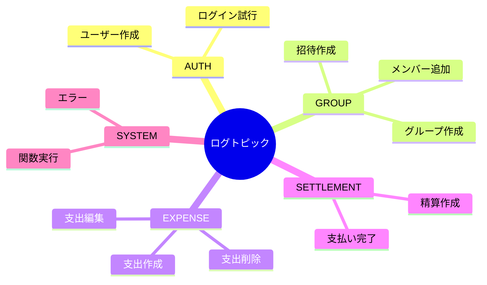
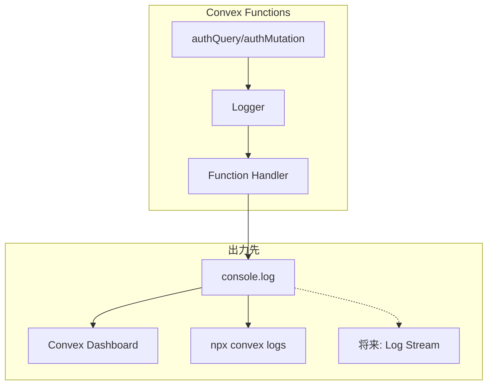
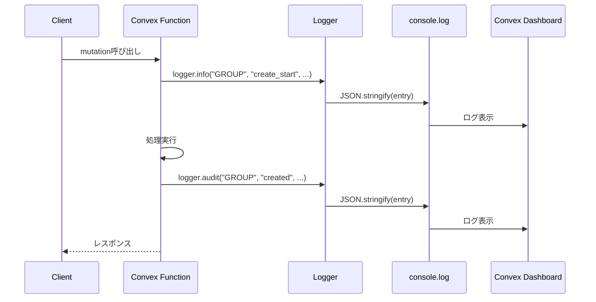
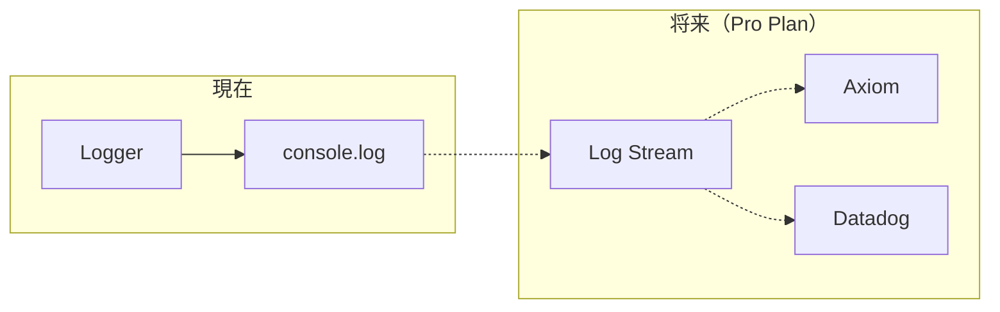

# ロガー機能 設計書

## Overview

Oaiko（おあいこ）における構造化ロギング機能の設計。Convex関数で統一されたログ出力を行い、デバッグ、監査、運用監視を効率化する。

## Purpose

### なぜ必要か

1. **デバッグの効率化**
   - 開発中の問題特定を迅速化
   - 本番環境での障害調査をサポート

2. **監査ログの基盤**
   - セキュリティチェックリストで「監査ログ未実装」と指摘
   - 重要操作（グループ作成、精算等）の記録が必要

3. **運用監視の準備**
   - 将来のログストリーム連携（Axiom/Datadog）への布石
   - 構造化ログにより分析・アラート設定が容易に

4. **一貫性のあるログ出力**
   - 開発者ごとのログ形式のばらつきを防止
   - 検索・フィルタリングしやすい形式

### 代替案との比較

| 方法 | メリット | デメリット |
|------|----------|------------|
| 素の `console.log` | 実装不要 | 形式不統一、検索困難 |
| 構造化ロガー（採用） | 検索容易、拡張性高 | 初期実装コスト |
| 外部ログサービス直接連携 | 高機能 | 設定複雑、コスト（Pro Plan必要） |

## What to Do

### 機能要件

#### 1. ログレベル

| レベル | 用途 | 出力先 |
|--------|------|--------|
| `debug` | 開発時の詳細情報 | 開発環境のみ |
| `info` | 通常の処理情報 | 全環境 |
| `warn` | 警告（処理は継続） | 全環境 |
| `error` | エラー（処理失敗） | 全環境 |
| `audit` | 監査ログ（重要操作） | 全環境 |

#### 2. ログトピック



#### 3. ログ出力形式

```json
{
  "timestamp": "2024-12-30T12:00:00.000Z",
  "level": "info",
  "topic": "GROUP",
  "action": "create",
  "userId": "user_abc123",
  "metadata": {
    "groupId": "group_xyz789",
    "groupName": "テスト家計簿"
  },
  "message": "グループを作成しました",
  "requestId": "req_123456"
}
```

#### 4. 提供するAPI

```typescript
// 使用例
ctx.logger.info("GROUP", "create", { groupId, groupName }, "グループを作成しました");
ctx.logger.error("EXPENSE", "create", { error: e.message }, "支出作成に失敗");
ctx.logger.audit("SETTLEMENT", "complete", { settlementId, amount }, "精算が完了");
```

### 非機能要件

| 項目 | 要件 |
|------|------|
| パフォーマンス | ログ出力が処理時間に影響しない（同期的に実行） |
| 可用性 | ログ出力の失敗が本体処理に影響しない |
| 拡張性 | 将来のログストリーム連携に対応可能な形式 |
| 型安全性 | トピック、レベルは型で制約 |

## How to Do It

### アーキテクチャ



### ディレクトリ構成

```
convex/
├── lib/
│   ├── logger.ts        # ロガー本体
│   └── auth.ts          # 既存（ロガー統合）
└── ...
```

### 実装詳細

#### 1. ログトピック・レベル定義

```typescript
// convex/lib/logger.ts

export const LOG_TOPICS = {
  AUTH: "AUTH",
  GROUP: "GROUP",
  EXPENSE: "EXPENSE",
  SETTLEMENT: "SETTLEMENT",
  SHOPPING: "SHOPPING",
  SYSTEM: "SYSTEM",
} as const;

export type LogTopic = (typeof LOG_TOPICS)[keyof typeof LOG_TOPICS];

export const LOG_LEVELS = {
  debug: "debug",
  info: "info",
  warn: "warn",
  error: "error",
  audit: "audit",
} as const;

export type LogLevel = (typeof LOG_LEVELS)[keyof typeof LOG_LEVELS];
```

#### 2. ロガークラス

```typescript
// convex/lib/logger.ts

interface LogEntry {
  timestamp: string;
  level: LogLevel;
  topic: LogTopic;
  action: string;
  userId?: string;
  metadata?: Record<string, unknown>;
  message?: string;
  requestId?: string;
}

export class Logger {
  private userId?: string;

  constructor(userId?: string) {
    this.userId = userId;
  }

  private log(
    level: LogLevel,
    topic: LogTopic,
    action: string,
    metadata?: Record<string, unknown>,
    message?: string
  ): void {
    const entry: LogEntry = {
      timestamp: new Date().toISOString(),
      level,
      topic,
      action,
      userId: this.userId,
      metadata,
      message,
    };

    // JSON形式で出力（将来のログストリーム対応）
    const output = JSON.stringify(entry);

    switch (level) {
      case "debug":
        console.debug(output);
        break;
      case "info":
        console.info(output);
        break;
      case "warn":
        console.warn(output);
        break;
      case "error":
        console.error(output);
        break;
      case "audit":
        console.info(output); // auditはinfo扱いだが、topicで区別
        break;
    }
  }

  debug(topic: LogTopic, action: string, metadata?: Record<string, unknown>, message?: string) {
    this.log("debug", topic, action, metadata, message);
  }

  info(topic: LogTopic, action: string, metadata?: Record<string, unknown>, message?: string) {
    this.log("info", topic, action, metadata, message);
  }

  warn(topic: LogTopic, action: string, metadata?: Record<string, unknown>, message?: string) {
    this.log("warn", topic, action, metadata, message);
  }

  error(topic: LogTopic, action: string, metadata?: Record<string, unknown>, message?: string) {
    this.log("error", topic, action, metadata, message);
  }

  audit(topic: LogTopic, action: string, metadata?: Record<string, unknown>, message?: string) {
    this.log("audit", topic, action, metadata, message);
  }
}
```

#### 3. 認証ミドルウェアへの統合

```typescript
// convex/lib/auth.ts（変更箇所）

import { Logger } from "./logger";

export type AuthQueryCtx = QueryCtx & {
  user: AuthUser;
  logger: Logger;  // 追加
};

export type AuthMutationCtx = MutationCtx & {
  user: AuthUser;
  logger: Logger;  // 追加
};

// authQueryMiddleware 内
return {
  ctx: {
    ...ctx,
    user,
    logger: new Logger(user._id),  // 追加
  },
  args,
};
```

#### 4. 使用例

```typescript
// convex/groups.ts

export const create = authMutation({
  args: {
    name: v.string(),
    description: v.optional(v.string()),
  },
  handler: async (ctx, args) => {
    ctx.logger.info("GROUP", "create_start", { name: args.name });

    // バリデーション
    const name = args.name.trim();
    if (name.length === 0) {
      ctx.logger.warn("GROUP", "create_validation_failed", { reason: "empty_name" });
      throw new Error("グループ名を入力してください");
    }

    // ... 処理 ...

    const groupId = await ctx.db.insert("groups", { ... });

    // 監査ログ
    ctx.logger.audit("GROUP", "created", {
      groupId,
      groupName: name,
      ownerId: ctx.user._id,
    });

    return groupId;
  },
});
```

### シーケンス図



### ログ検索・フィルタリング

#### Convex Dashboard

```
# トピックでフィルタ
"topic":"GROUP"

# レベルでフィルタ
"level":"error"

# ユーザーIDでフィルタ
"userId":"user_abc123"

# 監査ログのみ
"level":"audit"
```

#### CLI

```bash
# 全ログ確認
npx convex logs

# grepでフィルタ
npx convex logs | grep '"topic":"GROUP"'

# エラーのみ
npx convex logs | grep '"level":"error"'
```

## What We Won't Do

### MVP外の機能

| 項目 | 理由 |
|------|------|
| ログストリーム連携（Axiom/Datadog） | Pro Plan必要、MVP後に検討 |
| ログのDB保存 | 容量・コスト懸念、必要になったら検討 |
| リアルタイムアラート | ログストリーム連携後に検討 |
| ログローテーション | Convex側で管理 |
| フロントエンドロギング | バックエンドのみ対象 |
| パフォーマンス計測ログ | `console.time` は別途必要時に使用 |

### 対象外の操作

| 操作 | 理由 |
|------|------|
| 読み取り操作（query）の詳細ログ | 量が多すぎる、必要時のみdebugで |
| 認証情報の詳細 | セキュリティリスク |
| パスワード等の機密情報 | ログに出力禁止 |

## Concerns

### 懸念事項と対策

| 懸念 | リスク | 対策 |
|------|--------|------|
| ログ出力によるパフォーマンス低下 | 処理遅延 | 同期的console.logは軽量、影響は軽微 |
| ログ容量の増大 | Convexの制限に達する | 重要な操作のみ記録、debugは開発時のみ |
| 機密情報の漏洩 | セキュリティリスク | metadataに入れる情報を精査 |
| ログ形式の変更 | 既存ログとの互換性 | バージョニングを検討 |

### 未解決の疑問

| 疑問 | 検討状況 |
|------|----------|
| debugログを本番で無効化するか | 環境変数で制御？一旦全環境で出力 |
| ログにRequest IDを含めるか | Convexが自動付与、手動で取得は困難 |
| 監査ログの保持期間 | Convexの制限に依存、重要なら別途保存 |

### 将来の拡張



## Reference Materials/Information

### Convex公式

- [Debugging | Convex Developer Hub](https://docs.convex.dev/functions/debugging) - デバッグ方法
- [Logs | Convex Developer Hub](https://docs.convex.dev/dashboard/deployments/logs) - ログ表示
- [Log Streams | Convex Developer Hub](https://docs.convex.dev/production/integrations/log-streams/) - ログストリーム
- [Customizing serverless functions](https://stack.convex.dev/custom-functions) - カスタム関数

### 構造化ロギング

- [Log Streams: Common uses](https://stack.convex.dev/log-streams-common-uses) - ログストリームの活用例
- [Observing your app in production](https://stack.convex.dev/observability-in-production) - 本番環境の監視

### 注意事項

- Convexバックエンドは限られた数のログのみ保持し、メンテナンス時に消去される可能性がある
- 本番環境ではクライアントにログが送信されない（セキュリティ上の理由）
- 長期保存が必要な場合はLog Stream連携を検討

## 変更履歴

| 日付 | 変更内容 | 変更者 |
|------|----------|--------|
| 2024-12-30 | 初版作成 | Claude |
