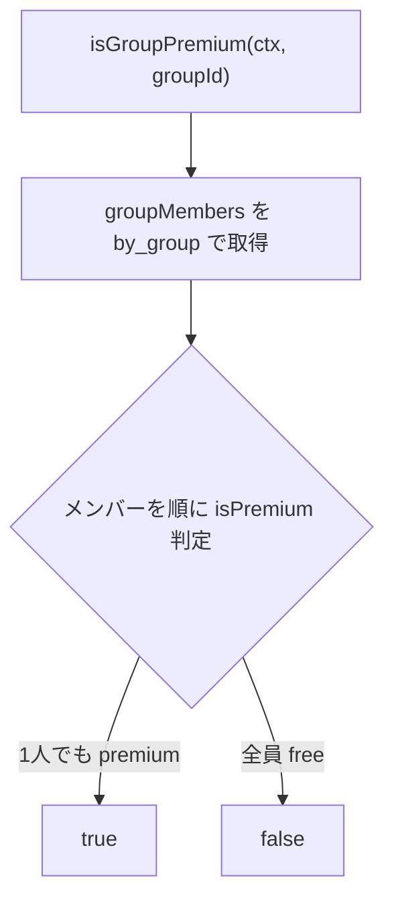

# 設計書: ペアプラン（グループ単位Premium解放）

## Overview

Premium判定を「ユーザー単位」から「グループ単位」に変更する。グループ内に1人でもPremiumメンバーがいれば、グループ全員がそのグループ内でPremium機能を使えるようにする。

料金・プラン構成（¥100/月・¥1,000/年）は変更しない。Stripe側の変更もなし。

## Purpose

### 背景

- Pairboは「2人で使う家計簿」だが、課金はユーザー個人単位
- 片方がPremiumでも、もう片方は傾斜折半の支出を作成・編集できず、タグも付けられない。グループ単位で価値が出る機能（傾斜折半・タグ・年次分析）の体験が歪んでいる
- カップル間で「どっちが払うか」という課金の心理的ハードルが存在する

### 目的

1. 「1人分の課金で2人とも使える」という訴求で課金摩擦を下げる
2. Premium機能のグループ内体験を一貫させる
3. 競合（個人単位課金の家計簿アプリ）との差別化

### 前提

このDocは以下2機能の前提となる（判定基盤を共有するため先行実装する）:

- [design-recurring-expenses.md](design-recurring-expenses.md) 定期支出の自動記録
- [design-budget.md](design-budget.md) 予算機能

## What to Do

### 機能要件

| ID   | 要件                                                                                                         |
| ---- | ------------------------------------------------------------------------------------------------------------ |
| FR-1 | グループ内に1人でもPremiumメンバー（有料・trial・planOverride含む）がいれば、グループ全員にPremium機能を解放 |
| FR-2 | 対象機能: 傾斜折半、タグ、年次分析・月別推移、データエクスポート、広告非表示                                 |
| FR-3 | pricing頁・Premium訴求UIの文言を「1人分の課金で2人とも使える」に更新                                         |
| FR-4 | 判定はグループ文脈でのみ変更する。グループ文脈のない画面（pricing頁の自プラン表示等）は従来の個人判定のまま  |

### 非機能要件

- 既存のPremiumユーザー・trialユーザーの体験を壊さない（本人の解放範囲は従来と同一以上）
- 判定クエリの追加読み取りはグループメンバー数（実質2人）分に留める

## How to Do It

### 判定ロジック

個人判定 `isPremium`（planOverride → trial → Stripe subscription の順で評価）は変更せず、その上に `isGroupPremium` を重ねる。

### バックエンド変更

`convex/lib/subscription.ts`:

- `isGroupPremium(ctx, groupId): Promise<boolean>` を追加
- 機能別ゲート関数のシグネチャを userId → groupId に変更:
  - `canUseSlopedSplit(ctx, groupId)`
  - `canUseTags(ctx, groupId)`
  - `canAccessYearlyAnalytics(ctx, groupId)`
  - `canExportData(ctx, groupId)`

呼び出し側（すべて args に groupId を持つため引数の差し替えのみ）:

| ファイル              | 箇所                                                   |
| --------------------- | ------------------------------------------------------ |
| `convex/expenses.ts`  | create / update の傾斜折半チェック、タグ紐付けチェック |
| `convex/tags.ts`      | タグCRUD 4箇所                                         |
| `convex/analytics.ts` | 年次分析・タグ分析のゲート                             |
| `convex/google.ts`    | エクスポートのゲート                                   |

### フロントエンド変更

新規クエリ `subscriptions.getGroupPremium({ groupId })` を追加し、`{ isPremium: boolean }` を返す。

現在 `subscription?.plan === "premium"`（個人判定）でUIを切り替えている箇所のうち、グループ文脈の画面を新クエリに置き換える:

- `app/groups/[groupId]/expenses/` 配下（一覧・新規・詳細）
- `components/expenses/ExpenseCreateModal.tsx` / `ExpenseEditModal.tsx`
- `components/analytics/AnalyticsContent.tsx`
- `components/settings/ExportButton.tsx`
- `components/ads/AdBanner.tsx` / `ProPromoBanner.tsx`（グループ画面内の表示判定）

pricing頁・`TrialRemainingBanner` は個人のプラン状態を表示する画面なので `getMySubscription` のまま。

### 訴求文言の更新

- pricing頁のPremiumプラン特徴に「1人分の課金でグループ全員が使えます」を追加
- `ProPromoBanner` 等の訴求文言も同様に更新
- LP（`components/landing/LandingPage.tsx`）の料金セクションを確認し、同じ訴求を反映

### テスト・その他

- `convex/__tests__/` に `isGroupPremium` のユニットテスト（片方Premium/両方Free/trial中/planOverride/脱退後）
- 既存の機能ゲートテストの引数を groupId に追従
- `lib/releases.ts` にリリースノート追加（「Premiumがグループ全員に適用されるようになりました」）
- シードデータ: subscription はシード対象外（確認済み）。動作確認は管理者モードの planOverride トグルで片方だけPremiumの状態を作って行う

## What We Won't Do

- Stripe側のプラン・価格変更（ペアプラン専用SKUは作らない）
- グループ数・解放範囲の制限（Premiumユーザーが複数グループに入ると全グループ解放されるが許容）
- 「どちらが支払うか」の管理UI（支払者の重複課金防止はFAQ・訴求文言での案内に留める）
- 広告非表示のユーザー単位維持（グループ単位に統一する）

## Alternatives Considered

| 案                                         | 概要                                   | 不採用理由                                                             |
| ------------------------------------------ | -------------------------------------- | ---------------------------------------------------------------------- |
| B: ペアプラン専用SKU（例: ¥150/月）        | Stripeに新Priceを追加し2人分を明示課金 | 単価据え置き方針と矛盾。Price管理・UI説明・移行導線のコスト増          |
| パートナー招待制（課金者が相手を指名）     | 解放範囲を明示的に1人に限定            | 指名UI・解除フローが必要になり複雑。同棲カップル向けでは乱用実害が薄い |
| フロントのみグループ判定・バックは個人判定 | 実装最小                               | mutation側で弾かれて操作が失敗する。判定の二重管理はバグの温床         |

## Concerns

- **Premiumメンバーの脱退・解約時**: グループが Free に戻り、相手が使っていたタグ・傾斜折半がロックされる。既存データは保持され閲覧可能（現行のtrial失効時と同じ挙動）だが、体験としては急に見えるため、将来的に猶予表示を検討
- **両方が課金する重複**: 片方が課金済みなのに相手も課金してしまうケース。pricing頁で「グループ内にPremiumメンバーがいます」の表示を出すかは実装時に判断
- **読み取り増**: ゲート判定ごとにメンバー全員分の subscription 読み取りが発生。メンバー数は実質2〜数人なので許容

## Reference Materials/Information

- `convex/lib/subscription.ts` — 現行の個人単位判定
- `docs/design-monetization.md` — 収益化の全体設計
- `docs/design-invite-reward-trial.md` — trial延長リワード（trial判定との相互作用）
