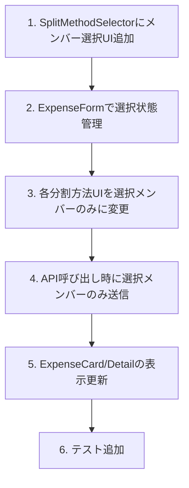

# 一部メンバー選択（部分分割） 設計ドキュメント

## 概要

グループの一部メンバーだけを支払い対象にできるようにする。例: 5人グループで3人だけで外食した場合、その3人だけで均等分割。

## 目的

現状、支出は必ず全メンバーで分割される。しかし実際の利用シーンでは：

- 5人のシェアハウスで、3人だけで外食した
- カップルで片方だけが使う化粧品を買った
- 一部メンバーだけが参加したイベント費用

このような場合、関係ないメンバーにも負担が発生してしまう問題がある。

## やること

### 機能要件

1. **参加メンバー選択UI**
   - 支出作成/編集時に、どのメンバーが負担するかを選択可能にする
   - デフォルトは全員選択（後方互換）

2. **各分割方法での対応**

   | 分割方法 | 現状             | 変更後                        |
   | -------- | ---------------- | ----------------------------- |
   | 均等     | 全員で均等       | 選択メンバーで均等            |
   | 割合     | 全員の割合を設定 | 選択メンバーの割合を設定      |
   | 金額     | 全員の金額を設定 | 選択メンバーの金額を設定      |
   | 全額     | 1人が全額負担    | 選択メンバーから1人が全額負担 |

3. **参加しないメンバーの扱い**
   - expenseSplitsに0円のレコードを作らない（そもそも関係ない）
   - 精算計算からも除外される

### 非機能要件

- 既存データへの影響なし
- 直感的なUI（チェックボックスでメンバー選択）

## やり方

### 1. UI設計

#### メンバー選択UI

分割方法選択の上に、参加メンバーを選択するチェックボックスを配置：

```
┌─────────────────────────────────┐
│ 負担するメンバー                │
│ ┌─────────────────────────────┐ │
│ │ ☑ 田中（自分）              │ │
│ │ ☑ 佐藤                      │ │
│ │ ☐ 山田                      │ │
│ └─────────────────────────────┘ │
│                                  │
│ 分割方法                         │
│ [均等] [割合] [金額] [全額]     │
│                                  │
│ (均等分割: 2人で ¥500 ずつ)     │
└─────────────────────────────────┘
```

#### 分割方法との連携

- **均等**: 選択メンバーで自動計算、プレビュー表示
- **割合**: 選択メンバーのみ入力欄表示、合計100%
- **金額**: 選択メンバーのみ入力欄表示
- **全額**: 選択メンバーから1人を選択

### 2. 状態管理

```typescript
// ExpenseForm内の状態
const [selectedMemberIds, setSelectedMemberIds] = useState<Set<Id<"users">>>(
  new Set(members.map((m) => m.userId)), // デフォルトは全員
);

// 選択変更時
const handleMemberToggle = (userId: Id<"users">) => {
  const newSet = new Set(selectedMemberIds);
  if (newSet.has(userId)) {
    if (newSet.size > 1) {
      // 最低1人は必要
      newSet.delete(userId);
    }
  } else {
    newSet.add(userId);
  }
  setSelectedMemberIds(newSet);
};
```

### 3. バックエンド変更

splitCalculatorは既に部分メンバーに対応しているため、**バックエンド変更は不要**。

```typescript
// 現状のcalculateEqualSplit
export function calculateEqualSplit(
  amount: number,
  memberIds: Id<"users">[], // ← 選択メンバーのみ渡せば良い
  payerId: Id<"users">,
): SplitResult[];
```

### 4. API変更

expenses.create / expenses.update のvalidationで、選択メンバーが0人でないことを確認：

```typescript
// convex/expenses.ts
if (memberIds.length === 0) {
  throw new Error("少なくとも1人のメンバーを選択してください");
}
```

### 5. 実装順序



### 6. コンポーネント変更

#### SplitMethodSelector

```tsx
type SplitMethodSelectorProps = {
  // 既存...
  members: Member[];
  selectedMemberIds: Set<Id<"users">>; // 追加
  onSelectedMemberIdsChange: (ids: Set<Id<"users">>) => void; // 追加
};
```

#### MemberSelector（新規コンポーネント）

```tsx
function MemberSelector({
  members,
  selectedIds,
  onChange,
}: {
  members: Member[];
  selectedIds: Set<Id<"users">>;
  onChange: (ids: Set<Id<"users">>) => void;
}) {
  return (
    <div className="space-y-2">
      <p className="text-sm font-medium text-slate-700">負担するメンバー</p>
      <div className="space-y-1">
        {members.map((member) => (
          <label key={member.userId} className="flex items-center gap-2">
            <input
              type="checkbox"
              checked={selectedIds.has(member.userId)}
              onChange={() => {
                const newSet = new Set(selectedIds);
                if (newSet.has(member.userId)) {
                  if (newSet.size > 1) newSet.delete(member.userId);
                } else {
                  newSet.add(member.userId);
                }
                onChange(newSet);
              }}
              disabled={
                selectedIds.has(member.userId) && selectedIds.size === 1
              }
            />
            <span>{member.displayName}</span>
          </label>
        ))}
      </div>
    </div>
  );
}
```

## やらないこと

1. **支払者の自動除外**: 支払者は負担しないケースもあるが、今回は対応しない（ユーザーが手動で外す）
2. **負担額0円の許可**: 選択されたメンバーは必ず負担する（0円負担は選択解除で対応）
3. **グループ全体のデフォルト設定**: 毎回選択する形式（簡潔さ優先）

## 懸念事項

### 1. 支払者が負担メンバーに含まれない場合

**懸念**: 田中が支払って、佐藤と山田だけが負担する場合、精算計算はどうなるか

**対応**:

- これは有効なケースとして許可する
- 精算計算: 田中は全額立て替え、佐藤と山田が田中に払う
- splitCalculatorは既にこれに対応している（payerIdがmemberIdsに含まれなくても動作）

### 2. 編集時の整合性

**懸念**: 既存の支出を編集する際、元の選択メンバーをどう復元するか

**対応**:

- expenseSplitsから現在の負担メンバーを取得
- amount > 0 のメンバーを選択状態として復元

### 3. 全員未選択の防止

**懸念**: 全員のチェックを外してしまうケース

**対応**:

- 最後の1人はチェックを外せないようにdisabled
- バックエンドでもvalidation

## 参考資料

- 現在のSplitMethodSelector: `components/expenses/SplitMethodSelector.tsx`
- splitCalculator: `convex/domain/expense/splitCalculator.ts`（変更不要）
