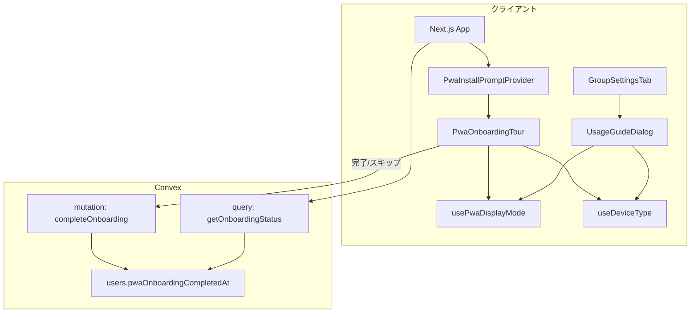
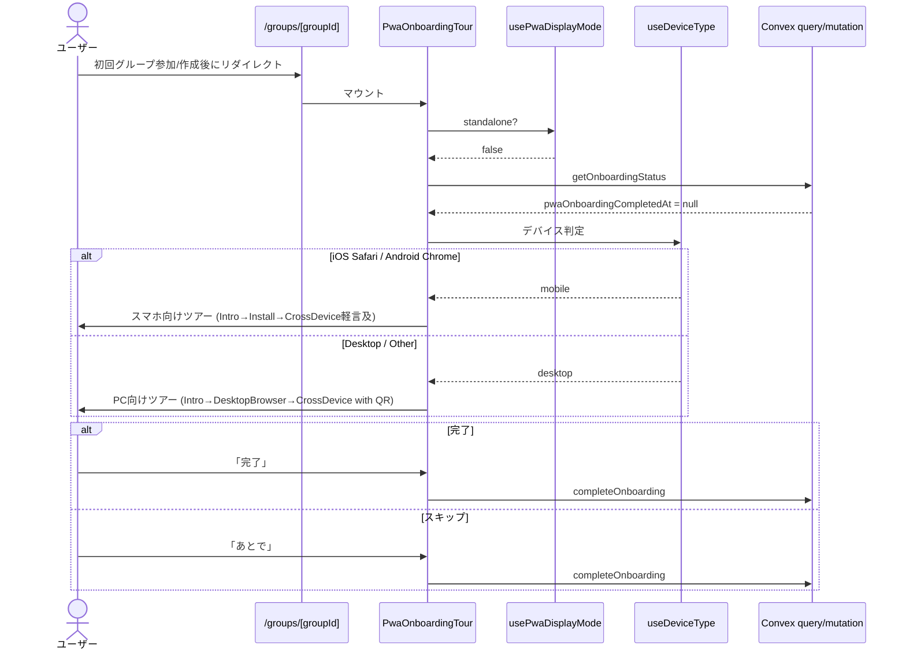
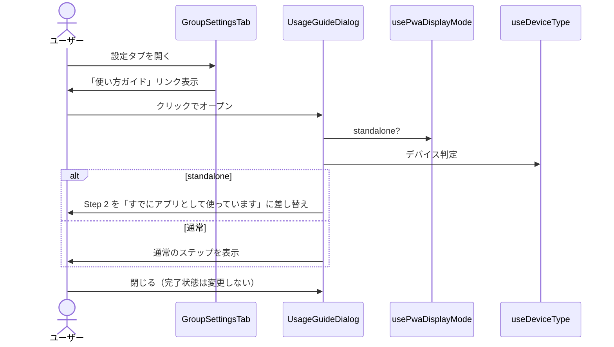
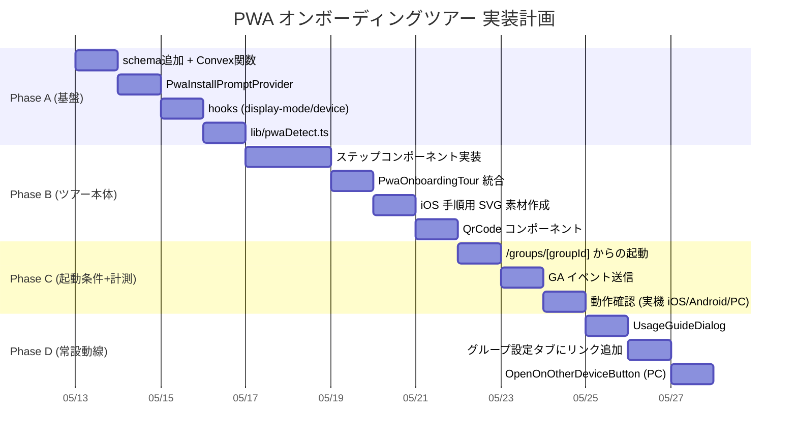

# Overview

Pairbo の「スマホでは PWA としてアプリのように使える / PC ではブラウザでそのまま使える」というマルチデバイス特性を、新規ユーザーに気づかせるためのオンボーディングツアー設計。初回グループ参加/作成完了直後にデバイス別のツアーを 1 回だけ表示し、スマホアクセスでは PWA インストールを強く促進、PC アクセスでは「ブラウザのまま使える」ことを肯定しつつ QR コードでスマホへの避難動線を提供する。グループ設定タブに「使い方ガイド」を常設し、いつでも再アクセスできるようにする。

対象スコープ:

1. **デバイス文脈別オンボーディングツアー**: 初回グループ参加/作成完了直後、`display-mode: standalone` でないユーザーに 1 回だけ表示
2. **設定タブ常設の「使い方ガイド」**: ツアーと同じ UI を完了状態に影響を与えずに何度でも開けるエントリポイント
3. **インストール済み判定**: PWA 起動中ユーザーへは初回ツアーを出さず、常設ガイドでも文言を切り替える

Push 通知基盤（旧設計の F6〜F9）は本設計のスコープ外とし、必要になった時点で別ドキュメントとして起こす。

## Purpose

Pairbo は Web アプリでありながら、スマホでは PWA としてホーム画面に追加すればアプリのように使え、PC ではブラウザでそのまま使えるという二面性を持つ。これは「アプリインストール必須」のネイティブにも、「毎回ブラウザを開く必要がある」純粋な Web サイトにもない強みだが、ユーザーは多くの場合これに気づかず、スマホでもブラウザブックマークから起動して「面倒 → 忘却 → 離脱」のループに入る。

- **スマホユーザーのリテンション強化**: ホーム画面アイコン化により毎日目に入る導線を確保。ブラウザブックマーク依存から脱却し、Web の最大弱点である忘却性を抑え込む
- **PC 派ユーザーへの「使い方の自由」訴求**: 「アプリじゃないと使えない」というネイティブアプリの欠点を回避し、好きなデバイス・好きな形態で使えることを認知させる
- **マルチデバイス連携の認知**: 同じアカウントでスマホ・PC 両方使える事実を伝え、相棒へのシェア・併用を促す
- **将来の Push 通知基盤の土台**: iOS 16.4 以降、PWA をホーム画面追加したユーザーのみ Push を受け取れる。インストール率の底上げが次フェーズの前提条件となる

これらを単発のモーダルや散発的なバナーではなく、定着開始の節目（初回グループ参加/作成完了）に集約した 1 回のツアーで束ねて伝える。

## What to Do

### 機能要件

**F1. オンボーディングツアー起動条件**

- ログイン済みかつ `users.pwaOnboardingCompletedAt` が未設定
- `matchMedia('(display-mode: standalone)')` が false（PWA 起動でない）
- 初回グループ作成 or 招待受諾完了直後の遷移先 `/groups/[groupId]` で起動
- スキップ・完了いずれの結果でも `pwaOnboardingCompletedAt` に現在時刻を保存し、以後表示しない

**F2. インストール可否判定（主軸）とツアー分岐**

- **主判定軸は `canPrompt`**（`beforeinstallprompt` 由来の `deferredPrompt` を保持しているか）。`true` なら「アプリ化」ボタン押下で `deferredPrompt.prompt()` を呼んでネイティブダイアログを起動できる
- UA 判定（`iosSafari` / `iosOther` / `androidChrome` / `androidOther` / `desktopChrome` / `desktopSafari` / `desktopFirefox` / `other`）は `canPrompt = false` のときの手動ガイドの出し分けにのみ使う
- 形態分岐（モバイル向けツアー / PC 向けツアー）は OS レベルで決定（iOS/Android → モバイル、その他 → PC）
- ツアー本体は単一の `PwaOnboardingTour` コンポーネントで、形態判定とステップ内容を出し分け

**F3. インストール起動の自動化（全環境共通）**

- `canPrompt = true` の環境では「アプリ化」ボタン押下でネイティブダイアログを 1 タップ起動
- 対象環境: Android Chrome / Edge / Samsung Internet / Desktop Chrome / Desktop Edge 等
- ボタン押下結果（`accepted` / `dismissed`）を GA に送る
- `appinstalled` イベントを捕捉してインストール完了を計測

**F4. スマホ向けツアー（iOS / Android）**

- Step 1: 「Pairbo は 2 つの使い方ができます」マルチデバイス導入
- Step 2: 「スマホならアプリのように使えます」
  - `canPrompt = true` の場合: 「アプリ化」ボタン → ワンタップ起動（F3）
  - `canPrompt = false` の場合: UA 別の手動ガイド
    - iOS Safari: 「共有 → ホーム画面に追加」3 ステップ画像付き
    - iOS Chrome / Edge / その他: 「Safari で開き直して、共有 → ホーム画面に追加」を案内（iOS では Safari 以外からのホーム画面追加は不可）
    - Android で `beforeinstallprompt` 未発火: 「メニュー → アプリをインストール」を案内
- Step 3: 「PC のブラウザからも同じアカウントで使えます」（軽く言及するのみ）

**F5. PC 向けツアー（desktop / other）**

- Step 1: 「Pairbo は 2 つの使い方ができます」マルチデバイス導入（スマホ向けと同一）
- Step 2: 「PC ならブラウザでそのまま使えます」を主軸（いま使っている状態を肯定し、PC 派ユーザーの自由を尊重）
  - `canPrompt = true` の場合（Desktop Chrome / Edge 等）: 「ブラウザのままで使う」を主 CTA、「アプリ化もできます」を補助 CTA として並列提示。押下でワンタップ起動
  - `canPrompt = false` の場合: ブラウザ別の補足
    - Desktop Safari（macOS Sonoma 以降）: 「ファイル → Dock に追加」が可能であることを軽く案内
    - Desktop Safari（それ以前）/ Firefox / その他: 「ブラウザのまま使えます」のみ
- Step 3: 「スマホでも同じアカウントで使えます」+ `https://pairbo.app` の QR コード表示

**F6. 設定タブ常設の「使い方ガイド」**

- グループ設定タブのアプリバージョン表示の上に「使い方ガイド」リンクを追加
- クリックでツアーと同じ UI が `UsageGuideDialog` として開く
- `pwaOnboardingCompletedAt` には影響を与えない（何度開いても完了扱いにしない）
- standalone 起動中に開いた場合は Step 2 の文言を「すでにアプリとして使っています」に差し替え

**F7. インストール済み判定と分岐**

- `matchMedia('(display-mode: standalone)')` で PWA 起動を検知
- standalone なら初回ツアーは起動条件不成立で表示しない（`pwaOnboardingCompletedAt` も書き込まない）
- 設定タブの「使い方ガイド」内ではスマホ向け Step 2 を「すでにアプリとして使っています」表示に差し替え

**F8. PC 常設「スマホで開く」ボタン**

- PC（`desktop` / `other`）アクセス時のみ、ヘッダー右上（ユーザーメニューの隣）に小さなアイコンボタンを常設
- アイコンはスマホ + QR を想起させるもの（例: `lucide-react` の `Smartphone` または `QrCode` アイコン）
- クリックでポップオーバーが開き、`https://pairbo.app` の QR コードと短い説明（「スマホでこの QR を読み取るとそのまま開けます」）を表示
- ツアー Step 3 の QR コード表示と同じ `QrCode` コンポーネントを再利用
- スマホアクセス時（iOS / Android）は描画しない（自分のデバイスで開いてもメリットが薄い）
- ツアー Step 3 を見たかどうかに関係なく常に表示。「さっと出せる」動線が目的

**F9. 計測**

- GA カスタムイベント:
  - `onboarding_tour_started` / `onboarding_tour_step_viewed`（step 番号付き）
  - `install_prompt_shown` / `install_prompt_accepted` / `install_prompt_dismissed`（Android Chrome のネイティブプロンプト経由のみ）
  - `qr_code_shown`（PC ツアー Step 3 到達）
  - `onboarding_tour_skipped` / `onboarding_tour_completed`
  - `usage_guide_opened`（設定タブから常設ガイド起動時）
  - `open_on_other_device_clicked`（PC ヘッダー常設ボタン押下）
- ユーザー属性として `pwa_installed`（standalone 検知の有無）を送信

### 非機能要件

- モーダル UI は既存の `@radix-ui/react-dialog` を利用して視覚整合性を保つ
- `display-mode` 判定 / UA 判定は SSR セーフ（`useEffect` でクライアントマウント後に確定）
- 判定確定までツアー UI を表示しないことでフラッシュを抑制
- QR コード生成はクライアントサイドで完結し、外部 API への依存を持たない
- iOS 手順用の画像は SVG で軽量化し `/public/onboarding/` 配下に配置
- Convex `users` テーブルへの `pwaOnboardingCompletedAt` 追加は optional フィールド（破壊的変更ではない）

## How to Do It

### 全体アーキテクチャ



### コンポーネント / フック設計

**新規作成**

| パス                                             | 役割                                                                                                    |
| ------------------------------------------------ | ------------------------------------------------------------------------------------------------------- |
| `components/pwa/PwaInstallPromptProvider.tsx`    | `beforeinstallprompt` を保持、`appinstalled` を捕獲、`deferredPrompt` を context 提供                   |
| `components/pwa/PwaOnboardingTour.tsx`           | 初回ツアー本体。起動条件チェック・ステップ進行・完了書き込み                                            |
| `components/pwa/UsageGuideDialog.tsx`            | 設定タブから開く常設ガイド。Tour と同じステップを完了状態を変えずに表示                                 |
| `components/pwa/InstallButton.tsx`               | 「アプリ化」ボタン共通コンポーネント。`canPrompt` 判定 + `prompt()` 起動を内包                          |
| `components/pwa/QrCode.tsx`                      | クライアントサイド QR コード生成                                                                        |
| `components/pwa/OpenOnOtherDeviceButton.tsx`     | PC ヘッダー常設の「スマホで開く」アイコンボタン + ポップオーバー（QR 表示）                             |
| `components/pwa/steps/IntroStep.tsx`             | Step 1: マルチデバイス導入（モバイル/PC 共通文言）                                                      |
| `components/pwa/steps/MobileInstallStep.tsx`     | スマホ向け Step 2。`canPrompt = true` ならボタン、false なら UA 別ガイドへ分岐                          |
| `components/pwa/steps/DesktopBrowserStep.tsx`    | PC 向け Step 2。「ブラウザのまま」を主軸、`canPrompt = true` なら補助 CTA も並列                        |
| `components/pwa/steps/CrossDeviceStep.tsx`       | Step 3（スマホ→PC 言及 / PC→QR コード）                                                                 |
| `components/pwa/guides/IosSafariGuide.tsx`       | iOS Safari 用「共有→ホーム画面に追加」3 ステップ                                                        |
| `components/pwa/guides/IosOtherBrowserGuide.tsx` | iOS の Safari 以外（Chrome / Edge 等）向け「Safari で開き直して追加」案内                               |
| `components/pwa/guides/AndroidManualGuide.tsx`   | Android で `beforeinstallprompt` 未発火時のメニュー手順案内                                             |
| `components/pwa/guides/DesktopSafariGuide.tsx`   | Desktop Safari（macOS Sonoma+ なら「Dock に追加」、それ以前は案内なし）                                 |
| `hooks/usePwaDisplayMode.ts`                     | `matchMedia('(display-mode: standalone)')` を SSR セーフに返す                                          |
| `hooks/useDeviceType.ts`                         | OS（iOS / Android / Desktop / Other）+ ブラウザ（Safari / Chrome / Edge / Firefox / Other）の組合せ判定 |
| `hooks/useInstallPrompt.ts`                      | Provider から `{ canPrompt, prompt }` を取り出して提供                                                  |
| `lib/pwaDetect.ts`                               | UA 判定・display-mode 判定の純粋関数                                                                    |
| `public/onboarding/ios-share-*.svg` 他           | iOS 手順用アイコン素材                                                                                  |

**変更**

| パス                               | 内容                                                                                |
| ---------------------------------- | ----------------------------------------------------------------------------------- |
| `app/layout.tsx`                   | `<PwaInstallPromptProvider>` でラップ                                               |
| `convex/schema.ts`                 | `users` テーブルに `pwaOnboardingCompletedAt: v.optional(v.number())` 追加          |
| `convex/users.ts`                  | `getOnboardingStatus` query, `completeOnboarding` mutation 追加                     |
| `app/groups/[groupId]/page.tsx`    | マウント時に `<PwaOnboardingTour />` 配置                                           |
| グループ設定タブ該当ファイル       | アプリバージョン表示の上に「使い方ガイド」リンク追加、`<UsageGuideDialog />` を配置 |
| ヘッダーコンポーネント該当ファイル | PC アクセス時のみ `<OpenOnOtherDeviceButton />` を配置                              |
| `lib/analytics.ts`                 | 新規イベント名を型で定義（任意）                                                    |

### 起動フロー



### 設定タブ常設ガイドのフロー



### Convex データモデル追加

`convex/schema.ts` の `users` テーブルに 1 フィールド追加:

```typescript
users: defineTable({
  // 既存フィールド…
  pwaOnboardingCompletedAt: v.optional(v.number()),
}),
```

### Convex 関数

```typescript
// convex/users.ts に追加

export const getOnboardingStatus = query({
  args: {},
  handler: async (ctx) => {
    const identity = await ctx.auth.getUserIdentity();
    if (!identity) return null;
    const user = await ctx.db
      .query("users")
      .withIndex("by_clerk_id", (q) => q.eq("clerkId", identity.subject))
      .unique();
    return { pwaOnboardingCompletedAt: user?.pwaOnboardingCompletedAt ?? null };
  },
});

export const completeOnboarding = mutation({
  args: {},
  handler: async (ctx) => {
    const identity = await ctx.auth.getUserIdentity();
    if (!identity) throw new Error("Not authenticated");
    const user = await ctx.db
      .query("users")
      .withIndex("by_clerk_id", (q) => q.eq("clerkId", identity.subject))
      .unique();
    if (!user) throw new Error("User not found");
    await ctx.db.patch(user._id, { pwaOnboardingCompletedAt: Date.now() });
  },
});
```

### QR コード生成

QR コード表示は外部 API 依存を避けるため、軽量ライブラリ `qrcode.react` をクライアントサイドのみで使用する。SSR セーフな実装にするため `next/dynamic` で `ssr: false` 指定でロード。

```typescript
// components/pwa/QrCode.tsx
const QRCodeSVG = dynamic(
  () => import("qrcode.react").then((m) => m.QRCodeSVG),
  { ssr: false },
);
```

### 実装ロードマップ



Phase ごとに独立した PR を作成する。Phase A〜C 完了時点で staging にデプロイして実機確認 → Phase D を後追いする想定。

## What We Won't Do

- **Push 通知基盤一式**: VAPID、購読管理、cron 送信、各種リマインダーは別ドキュメントで設計
- **文脈依存モーダル（招待後 / 初回支出後）の二段構え**: 1 回のオンボーディングツアーに集約
- **再プロンプトバッジ / 「アプリで開く」誘導**: 設定タブ常設ガイドで代替
- **Desktop 向け強い訴求**: PC 利用はブラウザで肯定するのみ。インストール促進はしない
- **ネイティブアプリ化（Capacitor / React Native 等）**: PWA で戦略を成立させる
- **主要機能の使い方チュートリアル**: ガイドは PWA / マルチデバイス認知のみ。機能の使い方は画面 UI で自己説明的に伝える
- **A/B テスト**: MVP では固定実装
- **オフライン対応（Background Sync 等）**: 既存 `docs/design-pwa.md` の方針を踏襲

## Alternatives Considered

### A1. 元設計案: 文脈依存モーダル 2 段（招待参加直後 + 初回支出記録直後）+ Push 通知基盤

**内容**: 招待参加完了直後と初回支出記録直後の 2 箇所でインストールモーダルを出し、加えて Web Push 基盤を一括構築。

**不採用の理由**:

- 「マルチデバイス特性を気づかせる」というユーザーの真の目的を、PWA インストール促進だけでカバーするには弱い
- モーダルが 2 回出るとうるさい。1 回のツアーに集約する方がメッセージが伝わる
- Push 通知基盤はインストール率が一定積み上がってから着手する方が ROI が高い

### A2. ブラウザ標準のインストールバナーのみに依存

**内容**: `beforeinstallprompt` を抑止せず、ブラウザの自動バナーに任せる。

**不採用の理由**:

- iOS Safari は自動バナー非発火
- 表示タイミングをプロダクト側でコントロールできない
- 「マルチデバイス対応」という Pairbo 固有メッセージを乗せられない

### A3. PWA 促進だけに絞り、PC への言及はしない

**内容**: スマホ向け PWA インストールツアーだけを実装し、PC ユーザーには何も出さない。

**不採用の理由**:

- 目的が「マルチデバイス特性に気づかせること」なので、PC ユーザーに何も伝えないと体験向上に寄与しない
- PC で使い始めた人が「スマホでも使える」と気づかず、相棒へのシェア・併用の障壁が上がる

### A4. オンボーディング内で全機能ツアー（割り勘、傾斜、精算等を含める）

**内容**: PWA / マルチデバイス認知に加え、主要機能の使い方もオンボーディングで一括説明。

**不採用の理由**:

- 一度に詰め込むとスキップされやすい
- 機能の使い方は画面 UI で自己説明的に伝えるべき
- マルチデバイス認知は「気づき」のための説明 UI が必要なケースで、機能説明とは性質が異なる

### A5. 常設リンクのみ、初回ツアーなし

**内容**: 設定画面に「使い方ガイド」を置くだけで、初回ツアーは出さない。

**不採用の理由**:

- 能動的に設定を開く人しか気づけず、認知率が極端に下がる
- 「マルチデバイス対応」という事実は受動的に届かないと伝わらない

### A6. PC 訴求は「URL 文字列のみ」、QR コード非表示

**内容**: PC 向け Step 3 で「pairbo.app をスマホで開いて」と URL を見せるだけ。

**不採用の理由**:

- 認知から行動までの摩擦が高い（スマホで URL 手入力）
- QR コード生成はクライアントライブラリで完結でき、実装コストが低い

## Concerns

### C1. 初回グループ参加/作成直後にモーダル過多にならないか

招待受諾→グループ画面遷移→いきなりツアーモーダル の連続でうるさく感じる懸念。

**緩和策**:

- グループ画面の初期表示後に 500ms 程度ディレイしてからツアー起動
- ツアー最初のステップで「あとで」を目立たせ、心理的圧迫を減らす
- グループ画面側で「Welcome」的なトースト等を出さないようにし、ツアーと競合させない

### C2. iOS Safari の制約

`beforeinstallprompt` 非発火のため手動ガイドのみ。ガイドを正確に作っても「面倒で離脱」する一定割合は不可避。

**緩和策**: 共有メニュー・「ホーム画面に追加」アイコンを SVG で実物に近い見た目にし、迷わず操作できるよう設計。Step 2 で 1〜3 番の番号付き手順を視覚的に強調。

### C3. Android Chrome の `beforeinstallprompt` タイミング

ツアー表示時点で `beforeinstallprompt` イベントが未発火の可能性。

**緩和策**:

- 未発火時は「メニュー → アプリをインストール」の手動ガイドにフォールバック
- PWA 要件（manifest, SW, HTTPS）が満たされていることを定期的に確認

### C4. SSR と display-mode 判定

`matchMedia` はサーバー側で使えない。

**緩和策**:

- 初期レンダリングは「未判定」状態として扱い、`useEffect` でクライアント判定確定後に状態更新
- 判定確定までツアー UI を一切表示しないことでフラッシュを抑制

### C5. PWA 起動中ユーザーが「使い方ガイド」を開いたとき

常設ガイドで「ホーム画面に追加」を再案内するのは無意味。

**解決**:

- standalone なら Step 2 を「すでにアプリとして使っています」表示に差し替え
- PC 側案内（Step 3）は通常通り表示し、相棒への共有の参考にしてもらう

### C6. QR コードの実装方法

外部 API 依存を避けたい。

**解決**:

- `qrcode.react`（または同等のクライアントライブラリ）を `next/dynamic` の `ssr: false` で動的ロード
- bundle size 影響を Phase B 着手時に計測

### C7. `pwaOnboardingCompletedAt` のリセット動線

開発時/テスト時にリセットしたい。

**対応**:

- Convex Dashboard から手動で削除
- `convex/seed.ts` に「未完了状態にする」処理を入れて任意で実行
- ユーザー向けには露出しない

### C8. 既存ユーザーへの遡及表示

実装デプロイ時点で既にグループ参加済みのユーザーには `pwaOnboardingCompletedAt` が未設定でツアーが出る。

**意図**: マルチデバイス価値を既存ユーザーにも気づかせる機会になるためそのまま採用。ただし起動条件を「初回グループ参加/作成完了直後」だけに限ると既存ユーザーには出ないため、起動条件を **「任意のグループ画面アクセス時、未完了なら 1 回だけ」** に緩める。新規/既存ともに最初のグループ画面到達時に 1 回見せる挙動になる。

### C9. PC 常設「スマホで開く」ボタンの設置とタブレット判定

ヘッダー右上はユーザーアイコン等が既に並んでいる可能性があり、アイコンの並び調整が必要。タブレット（特に iPadOS の Desktop UA 詐称）は OS 判定で iOS 扱いになるが、`navigator.platform` や画面幅次第で `desktop` 判定に倒れることがある。

**対応**:

- ヘッダーレイアウトは Phase D 着手時に既存実装を見て調整
- タブレット判定は `useDeviceType` 内で `maxTouchPoints > 1 && Mac UA` のような複合条件で iPadOS を補正
- 誤判定で QR が出てしまっても害は小さい（自分の端末で読み取ろうとして気づくだけ）ため、過剰なロジックは入れない

### C10. Service Worker 更新とキャッシュ

本設計では SW の挙動を変更しないが、Provider 追加に伴うバンドル変化でキャッシュ再構築が走る可能性。

**対応**: Serwist の `skipWaiting: true` が既に設定されているため、リリース直後の初回起動はキャッシュ再構築が走る。挙動への影響は限定的。

## Reference Materials/Information

- [MDN: `beforeinstallprompt` イベント](https://developer.mozilla.org/docs/Web/API/Window/beforeinstallprompt_event)
- [MDN: `matchMedia` / display-mode](https://developer.mozilla.org/docs/Web/CSS/@media/display-mode)
- [web.dev: Install criteria / Promoting installation](https://web.dev/articles/install-criteria)
- [WebKit Blog: Web Push for Web Apps on iOS and iPadOS](https://webkit.org/blog/13878/web-push-for-web-apps-on-ios-and-ipados/)（将来 Push 通知設計時に参照）
- [`docs/design-pwa.md`](./design-pwa.md) — 既存 PWA 対応設計
- [`docs/design-indie-dev-playbook.md`](./design-indie-dev-playbook.md) — 開発優先度指針
- [`HANDOVER.md`](../HANDOVER.md) — 現状ステータス
