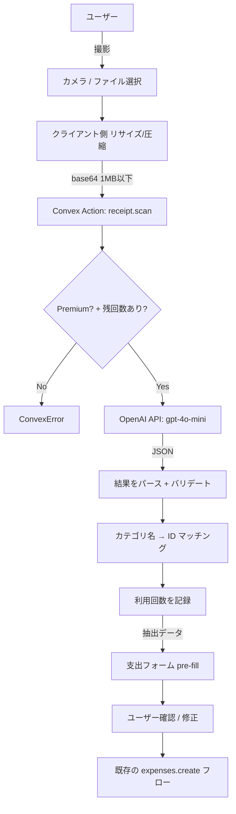
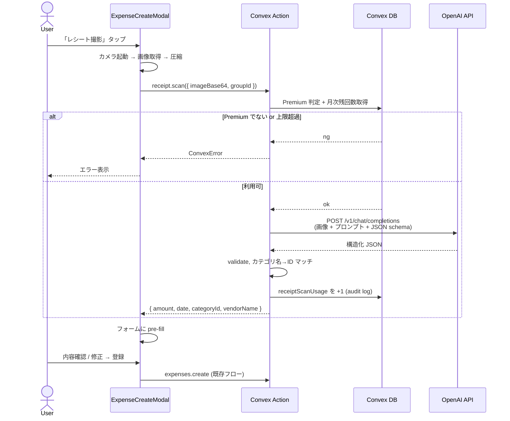
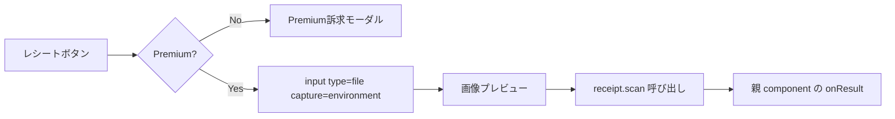

# Overview

Premium ユーザー向けに、レシート画像を撮影 or アップロードするだけで支出フォームの **金額・日付・カテゴリ** を自動入力する機能を提供する。家計簿アプリ最大の継続障壁である「入力の手間」を消し、Pairbo のコアコンセプト **「共有口座を作らず 2人の生活費を "いい感じに" 管理する」** の "いい感じに" の中身を強化する。

OCR には外部 OCR API でも OSS ライブラリでもなく、**Vision 対応 LLM（GPT-4o-mini ベース）** を採用する。実装の軽さ、精度、コスト、構造化抽出の柔軟性のすべてで最良。

# Purpose

## 短期的な目的

- Premium プラン (¥100/月) を購入する **強い動機** を作る。現 Premium 価値（傾斜折半・タグ・年次分析・広告非表示・Google Sheets エクスポート）は "あったら便利" 止まりで、課金の決め手として弱い。
- 「家計簿は続けるのが難しい」という最大の離脱要因を消す。レシートを撮るだけで 1 件登録が完結する体験を提供。
- 同棲・夫婦カップル間で「君が記録しない」「あなたが管理しろ」というありがちな摩擦の予防。

## 長期的な目的

- Premium ティアを "感情訴求型" 機能（月次まとめレポート、ふたりの公平性可視化等）へ進化させる前段として、まず "ペインキラー" タイプの Premium 機能で課金率を上げる。
- "口座を作らない × でも楽" という Pairbo の差別化軸を機能で証明する。
- 将来の AI 系機能（カテゴリ自動推定の精度向上、ふたりの傾向分析）の基盤データとして、OCR 経由の入力ログを活用する余地を残す。

## このタイミングで実装する理由

- LLM Vision の精度・コストが 2026 年時点で実用に達している（GPT-4o-mini で ¥0.06/枚）。
- Pairbo の core 機能セット（傾斜折半・精算・分析・エクスポート）はほぼ完成済みで、次の差別化候補として最有力。
- ユーザー数 32 人のうち Premium 3 人。Premium ファネル改善の効果検証がしやすい規模。

# What to Do

## 機能要件

### コアフロー

- 支出登録モーダル（`ExpenseCreateModal`）に **「レシートを撮影」ボタン** を追加
- ボタン押下でデバイスカメラ起動（PWA / モバイル）、または画像ファイル選択（デスクトップ）
- 画像を Convex action に送信、LLM Vision API で解析
- 解析結果（金額・日付・店名・推定カテゴリ）を支出フォームに pre-fill
- ユーザーは結果を確認・修正してから登録（**自動登録はしない**）

### 抽出するデータ

| フィールド       | 必須 | 期待精度 | フォールバック                                   |
| ---------------- | ---- | -------- | ------------------------------------------------ |
| 金額             | ◎    | 95%+     | 失敗時はフォーム空欄、エラー表示                 |
| 日付             | ◎    | 90%+     | 失敗時は今日の日付をデフォルト                   |
| 店名             | ○    | 85%+     | カテゴリ推測の材料、表示はしない                 |
| カテゴリ ID      | ○    | 80%      | 失敗時はデフォルトカテゴリ（食費等）             |
| 個別アイテム明細 | ✗    | —        | 抽出しない（不要）                               |
| 支払者           | ✗    | —        | 抽出不可（現在ログイン中のユーザーをデフォルト） |
| 分割方法         | ✗    | —        | グループ既定値を使用                             |

### 動線

- **エントリーポイント**: 支出登録モーダル上部に「📷 レシートから入力」ボタン
- **Free ユーザー**: ボタンは表示するが、押下すると Premium 訴求モーダル（pricing ページへ誘導）
- **Premium ユーザー**: 押下で OCR フローが起動
- 月次利用上限: Premium ユーザーは **月 100 回** まで（コスト見合い、後述）

### UI フロー

```mermaid
flowchart TD
    Start([支出登録モーダル]) --> Btn{レシート撮影ボタン押下}
    Btn -->|Premium| Cam[カメラ/ファイル選択起動]
    Btn -->|Free| Promo[Premium訴求モーダル]
    Promo --> Pricing[/pricing]

    Cam --> Img[画像取得]
    Img --> Preview[プレビュー表示]
    Preview --> Confirm{この画像でOK?}
    Confirm -->|やり直し| Cam
    Confirm -->|送信| Loading[OCR処理中 spinner]

    Loading --> API[Convex action: receipt.scan]
    API -->|成功| Fill[フォームに pre-fill]
    API -->|失敗| ErrorMsg[エラー表示 + 手動入力に戻る]
    API -->|月次上限超過| LimitMsg[「今月の上限に達しました」]

    Fill --> Edit[ユーザーが内容確認・修正]
    Edit --> Submit[通常の支出登録フロー]
```

## 非機能要件

- **精度目標**: 金額正解率 90%+（コンビニ / スーパー / 飲食店の印字レシート）
- **レスポンス**: 画像送信から pre-fill 表示まで **5 秒以内**（GPT-4o-mini の典型応答 2-3 秒）
- **画像サイズ制限**: クライアント側で **1MB 以下** に圧縮（リサイズ＋JPEG 品質調整）
- **Premium ゲート**: Convex action で `canUseReceiptOCR()` ヘルパーを強制チェック
- **レート制限**: 1 ユーザーあたり **月 100 回** 上限、超過時は ConvexError で明示
- **画像保存**: **しない**（PII リスク回避、ストレージコスト削減、解析後即破棄）
- **ロギング**: 利用回数・失敗率を `Logger.audit("RECEIPT", "scanned", ...)` で記録
- **コスト管理**: 月次のトータル OCR 呼出数を admin dashboard で可視化（後追い）

# How to Do It

## Architecture



## Data flow



## Convex side

### New file: `convex/receipts.ts`

```ts
export const scan = action({
  args: {
    imageBase64: v.string(), // data URI 形式 "data:image/jpeg;base64,..."
    groupId: v.id("groups"),
  },
  handler: async (
    ctx,
    args,
  ): Promise<{
    amount: number | null;
    date: string | null; // YYYY-MM-DD
    vendorName: string | null;
    categoryId: Id<"categories"> | null;
    confidence: "high" | "medium" | "low";
  }> => {
    // 1. 認証 + 認可
    const user = await ctx.runQuery(internal.receipts.getCurrentUser);
    if (!user) throw new ConvexError("認証が必要です");
    await ctx.runQuery(internal.receipts.requireGroupMember, {
      groupId: args.groupId,
      userId: user._id,
    });

    // 2. Premium + 残回数チェック
    const canUse = await ctx.runQuery(internal.receipts.canUseReceiptOcr, {
      userId: user._id,
    });
    if (!canUse.allowed) throw new ConvexError(canUse.reason);

    // 3. グループのカテゴリ一覧を取得（カテゴリ推測のためにプロンプトに含める）
    const categories = await ctx.runQuery(
      internal.receipts.getGroupCategories,
      {
        groupId: args.groupId,
      },
    );

    // 4. OpenAI Vision に投げる
    const result = await scanReceiptWithLLM(args.imageBase64, categories);

    // 5. カテゴリ名 → ID マッチング
    const categoryId = matchCategoryByName(result.categoryName, categories);

    // 6. 利用回数を記録
    await ctx.runMutation(internal.receipts.recordUsage, {
      userId: user._id,
      success: result.amount !== null,
    });

    return { ...result, categoryId };
  },
});
```

### New helper: `convex/lib/receiptOcr.ts`

LLM API 呼び出し + プロンプト + JSON パース。プロンプト概略:

```
あなたは日本のレシート画像から構造化データを抽出するアシスタントです。

以下の JSON スキーマで返答してください:
{
  "amount": number | null,       // 合計金額（税込）
  "date": string | null,         // YYYY-MM-DD
  "vendorName": string | null,   // 店名
  "categoryName": string | null, // 以下のカテゴリから最も近いものを選んでください: ${カテゴリ名リスト}
  "confidence": "high" | "medium" | "low"
}

画像が不鮮明・レシートでない場合は全フィールド null + confidence "low" を返してください。
推測ではなく、画像から明確に読み取れる値のみを返してください。
```

### Schema 追加: `receiptScanUsage` テーブル

```ts
receiptScanUsage: defineTable({
  userId: v.id("users"),
  scannedAt: v.number(),
  success: v.boolean(),
})
  .index("by_user", ["userId"])
  .index("by_user_and_scanned_at", ["userId", "scannedAt"]),
```

月初〜現在の `scannedAt` 範囲で count して月次残回数を判定。

### `subscription.ts` に `canUseReceiptOcr` 追加

```ts
const RECEIPT_OCR_MONTHLY_LIMIT = 100;

export async function canUseReceiptOcr(
  ctx: QueryCtx,
  userId: Id<"users">,
): Promise<{ allowed: boolean; reason?: string; usedThisMonth: number }> {
  if (!(await isPremium(ctx, userId))) {
    return {
      allowed: false,
      reason: "Premium プランでご利用いただけます",
      usedThisMonth: 0,
    };
  }
  const monthStart = startOfThisMonth(); // unix ms
  const usage = await ctx.db
    .query("receiptScanUsage")
    .withIndex("by_user_and_scanned_at", (q) =>
      q.eq("userId", userId).gte("scannedAt", monthStart),
    )
    .collect();
  if (usage.length >= RECEIPT_OCR_MONTHLY_LIMIT) {
    return {
      allowed: false,
      reason: `今月の利用上限 (${RECEIPT_OCR_MONTHLY_LIMIT}回) に達しました`,
      usedThisMonth: usage.length,
    };
  }
  return { allowed: true, usedThisMonth: usage.length };
}
```

## Frontend side

### New component: `components/expenses/ReceiptScanButton.tsx`



`ExpenseForm` に `onScanResult?: (data: ScanResult) => void` を追加し、scan 結果でフォーム state を一括更新。

### 画像圧縮 (`lib/imageCompression.ts`)

- canvas で resize（長辺 1024px 上限）
- JPEG quality 0.85
- 最終的に 1MB 以下を目標
- base64 化して action に渡す

### 環境変数

- `OPENAI_API_KEY` を Convex env に追加
- `OPENAI_VISION_MODEL=gpt-4o-mini`（環境別切替を想定）

# What We Won't Do

- **個別アイテム明細の抽出**: 「お米 ¥500、お茶 ¥150」のようなライン抽出は不要。Pairbo は合計金額のみ扱う。
- **画像の永続保存**: PII / ストレージコスト回避。OCR 後に即破棄。
- **手書きレシート対応**: 精度低、頻度低、サポート対象外と明記。
- **複数レシートを 1 枚で**: UI で「1 枚ずつ撮ってください」と案内。
- **PDF 領収書のアップロード**: 当面は画像 (JPEG/PNG/HEIC) のみ対応。
- **自動登録**: 解析後にユーザー確認を必ず挟む（誤入力リスク回避）。
- **支払者・分割方法の推定**: 推定不可能 / 推定しても精度低い。デフォルト値を使う。
- **OCR 履歴の表示**: 利用回数だけ追跡、過去スキャン履歴を一覧する画面は作らない。
- **無料プランへの部分開放**（"月3回お試し" 等）: 課金ファネルを直接的にしたいので、当面 Premium 限定。
- **ローカル OCR (Tesseract / WebAssembly)**: バンドル肥大化・精度不足で見送り。

# Concerns

## 検証が必要な事項

### 1. LLM Vision の実精度（日本のレシートで）

- **想定**: 印字レシートで金額 95%+、日付 90%+、カテゴリ 80%
- **不確実性**: 実機での精度は未検証。試作で 20-30 枚の実レシートでベンチマークを取る必要あり
- **対処**: 試作段階で精度が想定を 10% 以上下回る場合、プロンプト改善 or モデル変更（GPT-4o full / Claude Sonnet）を検討

### 2. コスト想定の妥当性

- **想定**: 1 枚 ¥0.06、Premium ユーザーが月平均 30 枚使うと ¥1.80/ユーザー/月
- **不確実性**: ヘビーユーザーが上限の 100 枚使うと ¥6/月。Premium 売上 ¥100/月の 6% がコスト
- **対処**: 月次レート制限 (100 回/月) で天井を作る。実利用データを見て調整

### 3. PWA / iOS Safari でのカメラ起動挙動

- **想定**: `<input type="file" accept="image/*" capture="environment">` で直接カメラ起動
- **不確実性**: iOS PWA インストール後の挙動が機種依存の可能性
- **対処**: 試作で実機確認 (iPhone Safari / Chrome / インストール PWA)。最悪 fallback はギャラリー選択

### 4. カテゴリマッチングの精度

- **想定**: LLM が "食費" "日用品" などのカテゴリ名を返す → ID にマッチ
- **不確実性**: グループによってカテゴリ名がカスタマイズされている (「ふたりのご飯」「掃除用品」等)
- **対処**: プロンプトに各グループの実カテゴリ名を含める。マッチしない場合は null（フォームで手動選択）

## 設計上の悩み

### 5. Free ユーザーへのお試し提供

- **議論**: 月 3 回などの試用枠を提供すべきか
- **賛**: 体験させた方が課金転換が高まる可能性
- **反**: Pairbo の Premium 価値が薄まる、コスト負担増、無料ユーザーの abuse 可能性
- **判断**: 当面は **完全 Premium 限定**。リリース後 1〜2 ヶ月で課金転換率を見て、必要なら "月 3 回お試し" を後追い導入

### 6. レシート以外の画像が来た場合

- **議論**: クレジットカード明細の SS、Pay 系決済画面 SS なども来る可能性
- **判断**: LLM はそういう画像にも対応できる。プロンプトで「レシートまたは決済画面から」と明示。`confidence: "low"` で返ってきた場合のみエラー扱い

### 7. 月次上限 100 回は適切か

- **議論**: 多すぎ? 少なすぎ?
- **想定**: 同棲カップル 2 人で日々の生活費 → 月 30〜60 件登録、その全てを OCR で入力するヘビー層でも 100 回で十分
- **対処**: リリース後の利用データで調整

## スケーラビリティ

### 8. ピーク時のレート制限

- **議論**: 同時刻に多数のユーザーが OCR を叩いた場合の OpenAI API レート制限
- **想定**: 32 ユーザー規模では問題ないが、将来 1000 ユーザー超で要検討
- **対処**: 現段階では Convex action がそのまま OpenAI を叩く。将来必要なら queue or キャッシュレイヤー

### 9. プロンプトのバージョニング

- **議論**: プロンプトを改善する度に精度が変わる。回帰のリスク
- **対処**: プロンプトを `convex/lib/receiptOcr.ts` 内の定数として明示。変更時は実機 5 件以上でベンチ → ログで精度 watch

# Reference Materials/Information

- [HANDOVER.md](../HANDOVER.md) — Premium 限定機能のロードマップ
- [convex/lib/subscription.ts](../convex/lib/subscription.ts) — Premium ゲートのパターン
- [convex/google.ts](../convex/google.ts) — Convex action + 外部 API 呼び出しの先行実装例
- [docs/design-monetization.md](./design-monetization.md) — Premium 価値の全体像
- [docs/design-logger.md](./design-logger.md) — 監査ログの設計
- [OpenAI Vision Guide](https://platform.openai.com/docs/guides/vision) — gpt-4o-mini の Vision API
- [Anthropic Vision Guide](https://docs.claude.com/en/docs/build-with-claude/vision) — Claude Vision (代替案)
- [Convex Actions Docs](https://docs.convex.dev/functions/actions) — Convex action から外部 API を叩く
