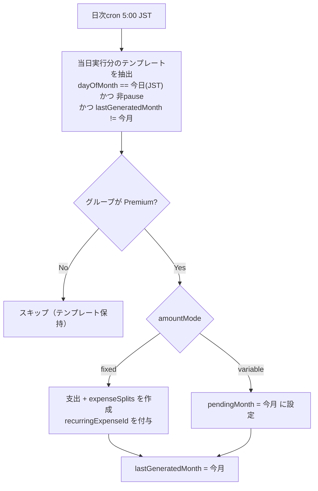

# 設計書: 定期支出の自動記録

## Overview

家賃・サブスク・光熱費など毎月発生する支出を、テンプレートとして登録しておくと毎月自動で記録される機能。Premium機能（グループ単位解放）として提供する。

金額が固定の支出は自動で支出レコードを作成し、金額が毎月変わる支出は「金額確認待ち」として提示してユーザーが金額だけ入力して確定する。

## Purpose

### 背景

- 家賃・サブスク・光熱費は毎月ほぼ同じ内容の手入力が発生している
- 「3タップ以内で記録完了」という入力UX方針の延長線上として、定型入力はゼロタップにできる
- 現行Premium機能（傾斜折半・年次分析・タグ）は接触頻度が低く、日常的に価値を感じる課金理由が弱い

### 目的

1. 定型支出の入力コストをゼロにする
2. 毎月自動で価値を感じる「日常接触型」のPremium機能を作り、課金理由を強化する
3. 記録漏れを防ぎ、精算・分析の正確性を上げる

## What to Do

### 機能要件

#### FR-1: テンプレート管理（Premium・グループ単位）

| 機能     | 説明                                                                      |
| -------- | ------------------------------------------------------------------------- |
| 登録     | 金額・カテゴリ・支払者・負担方法・タイトル・メモ・実行日（毎月n日）を登録 |
| 一覧     | グループのテンプレート一覧を表示（次回実行日つき）                        |
| 編集     | 各項目の変更                                                              |
| 削除     | テンプレート削除（作成済み支出は残す）                                    |
| 一時停止 | 実行を止める / 再開する                                                   |

#### FR-2: 金額モード

| モード | 説明                                                                                     |
| ------ | ---------------------------------------------------------------------------------------- |
| 固定   | 実行日に支出レコードを自動作成（家賃・サブスク向け）                                     |
| 変動   | 実行日に「金額確認待ち」を提示。ユーザーが金額を入力して確定すると支出作成（光熱費向け） |

#### FR-3: 自動作成された支出の扱い

- 支出一覧・詳細で「自動」バッジを表示
- 精算・分析には通常支出と同様に含まれる
- 作成後は通常支出として編集・削除可能

#### FR-4: Premium判定

- テンプレートのCRUDは `isGroupPremium` でゲート（[design-pair-plan.md](design-pair-plan.md) 前提）
- グループがFreeに戻った場合、cronは支出を作成しない（テンプレートは保持し、Premium復帰で再開）

### 非機能要件

- 冪等性: cronが同月に二重実行されても支出が重複しない
- 日付はJST基準（既存の支出dateと同じ YYYY-MM-DD 文字列）

## How to Do It

### データ構造

`convex/schema.ts` に追加:

```
recurringExpenses: defineTable({
  groupId: v.id("groups"),
  amount: v.optional(v.number()),        // 変動モードでは未設定可（前回値を初期値に使う場合は設定）
  amountMode: v.union(v.literal("fixed"), v.literal("variable")),
  categoryId: v.id("categories"),
  paidBy: v.id("users"),
  dayOfMonth: v.number(),                // 1-28（closingDayと同じ制約）
  title: v.string(),
  memo: v.optional(v.string()),
  splitDetails: splitDetailsValidator,   // expenses.create と同じ構造を保存
  pausedAt: v.optional(v.number()),
  lastGeneratedMonth: v.optional(v.string()),  // "YYYY-MM" 冪等性キー
  pendingMonth: v.optional(v.string()),        // 変動モード: 確認待ちの対象月
  createdBy: v.id("users"),
  createdAt: v.number(),
  updatedAt: v.number(),
}).index("by_group", ["groupId"])
```

`expenses` テーブルに `recurringExpenseId: v.optional(v.id("recurringExpenses"))` を追加（「自動」バッジ表示と出所の追跡用）。

### 自動実行フロー

`convex/crons.ts` を新規作成し、日次cron（20:00 UTC = 5:00 JST）で internal mutation を実行する。



- 分割計算は `expenses.create` と同じロジック（`calculateSplits` / `validateSplitDetails`）を internal mutation から再利用する
- テンプレートの `splitDetails` が現在のメンバー構成で無効な場合（対象メンバーの脱退等）は均等割にフォールバックして作成する
- cronはユーザー文脈を持たないため、`createdBy` はテンプレートの `createdBy` を引き継ぐ

### 変動モードの確認フロー

- 支出一覧の当月上部に「金額確認待ち」カードを表示（テンプレートの `pendingMonth == 表示中の月` で判定）
- カードで金額を入力 → 既存の `expenses.create` 相当の internal ロジックで支出作成 + `pendingMonth` をクリア
- 確定前に翌月分が来た場合は `pendingMonth` を上書き（未確定の旧月分は失効し、必要なら手動入力）

### UI

- 管理画面: グループ設定タブに「定期支出」セクションを追加（一覧・登録・編集・削除・一時停止）
- Free ユーザーには管理画面入口をロック表示し、Premium訴求を出す（タグ例表示と同じteaserパターン）
- 支出一覧・詳細: `recurringExpenseId` がある支出に「自動」バッジ

### テスト・その他

- `convex/__tests__/` にユニットテスト: 冪等性（同月二重実行）、Premium失効時スキップ、splitDetailsフォールバック、変動モードの確定フロー
- `lib/releases.ts` にリリースノート追加
- シードデータに定期支出テンプレート（固定・変動 各1件）を追加

## What We Won't Do

- 月次以外の頻度（週次・年次・隔月）
- 「月末」指定（dayOfMonthは1-28。29-31日の支出は28日で代用してもらう）
- 実行前の事前通知・リマインド（通知基盤がないため。将来PWA通知で拡張）
- 支出フォームからの「これを定期支出にする」ショートカット（管理画面からの登録のみ。反応を見て追加）
- 過去月への遡及作成

## Alternatives Considered

| 案                                       | 概要                         | 不採用理由                                                                   |
| ---------------------------------------- | ---------------------------- | ---------------------------------------------------------------------------- |
| 変動モードを金額0の支出として即作成      | 支出テーブルだけで完結       | 精算・分析に金額0が混入し、全集計箇所でのフィルタが必要になる                |
| 確認待ちを専用テーブルで管理             | 複数月分の未確定を保持できる | テーブルとUIが増える。単一 `pendingMonth` フィールドで実用上十分             |
| クライアント起動時に生成（cronなし）     | インフラ追加ゼロ             | 誰も開かない月は生成されず、2人同時起動で重複リスク。Convex cronで素直に解決 |
| 実行日を過ぎたら即時生成（時刻指定なし） | 実装同じ                     | ―（採用。日次cronで当日分を生成する方式がこれに相当）                        |

## Concerns

- **Premium失効中にスキップされた月の扱い**: 復帰しても遡及作成はしない（手動入力で補完）。仕様として明記する
- **支払者の脱退**: `paidBy` がグループを抜けた場合、生成に失敗する。テンプレートを自動pauseし、管理画面で警告表示する
- **変動モードの放置**: 確認待ちを無視し続けるユーザーには毎月上書きされ続けるだけで害はないが、記録漏れは防げない。通知基盤ができたら改善
- **cron時刻とタイムゾーン**: Convex cronはUTC指定。5:00 JST実行なら日付境界の混乱はほぼないが、日付計算はJST変換を明示的に行うこと

## Reference Materials/Information

- `docs/design-pair-plan.md` — Premium判定のグループ単位化（前提）
- `convex/expenses.ts` — 支出作成ロジック（分割計算の再利用元）
- Convex Cron Jobs: https://docs.convex.dev/scheduling/cron-jobs
