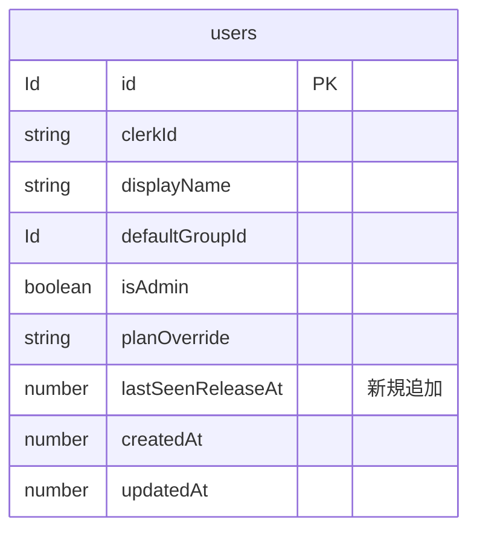
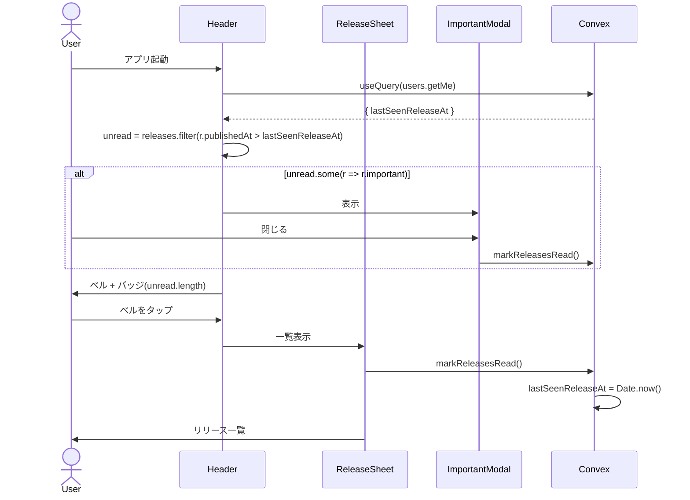
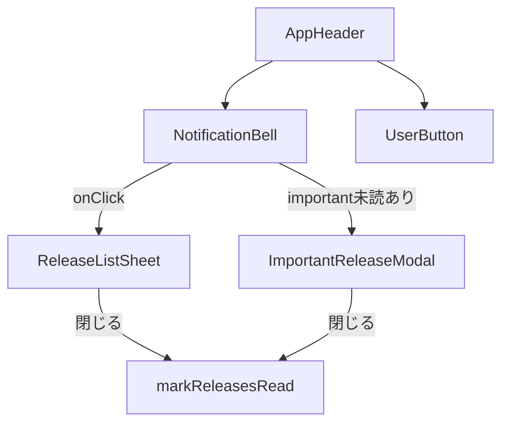

# Overview

機能追加・改善時にユーザーに知らせるリリース通知の仕組みを構築する。ヘッダーのベルアイコン + バッジ + 一覧表示を基盤とし、重要なリリースに限り起動時のモーダルでエスカレーションする。

## Purpose

現状32人のユーザーがいるが、機能追加や改善を行ってもユーザーが気づく手段がない。今回マージしたモーダル化・ログイン改善は気づかれないまま終わる可能性が高く、今後のPremium機能リリース時にも同じ問題が発生する。

ユーザーに変更を伝える基盤を作ることで:

- 改善が正しく届いてリテンション・満足度が向上する
- Premium機能のローンチ時に告知できる導線ができる
- 将来の通知種別（精算リマインダー、招待受諾通知等）の置き場になる

## What to Do

### 機能要件

- 認証済みユーザーのヘッダーにベルアイコンを表示し、未読リリース件数をバッジ表示する
- ベルクリックでリリース一覧を表示（モーダルシート）し、各リリースのタイトル・日付・本文を時系列で見られる
- 一覧を開いた時点で全リリースを既読扱いにし、バッジが消える
- 「重要」フラグが立ったリリースが未読の場合、ログイン直後に1度だけモーダル表示する
- モーダル閉鎖は既読扱いとなり、再表示されない
- 未ログインユーザーには通知UIを表示しない

### 非機能要件

- リリースノートはコード管理（`lib/releases.ts`）。デプロイと同期する自然なフロー
- バッジ計算は単一のConvex query（`users.getMe`）と静的データの比較で完結し、追加クエリ不要
- モバイルファースト UI（ヘッダー右側、UserButton と並ぶ）
- 既読状態は user テーブルの1列で管理

## How to Do It

### Data structure



`users` テーブルに `lastSeenReleaseAt: v.optional(v.number())` を追加。未読判定の唯一の真実源。

### Release data file

```ts
// lib/releases.ts
export type Release = {
  id: string; // "2026-05-11-premium-launch"
  publishedAt: number; // Date.UTC(2026, 4, 11)
  title: string;
  body: string;
  important?: boolean; // モーダル昇格
};

export const releases: Release[] = [
  // 古いものから順に追加（昇順）
];
```

リリース時に1エントリ追加してデプロイ。Premium機能のローンチなど絶対見せたい時のみ `important: true`。

### Read/unread judgment

```ts
const unread = releases.filter(
  (r) => r.publishedAt > (me.lastSeenReleaseAt ?? 0),
);
const importantUnread = unread.filter((r) => r.important);
```

### Flow



### File changes

- 新規: `lib/releases.ts` — リリース定義
- 新規: `components/notifications/NotificationBell.tsx` — ベル + バッジ
- 新規: `components/notifications/ReleaseListSheet.tsx` — 一覧シート
- 新規: `components/notifications/ImportantReleaseModal.tsx` — 重要モーダル
- 新規: `components/notifications/index.ts`
- 変更: `convex/schema.ts` — users に `lastSeenReleaseAt` 追加
- 変更: `convex/users.ts` — `markReleasesRead` mutation 追加、`getMe` の戻り値に `lastSeenReleaseAt` 追加
- 変更: `components/ui/AppHeader.tsx` — `rightElement` の前に `<NotificationBell />` を差し込めるよう調整
- 変更: `app/groups/page.tsx` / `app/groups/[groupId]/page.tsx` 等の header 利用箇所 — 認証済みなら bell を表示

### Mutation

```ts
// convex/users.ts
export const markReleasesRead = authMutation({
  args: {},
  handler: async (ctx) => {
    await ctx.db.patch(ctx.user._id, {
      lastSeenReleaseAt: Date.now(),
      updatedAt: Date.now(),
    });
  },
});
```

### Initial user behavior

新規 signup したユーザーに過去リリースを未読として見せない。`auth.ts` の `authMutationMiddleware` が初回ユーザーを自動作成する際、`lastSeenReleaseAt: Date.now()` をセットして全既存リリースを既読扱いにする。

### List UI

ボトムシート方式で実装する。モバイルファースト原則に従い、PCでも同じシートを使用する。実機で違和感があった場合は後でドロップダウン/専用ページに変更を検討。

### Component placement



## What We Won't Do

- **DB管理のリリースノート**（admin UIで投稿）: 現段階ではリリースとデプロイは1対1なのでコード管理で十分。将来必要になったら `releases` テーブル化
- **Web Push通知**: PWA push の iOS 制約や VAPID 等の基盤が必要。同設計ドキュメントの `docs/design-pwa-install-push.md` で別途検討
- **メール通知**: 配信基盤・購読管理・到達品質の運用負荷が大きい
- **audience フィルタ**（Premium向け / Free向けで出し分け）: MVP では全員に同じものを見せる。`audience` フィールド導入は次回
- **既読単位の細分化**: 「リリース毎に既読/未読を持つ」管理ではなく `lastSeenReleaseAt` 1列で集約
- **既存改善（PR #181, #182）のお知らせ**: ユーザー指示通り、今回のリリースには含めない。Premium機能ローンチ等の今後の改善で初使用
- **多言語対応**: 日本語のみ
- **マークダウンレンダリング**: 本文はプレーンテキスト + 改行のみ。リンクが必要になったら拡張

## Alternatives Considered

### A. モーダル一本（全リリースで強制表示）

すべてのリリースで起動時モーダル表示。

不採用理由: 家計簿アプリは利用頻度が高く（毎日〜週数回）、毎リリース毎にモーダルで割り込むのは「3タップ以内で記録完了」というUX原則に反する。コア体験を毎回阻害するコストが大きい。

### B. ベルバッジ一本（モーダルなし）

ベル + 一覧のみ。重要時もモーダル昇格なし。

不採用理由: 通常のリリースには十分だが、「絶対見せたい」（破壊的変更、Premium大型機能ローンチ）の時に手段がない。エスカレーション余地を残しておきたい。

### Static file vs Convex table

リリースデータをConvexテーブルにする案も検討。

不採用理由: リリースは本質的にコードデプロイと結びついており、別管理にすると齟齬が出やすい。admin UIの開発コストも今段階では過剰。

### Per-release dismissed list

各リリースに既読フラグを持つ詳細管理。

不採用理由: スコープが大きく、UX上の差別もほぼない。`lastSeenReleaseAt` 1列で必要十分。

## Concerns

1. **ヘッダーのスペース**: モバイル幅でロゴ・ベル・UserButtonが収まるか要確認。狭い場合は UserButton をベル側にまとめるか、ベルを小さく
2. **オフライン時のmutation失敗**: `markReleasesRead` がオフラインで失敗するとバッジが残る。Convex client は自動リトライするのでベストエフォートで許容
3. **important release を2回見せない保証**: モーダル close時のmutation がネットワーク失敗した場合、再表示される。同上、ベストエフォート許容
4. **古いリリースの蓄積**: `releases` 配列が増え続ける。月数十件ペースなら問題ないが、年単位で見て一覧UIが長くなる。将来 N件以上は折りたたみ、を検討
5. **公開設計の透明性**: `lib/releases.ts` は client bundle に含まれるため、未発表のリリースは入れられない。`publishedAt > now` でフィルタする逃げ道は用意するが、本格運用上は「コミット = 公開」と割り切る

## Reference Materials/Information

- [docs/design-pwa-install-push.md](./design-pwa-install-push.md) — Push通知の検討（本機能の延長線で参照）
- [components/ui/AppHeader.tsx](../components/ui/AppHeader.tsx) — 既存ヘッダーの実装
- [convex/users.ts](../convex/users.ts) — `getMe` / `ensureUser` の既存実装
- [components/expenses/ExpenseEditModal.tsx](../components/expenses/ExpenseEditModal.tsx) — モーダルシェルの参考実装
