# セキュリティチェックリスト 設計書

## Overview

Oaiko（おあいこ）のリリース前セキュリティ確認項目をまとめたチェックリスト。OWASP Top 10、Convex/Clerk のベストプラクティス、および共有家計簿アプリ固有のリスクを考慮した包括的なセキュリティ設計。

## Purpose

### なぜ必要か

1. **金融データの機密性**
   - 支出金額、精算情報など、ユーザーの財務状況に関わるデータを扱う
   - データ漏洩は深刻なプライバシー侵害につながる

2. **マルチテナント構造のリスク**
   - 複数のグループ、複数のユーザーがデータを共有
   - 認可の不備は他ユーザーのデータ漏洩に直結

3. **リリース前の網羅的確認**
   - 開発中に見落とした脆弱性を発見
   - セキュリティを意識した開発文化の確立

### 技術スタックのセキュリティ責任分担

```mermaid
flowchart TB
    subgraph "クライアント層"
        Browser[ブラウザ]
        NextJS[Next.js App Router]
    end

    subgraph "認証層"
        Clerk[Clerk]
        Middleware[Next.js Middleware]
    end

    subgraph "バックエンド層"
        Convex[Convex Functions]
        ConvexDB[(Convex DB)]
    end

    subgraph "インフラ層"
        Vercel[Vercel]
        ConvexCloud[Convex Cloud]
    end

    Browser --> NextJS
    NextJS --> Middleware
    Middleware --> Clerk
    Clerk --> Convex
    Convex --> ConvexDB
    NextJS --> Vercel
    Convex --> ConvexCloud
```



| 層           | 責任者          | セキュリティ対策                   |
| ------------ | --------------- | ---------------------------------- |
| クライアント | Next.js/React   | XSS自動エスケープ、CSP             |
| 認証         | Clerk           | OAuth、セッション管理、CSRF、MFA   |
| バックエンド | Convex + 開発者 | 認可チェック、入力検証、クエリ制限 |
| インフラ     | Vercel/Convex   | DDoS保護、HTTPS、暗号化            |

## What to Do

### 機能要件：チェックリスト

#### 1. 認証（Authentication）

| #   | チェック項目                               | 対応方法                                  | 責任  | 状態          |
| --- | ------------------------------------------ | ----------------------------------------- | ----- | ------------- |
| A-1 | 全ページで認証が必須か                     | Next.js Middleware で公開ルート以外を保護 | Clerk | ✅ 実装済み   |
| A-2 | 未認証アクセスは適切にリダイレクトされるか | `auth.protect()` でリダイレクト           | Clerk | ✅ 実装済み   |
| A-3 | セッション管理は安全か                     | HttpOnly, Secure, SameSite Cookie         | Clerk | ✅ 自動       |
| A-4 | ログアウトでセッションが無効化されるか     | Clerkのセッション管理                     | Clerk | ✅ 自動       |
| A-5 | 多要素認証（MFA）の提供                    | Clerkで設定可能                           | Clerk | ⚠️ 要設定確認 |

#### 2. 認可（Authorization）

| #   | チェック項目                                   | 対応方法                          | 責任   | 状態        |
| --- | ---------------------------------------------- | --------------------------------- | ------ | ----------- |
| Z-1 | Convex関数で認証チェックがあるか               | `authQuery` / `authMutation` 使用 | 開発者 | ✅ 実装済み |
| Z-2 | グループメンバーのみがデータにアクセスできるか | 各関数でメンバーシップチェック    | 開発者 | ⚠️ 要監査   |
| Z-3 | オーナー権限が必要な操作は制限されているか     | roleチェック                      | 開発者 | ⚠️ 部分的   |
| Z-4 | 退会後のメンバーはデータにアクセスできないか   | メンバーシップ削除時の処理        | 開発者 | 🔴 未実装   |
| Z-5 | 他ユーザーのプライベートデータは見えないか     | クエリのスコープ制限              | 開発者 | ⚠️ 要監査   |

```mermaid
flowchart TD
    Request[リクエスト] --> Auth{認証済み?}
    Auth -->|No| Reject1[拒否: 401]
    Auth -->|Yes| GetUser[ユーザー取得]
    GetUser --> Member{グループメンバー?}
    Member -->|No| Reject2[拒否: 403]
    Member -->|Yes| Role{権限チェック}
    Role -->|不足| Reject3[拒否: 403]
    Role -->|OK| Execute[処理実行]
```



#### 3. 入力検証（Input Validation）

| #   | チェック項目                           | 対応方法                      | 責任   | 状態      |
| --- | -------------------------------------- | ----------------------------- | ------ | --------- |
| V-1 | Convex関数の引数にバリデータがあるか   | `v.string()`, `v.number()` 等 | Convex | ✅ 自動   |
| V-2 | 文字列長の制限はあるか                 | カスタムバリデーション        | 開発者 | ⚠️ 部分的 |
| V-3 | 金額は正の数かチェックされているか     | バリデーション追加            | 開発者 | 🔴 未実装 |
| V-4 | 日付形式は正しいかチェックされているか | フォーマット検証              | 開発者 | 🔴 未実装 |
| V-5 | IDは存在するものかチェックされているか | DB参照チェック                | 開発者 | ⚠️ 部分的 |

#### 4. データ保護（Data Protection）

| #   | チェック項目                                 | 対応方法                 | 責任     | 状態      |
| --- | -------------------------------------------- | ------------------------ | -------- | --------- |
| D-1 | 通信はHTTPSで暗号化されているか              | Vercel/Convex強制SSL     | インフラ | ✅ 自動   |
| D-2 | データベースは暗号化されているか             | Convex側で暗号化         | Convex   | ✅ 自動   |
| D-3 | 機密情報がログに出力されていないか           | ログ内容確認             | 開発者   | ⚠️ 要確認 |
| D-4 | エラーメッセージに内部情報が含まれていないか | エラーハンドリング見直し | 開発者   | ⚠️ 要確認 |

#### 5. 環境変数・シークレット管理

| #   | チェック項目                                     | 対応方法              | 責任   | 状態        |
| --- | ------------------------------------------------ | --------------------- | ------ | ----------- |
| S-1 | `.env*` がgitignoreに含まれているか              | `.gitignore` 確認     | 開発者 | ✅ 設定済み |
| S-2 | シークレットがコードにハードコードされていないか | コードレビュー        | 開発者 | ⚠️ 要確認   |
| S-3 | 本番と開発で環境変数が分離されているか           | Vercel/Convex環境変数 | 開発者 | ✅ 分離済み |
| S-4 | シークレットのローテーション方針があるか         | 運用ルール策定        | 開発者 | 🔴 未策定   |

#### 6. OWASP Top 10 対応

| #    | リスク                    | 対応状況    | 備考                       |
| ---- | ------------------------- | ----------- | -------------------------- |
| O-1  | Broken Access Control     | ⚠️ 要監査   | 認可チェックの網羅性確認   |
| O-2  | Cryptographic Failures    | ✅ 対応済み | TLS強制、Convex暗号化      |
| O-3  | Injection                 | ✅ 対応済み | ConvexはNoSQL+型安全クエリ |
| O-4  | Insecure Design           | ⚠️ 要確認   | 設計レビュー必要           |
| O-5  | Security Misconfiguration | ⚠️ 要確認   | 設定項目の見直し           |
| O-6  | Vulnerable Components     | ⚠️ 要確認   | 依存パッケージ監査         |
| O-7  | Authentication Failures   | ✅ 対応済み | Clerk利用                  |
| O-8  | Data Integrity Failures   | ⚠️ 要確認   | 更新ログ等                 |
| O-9  | Logging Failures          | 🔴 未実装   | 監査ログ未実装             |
| O-10 | SSRF                      | ✅ 低リスク | 外部URLフェッチなし        |

### 非機能要件

| 項目               | 要件                                       |
| ------------------ | ------------------------------------------ |
| レートリミット     | Convex/Vercelのデフォルト制限を利用        |
| 監査ログ           | 重要操作（グループ作成、精算等）のログ記録 |
| インシデント対応   | 脆弱性発見時の対応フロー策定               |
| 依存パッケージ更新 | 定期的なアップデート（月次）               |

## How to Do It

### 1. 認可チェックの監査

全Convex関数をリストアップし、認可チェックの有無を確認する。

```mermaid
flowchart LR
    subgraph "現在のConvex関数"
        users[users.ts]
        groups[groups.ts]
        future[今後追加される関数]
    end

    subgraph "チェック項目"
        C1[authQuery/authMutation使用]
        C2[グループメンバーシップ確認]
        C3[オーナー権限確認]
        C4[リソース所有者確認]
    end

    users --> C1
    groups --> C1
    groups --> C2
    groups --> C3
```



#### 監査対象関数一覧

| ファイル  | 関数             | 認証 | メンバー確認     | 権限確認 | 状態 |
| --------- | ---------------- | ---- | ---------------- | -------- | ---- |
| users.ts  | ensureUser       | ✅   | -                | -        | OK   |
| groups.ts | create           | ✅   | -                | -        | OK   |
| groups.ts | listMyGroups     | ✅   | 自動（自分のみ） | -        | OK   |
| groups.ts | getDetail        | ✅   | ✅               | -        | OK   |
| groups.ts | createInvitation | ✅   | ✅               | ✅ owner | OK   |

### 2. 入力バリデーション強化

#### 金額バリデーション例

```typescript
// convex/lib/validators.ts に追加
export const positiveAmountValidator = v.number();
// + カスタムチェック: amount > 0 && amount <= 100000000
```

#### 日付バリデーション例

```typescript
// YYYY-MM-DD形式チェック
const dateRegex = /^\d{4}-\d{2}-\d{2}$/;
```

### 3. 監査ログの実装（将来）

```mermaid
sequenceDiagram
    participant User
    participant Convex
    participant AuditLog

    User->>Convex: グループ作成
    Convex->>Convex: 処理実行
    Convex->>AuditLog: ログ記録
    Note over AuditLog: who, what, when, result
    Convex-->>User: 成功レスポンス
```



### 4. 依存パッケージ監査

```bash
# 脆弱性チェック
pnpm audit

# 定期的に実行（CI/CDに組み込み推奨）
```

### 5. セキュリティテストの追加

```typescript
// convex/__tests__/security/authorization.test.ts

describe("Authorization", () => {
  test("非メンバーはグループ詳細を取得できない", async () => {
    // ユーザーAがグループ作成
    // ユーザーBがグループ詳細取得を試みる
    // → エラーになることを確認
  });

  test("メンバーでも他ユーザーの情報は編集できない", async () => {
    // ...
  });
});
```

## What We Won't Do

### MVP外のセキュリティ機能

| 項目                         | 理由                              |
| ---------------------------- | --------------------------------- |
| ペネトレーションテスト       | 専門知識と費用が必要、MVP後に検討 |
| WAF導入                      | Vercel/Convexの標準保護で十分     |
| IPアドレス制限               | 一般ユーザー向けアプリのため不要  |
| データ暗号化（アプリレベル） | Convexのインフラ暗号化で十分      |
| 監査ログの長期保存           | MVP後に検討                       |
| SIEM連携                     | 個人プロジェクトでは過剰          |
| バグバウンティプログラム     | MVP後に検討                       |

### 対応を見送るリスク

| リスク               | 対応見送り理由                      |
| -------------------- | ----------------------------------- |
| ブルートフォース攻撃 | Clerkの100回失敗ロックアウトで対応  |
| ボット攻撃           | ClerkのAIベースボット保護で対応     |
| DDoS                 | Vercel/Cloudflareのエッジ保護で対応 |

## Concerns

### 懸念事項と対策

| 懸念                   | リスク                       | 対策                                   |
| ---------------------- | ---------------------------- | -------------------------------------- |
| 認可チェック漏れ       | 他ユーザーデータへのアクセス | 関数追加時のレビュー体制、テスト必須化 |
| 依存パッケージの脆弱性 | 既知の脆弱性が悪用される     | 定期的な`pnpm audit`実行               |
| Clerk/Convexの障害     | サービス利用不可             | 外部依存のため受容、モニタリング       |
| シークレットの漏洩     | 不正アクセス                 | gitignore徹底、環境変数管理            |

### 未解決の疑問

| 疑問                 | 検討状況                                     |
| -------------------- | -------------------------------------------- |
| MFAを必須にするか    | ユーザー体験とのバランス。任意設定で開始     |
| 退会機能の実装方針   | データ削除 vs 匿名化、GDPRを考慮して設計必要 |
| 精算データの保持期間 | 法的要件確認が必要                           |

### リリース前必須アクション

```mermaid
flowchart TD
    A[認可チェック監査] --> B[入力バリデーション追加]
    B --> C[セキュリティテスト追加]
    C --> D[依存パッケージ監査]
    D --> E[本番環境変数確認]
    E --> F[リリース]

    style A fill:#ff9,stroke:#333
    style B fill:#ff9,stroke:#333
    style C fill:#ff9,stroke:#333
    style D fill:#ff9,stroke:#333
    style E fill:#ff9,stroke:#333
```



## Reference Materials/Information

### Convex セキュリティ

- [Authorization Best Practices](https://stack.convex.dev/authorization) - Convex認可のベストプラクティス
- [Row Level Security](https://stack.convex.dev/row-level-security) - 行レベルセキュリティの実装
- [Best Practices | Convex Developer Hub](https://docs.convex.dev/understanding/best-practices/) - 公式ベストプラクティス
- [Authentication Best Practices: Convex, Clerk and Next.js](https://stack.convex.dev/authentication-best-practices-convex-clerk-and-nextjs) - 認証統合ガイド

### Clerk セキュリティ

- [Next.js Authentication](https://clerk.com/nextjs-authentication) - Next.js認証ガイド
- [Complete Authentication Guide for Next.js App Router](https://clerk.com/articles/complete-authentication-guide-for-nextjs-app-router) - App Router認証ガイド

### OWASP

- [OWASP Top Ten](https://owasp.org/www-project-top-ten/) - Webアプリセキュリティリスクトップ10
- [OWASP Top Ten 2025](https://www.owasptopten.org/) - 最新版（2025年予定）

### 一般的なセキュリティ

- Verizon 2024 Data Breach Investigations Report - 認証情報窃取が侵害の38%を占める
- Microsoft MFA調査 - 侵害されたアカウントの99.9%がMFA未設定

## 変更履歴

| 日付       | 変更内容 | 変更者 |
| ---------- | -------- | ------ |
| 2024-12-30 | 初版作成 | Claude |
