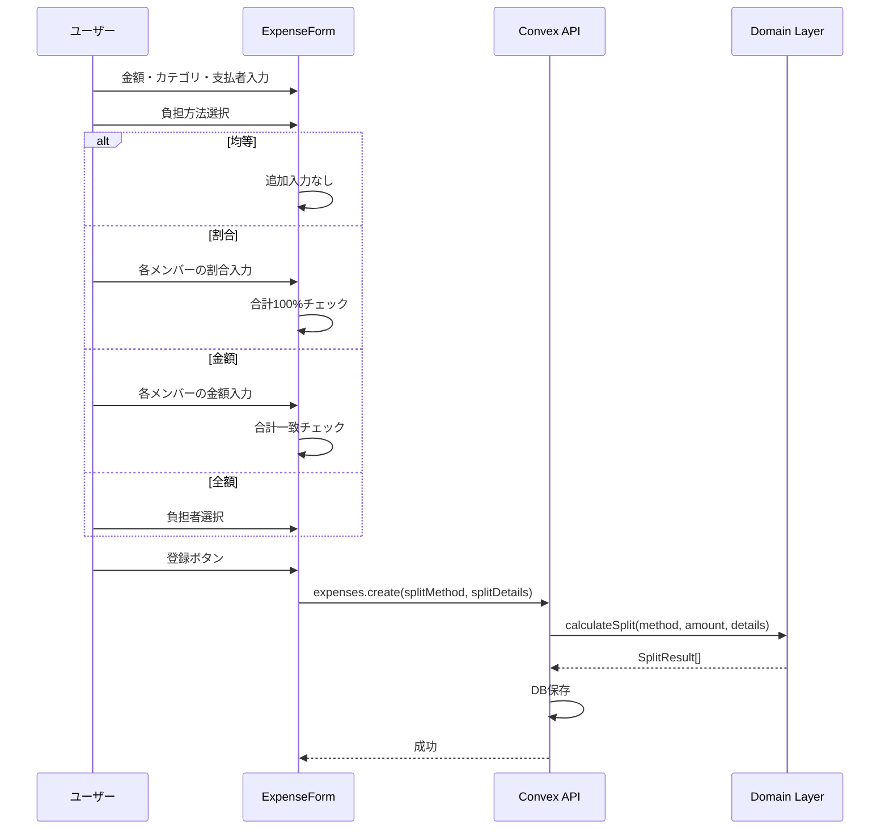
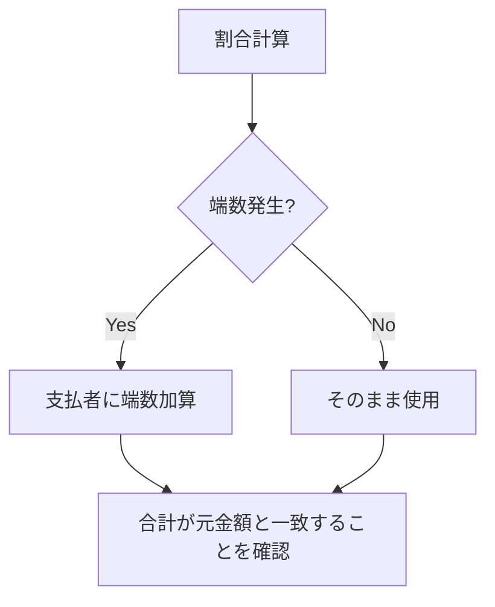

# 負担方法の拡張 設計書

## Overview

支出登録時の負担方法を拡張し、均等分割以外の方法（割合指定、金額指定、全額負担）をサポートする。現在は均等分割のみ実装されており、傾斜折半や個人負担のユースケースに対応できていない。

### 現状

```
支出登録フロー（現在）
┌─────────────────────────────────────────────┐
│  金額入力 → カテゴリ選択 → 支払者選択       │
│  → 日付選択 → メモ入力                      │
│  → [均等分割のみ] → 登録                    │
└─────────────────────────────────────────────┘
```

### 拡張後

```
支出登録フロー（拡張後）
┌─────────────────────────────────────────────┐
│  金額入力 → カテゴリ選択 → 支払者選択       │
│  → 日付選択 → 負担方法選択                  │
│     ├── 均等: そのまま登録                  │
│     ├── 割合: 割合入力UI表示                │
│     ├── 金額: 金額入力UI表示                │
│     └── 全額: 負担者選択UI表示              │
│  → メモ入力 → 登録                          │
└─────────────────────────────────────────────┘
```

## Purpose

### なぜ必要か

1. **現実の支出パターンに対応**
   - 収入比で負担を分ける（例: 6:4）
   - 特定のアイテムを個人負担にする
   - 特定の人だけ多く負担する

2. **Sharerooとの機能パリティ**
   - 競合アプリは傾斜折半をサポート
   - MVPとして必須の差別化機能

3. **ユーザーの声（想定）**
   - 「光熱費は収入比で分けたい」
   - 「自分用に買ったものは全額負担にしたい」

### ユーザーストーリー

- カップルとして、収入比（6:4など）で光熱費を分けたい
- シェアハウス住人として、個人的な買い物は自分だけの負担にしたい
- グループメンバーとして、特定の人の負担を軽くしたい

## What to Do

### 機能要件

#### 負担方法の種類

| 方法   | 説明     | 入力             | 計算例（1000円、A/B 2人） |
| ------ | -------- | ---------------- | ------------------------- |
| equal  | 均等分割 | なし             | A:500, B:500              |
| ratio  | 割合指定 | 各メンバーの%    | 60:40 → A:600, B:400      |
| amount | 金額指定 | 各メンバーの金額 | A:700, B:300              |
| full   | 全額負担 | 負担者1人        | Aが全額 → A:1000, B:0     |

#### UI要件

```
┌─────────────────────────────────────────┐
│  負担方法                               │
│  ┌─────┐ ┌─────┐ ┌─────┐ ┌─────┐      │
│  │均等 │ │割合 │ │金額 │ │全額 │      │
│  └─────┘ └─────┘ └─────┘ └─────┘      │
│                                         │
│  [割合選択時]                           │
│  ┌─────────────────────────────────┐   │
│  │ パートナーA    [60] %            │   │
│  │ パートナーB    [40] %            │   │
│  │ 合計: 100%                       │   │
│  └─────────────────────────────────┘   │
│                                         │
│  [金額選択時]                           │
│  ┌─────────────────────────────────┐   │
│  │ パートナーA    [¥600]            │   │
│  │ パートナーB    [¥400]            │   │
│  │ 合計: ¥1,000 / ¥1,000           │   │
│  └─────────────────────────────────┘   │
│                                         │
│  [全額負担選択時]                       │
│  ┌─────────────────────────────────┐   │
│  │ 誰が負担？                       │   │
│  │ ○ パートナーA                   │   │
│  │ ○ パートナーB                   │   │
│  └─────────────────────────────────┘   │
└─────────────────────────────────────────┘
```

### 非機能要件

- **入力UX**: 割合・金額の入力は直感的に
- **バリデーション**: 合計が100%/金額と一致しない場合はエラー
- **端数処理**: 割合指定時の端数は支払者が負担

### バリデーションルール

| 方法   | ルール                            |
| ------ | --------------------------------- |
| equal  | メンバーが1人以上                 |
| ratio  | 合計が100%、各値が0-100           |
| amount | 合計が支出金額と一致、各値が0以上 |
| full   | 負担者が1人のみ指定               |

## How to Do It

### データフロー



### ドメイン層の実装

#### 型定義の拡張

```typescript
// convex/domain/expense/types.ts

/**
 * 割合指定の入力
 */
export interface RatioSplitInput {
  userId: Id<"users">;
  ratio: number; // 0-100 の整数
}

/**
 * 金額指定の入力
 */
export interface AmountSplitInput {
  userId: Id<"users">;
  amount: number; // 0以上の整数
}

/**
 * 負担方法の詳細入力
 */
export type SplitDetails =
  | { method: "equal" }
  | { method: "ratio"; ratios: RatioSplitInput[] }
  | { method: "amount"; amounts: AmountSplitInput[] }
  | { method: "full"; bearerId: Id<"users"> };
```

#### 計算関数の追加

```typescript
// convex/domain/expense/splitCalculator.ts

/**
 * 割合分割（端数は支払者が負担）
 */
export function calculateRatioSplit(
  amount: number,
  ratios: RatioSplitInput[],
  payerId: Id<"users">,
): SplitResult[];

/**
 * 金額指定分割（入力値をそのまま使用）
 */
export function calculateAmountSplit(
  amounts: AmountSplitInput[],
): SplitResult[];

/**
 * 全額負担（1人が全額、他は0）
 */
export function calculateFullSplit(
  amount: number,
  memberIds: Id<"users">[],
  bearerId: Id<"users">,
): SplitResult[];
```

### API の変更

```typescript
// convex/expenses.ts

export const create = authMutation({
  args: {
    groupId: v.id("groups"),
    amount: v.number(),
    categoryId: v.id("categories"),
    paidBy: v.id("users"),
    date: v.string(),
    memo: v.optional(v.string()),
    // 新規追加
    splitMethod: splitMethodValidator,
    splitDetails: v.optional(
      v.union(
        v.object({ method: v.literal("equal") }),
        v.object({
          method: v.literal("ratio"),
          ratios: v.array(
            v.object({
              userId: v.id("users"),
              ratio: v.number(),
            }),
          ),
        }),
        v.object({
          method: v.literal("amount"),
          amounts: v.array(
            v.object({
              userId: v.id("users"),
              amount: v.number(),
            }),
          ),
        }),
        v.object({
          method: v.literal("full"),
          bearerId: v.id("users"),
        }),
      ),
    ),
  },
  handler: async (ctx, args) => {
    // splitMethodとsplitDetailsに応じて計算を分岐
  },
});
```

### UI コンポーネント構成

```
components/expenses/
├── ExpenseForm.tsx          # メインフォーム（既存を拡張）
├── SplitMethodSelector.tsx  # 負担方法の選択タブ（新規）
├── RatioSplitInput.tsx      # 割合入力UI（新規）
├── AmountSplitInput.tsx     # 金額入力UI（新規）
└── FullSplitInput.tsx       # 全額負担者選択UI（新規）
```

### 状態管理

```typescript
// ExpenseForm.tsx の状態拡張

const [splitMethod, setSplitMethod] = useState<SplitMethod>("equal");

// 割合指定用
const [ratios, setRatios] = useState<Map<Id<"users">, number>>(new Map());

// 金額指定用
const [amounts, setAmounts] = useState<Map<Id<"users">, number>>(new Map());

// 全額負担用
const [bearerId, setBearerId] = useState<Id<"users"> | null>(null);
```

### 端数処理ルール



**例**: 1000円を 60:40 で分割

- 計算: 600円, 400円 → 端数なし
- 計算: 1001円を 60:40 → 600.6円, 400.4円 → 601円, 400円（支払者が+1）

### テスト計画

#### ユニットテスト

| 関数                 | テストケース                   |
| -------------------- | ------------------------------ |
| calculateRatioSplit  | 端数なしの分割                 |
| calculateRatioSplit  | 端数ありの分割（支払者に加算） |
| calculateRatioSplit  | 2人/3人/多人数                 |
| calculateRatioSplit  | 0%を含む場合                   |
| calculateAmountSplit | 正常ケース                     |
| calculateAmountSplit | 0円を含む場合                  |
| calculateFullSplit   | 負担者が全額                   |
| calculateFullSplit   | 他メンバーが0円                |
| バリデーション       | 割合合計が100%でない           |
| バリデーション       | 金額合計が不一致               |

#### 統合テスト

| シナリオ           | 期待結果                           |
| ------------------ | ---------------------------------- |
| 割合指定で支出登録 | expenseSplitsに正しい金額が保存    |
| 金額指定で支出登録 | 入力金額がそのまま保存             |
| 全額負担で支出登録 | 負担者以外は0円                    |
| 精算計算との連携   | 各負担方法の支出が正しく精算に反映 |

## What We Won't Do

### スコープ外

| 項目                     | 理由                           |
| ------------------------ | ------------------------------ |
| 負担者の選択（均等以外） | 複雑化を避ける。全員が負担対象 |
| 割合のプリセット保存     | MVP後に検討                    |
| 支出テンプレート         | MVP後に検討                    |
| 負担方法の後から変更     | 編集機能と合わせて別PRで対応   |

### 設計上の制限

| 項目         | 制限                               |
| ------------ | ---------------------------------- |
| 負担者の選択 | 全メンバーが対象（一部除外は不可） |
| 割合の単位   | 整数%のみ（小数は不可）            |
| 金額の単位   | 円単位（小数は不可）               |

## Concerns

### 懸念事項と対策

| 懸念               | 対策                           |
| ------------------ | ------------------------------ |
| UI が複雑になる    | タブ切り替えでシンプルに見せる |
| 割合入力が面倒     | デフォルト50:50を設定          |
| 金額合計の計算ミス | リアルタイムで残額を表示       |
| 端数処理の不一致   | ドメイン層で統一ルールを適用   |

### 決定事項

| 項目                 | 決定                 |
| -------------------- | -------------------- |
| 割合のデフォルト値   | 均等（2人なら50:50） |
| 金額入力の初期値     | 均等配分             |
| 全額負担のデフォルト | 選択なし（必須選択） |

## Reference Materials/Information

- MVP機能仕様: `docs/mvp-features.md`
- 既存の支出機能設計: `docs/design-expense-feature.md`
- 現在の分割計算: `convex/domain/expense/splitCalculator.ts`
- Splitwiseのアルゴリズム: [Splitwise debt simplification](https://medium.com/@mithunmk93/algorithm-behind-splitwises-debt-simplification-feature-8ac485e97688)

---

## 実装ステップ

1. **ドメイン層**: 計算関数とバリデーション追加
2. **テスト**: ユニットテスト作成
3. **API**: expenses.create の args 拡張
4. **UI**: SplitMethodSelector と各入力コンポーネント
5. **統合**: ExpenseForm に組み込み
6. **E2Eテスト**: 各負担方法での登録確認
