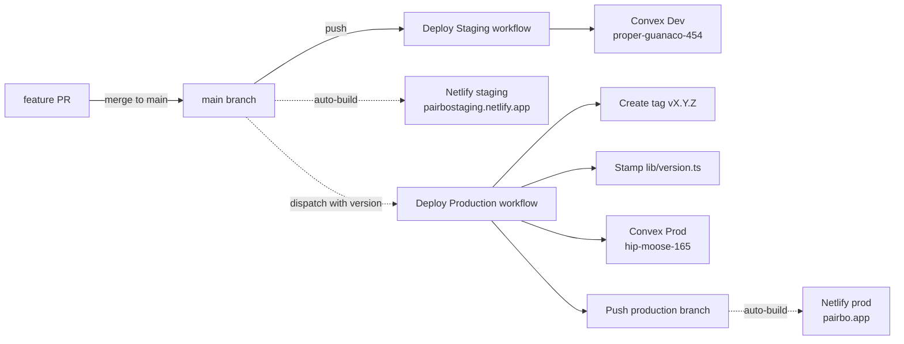

# Overview

Pairbo に **staging 環境** を導入する。これまで「ローカル開発 ←→ 本番」しか選択肢がなく、外部 API 連携や課金フローを本番投入前に検証する場が無かった問題を解消する。

## 採用するフロー

```
feature/* ──merge──→ main ──Netlify auto-build (staging)──→ staging site
                      │     GitHub Actions: Convex Dev deploy
                      │
                      ▼
              gh actions UI で Deploy Production を dispatch
              （input: version = vX.Y.Z）
                      │
                      ├─ tag を作成して push（既存なら fail）
                      ├─ lib/version.ts を version で書き換え → release commit
                      ├─ Convex Prod に deploy
                      └─ production branch に force-with-lease push
                           └─ Netlify auto-build (production branch) → prod site
```

- **main = staging**（push されたら staging に auto-deploy）
- **production ブランチ = prod に出てる最新コミット**（workflow が release commit を push する先）
- **production への push が prod auto-build を起動**（Netlify Build Hook 不要）
- `staging` ブランチは作らない（main がその役割を兼ねる）
- **タグフォーマット: `v<MAJOR>.<MINOR>.<PATCH>`**（例: `v1.0.1`）
- **同一 version の重複 dispatch は fail**（誤再実行を防止）

# Purpose

- **本番前に外部連携を試せる場を作る**: レシート OCR (OpenAI API) / Stripe / Sheets 等は本番に直接出すと事故リスクが高い
- **リリースを明示的なアクションに**: 「main に merge したら本番」だとうっかりリリースが起きやすい。dispatch + version 入力で承認の意思を明確化
- **タグでリリース履歴を残す**: 「どのコミットが何月何日に本番だったか」を tag で追跡可

# What to Do

## 機能要件

- `main` への push → staging Convex + Netlify staging に自動デプロイ
- `workflow_dispatch`（version 入力）→ tag 作成 + production branch 更新を経て pairbo.app にデプロイ
- 同一 version の重複 dispatch は fail（既に同名 tag が存在する場合）
- 失敗時は通常通り GitHub Actions の通知 / ログで把握

## 非機能要件

- **コスト**: 追加月額コストなし（Convex Development deployment を staging として流用、Netlify staging サイトは無料枠内）
- **Stripe Webhook**: staging では受信しない（本番のみ）。staging で課金状態の自動更新は走らない（必要時は `planOverride` を手動セット）
- **カスタムドメイン**: staging には不要、Netlify 標準 URL (`https://pairbostaging.netlify.app`)

# How to Do It

## Architecture



## 2つのワークフロー

| ワークフロー                              | trigger                                | 行うこと                                                                                                                        |
| ----------------------------------------- | -------------------------------------- | ------------------------------------------------------------------------------------------------------------------------------- |
| `.github/workflows/deploy-staging.yml`    | `push: branches: [main]`               | Convex Development deployment へ deploy（Netlify staging は別経路で main を auto-build）                                        |
| `.github/workflows/deploy-production.yml` | `workflow_dispatch` (input: `version`) | tag 作成 → `lib/version.ts` 書き換え → release commit → Convex Production deploy → `production` branch に force-with-lease push |

`deploy-production.yml` は `contents: write` permission が必要（tag push と production branch push のため）。`deploy-staging.yml` は読み取りのみ。

## Netlify サイト構成

| サイト      | URL                                 | Production branch | Auto-build |
| ----------- | ----------------------------------- | ----------------- | ---------- |
| **prod**    | `https://pairbo.app`                | `production`      | ON         |
| **staging** | `https://pairbostaging.netlify.app` | `main`            | ON         |

prod の Production branch が `main` ではなく `production` になっているので、main push では prod は auto-build されない（staging だけ）。release dispatch 時に workflow が `production` branch を更新することで prod auto-build がトリガーされる。

## バージョン表示

`lib/version.ts` が export する `APP_VERSION` 定数を設定タブ最下部に表示。

- main HEAD では `"v0.0.0"`（staging で常に表示される値）
- `deploy-production.yml` がデプロイ時に `"vX.Y.Z"` で書き換え → release commit → production branch → Netlify ビルドで bundle に焼き込まれる

# セットアップ完了済み（参考）

以下は導入時に行った手作業の記録。再構築時のリファレンスとして残す。

## 1. Convex Development deployment 用 Deploy Key

- Convex Dashboard → Pairbo project の Development deployment → Settings → Deploy Keys
- 「+ Create Deploy Key」で新規発行（名前は `pairbo-staging` 等）
- 値は **GitHub Secret `CONVEX_DEPLOY_KEY_STAGING`** に格納

Development deployment は既存のローカル開発で使っていたものをそのまま staging として流用。env vars (`CLERK_ISSUER_URL`, `GOOGLE_OAUTH_*`, `STRIPE_*` 等) は既に設定済みだったので追加作業なし。

## 2. Netlify staging サイト作成

- Netlify Dashboard → Add new project → Import (GitHub `nakayamaryo0731/pairbo`)
- Build command: `pnpm build` / Publish directory: `.next`
- Production branch: **`main`** にしてそのまま auto-build を活用
- Site name: `pairbostaging`

Environment variables（site settings から設定）:

| Key                                   | Value                                                    |
| ------------------------------------- | -------------------------------------------------------- |
| `NEXT_PUBLIC_CONVEX_URL`              | `https://proper-guanaco-454.convex.cloud`                |
| `NEXT_PUBLIC_CONVEX_SITE_URL`         | `https://proper-guanaco-454.convex.site`                 |
| `NEXT_PUBLIC_CLERK_PUBLISHABLE_KEY`   | Clerk dev instance の `pk_test_...`                      |
| `CLERK_SECRET_KEY`                    | Clerk dev instance の `sk_test_...`（Secret として登録） |
| `NEXT_PUBLIC_CLERK_SIGN_IN_URL`       | `/sign-in`                                               |
| `NEXT_PUBLIC_CLERK_SIGN_UP_URL`       | `/sign-up`                                               |
| `NEXT_PUBLIC_CLERK_AFTER_SIGN_IN_URL` | `/`                                                      |
| `NEXT_PUBLIC_CLERK_AFTER_SIGN_UP_URL` | `/`                                                      |

Stripe / Sentry 系は未設定（必要になったら追加）。

## 3. `production` ブランチ作成 + Netlify prod 設定変更

- GitHub に main HEAD ベースで `production` branch を新規作成
- pairbo.app Netlify site の Production branch を `main` → `production` に変更

これで pairbo.app は main push で auto-build されなくなり、`production` branch push 時のみ auto-build されるようになる。

## 4. GitHub Secrets

| Secret                            | 用途                                     |
| --------------------------------- | ---------------------------------------- |
| `CONVEX_DEPLOY_KEY`               | Convex prod 用（既存）                   |
| `CONVEX_DEPLOY_KEY_STAGING`       | Convex Development deployment 用（新規） |
| ~~`NETLIFY_DEPLOY_HOOK`~~         | 未使用（残置、削除可）                   |
| ~~`NETLIFY_DEPLOY_HOOK_STAGING`~~ | 未使用（残置、削除可）                   |

Hook 経由 deploy をやめて auto-build に統一したため、Hook secret は不要になった。残置のままでも害なし。

# 日常運用

## staging への deploy

1. feature ブランチで作業 → PR
2. CI green → main へ merge
3. main push で Deploy Staging workflow が起動
4. 同時に Netlify staging が main を auto-build
5. `https://pairbostaging.netlify.app` で動作確認、設定タブ最下部に `v0.0.0` 表示

## production への deploy

1. staging で動作確認済みであることを確認
2. GitHub → Actions → **Deploy Production** → Run workflow
3. version に `v1.0.1` 等を入力（`vX.Y.Z`、既存 tag と重複しない値）
4. Run workflow
5. Workflow が自動で:
   - 形式バリデーション
   - tag 作成 + push（既存なら fail）
   - `lib/version.ts` 書き換え → release commit
   - Convex Prod deploy
   - `production` branch を release commit に force-with-lease push
6. Netlify pairbo.app が production branch 更新を検知 → auto-build
7. `https://pairbo.app` で設定タブ最下部に新 version 表示を確認

## 確認コマンド

```bash
# 直近のワークフロー実行状況
gh run list --limit 5

# 現在 prod に出ているコミットを確認
git log -1 origin/production

# 既存タグの一覧
git tag --list 'v*' --sort=-v:refname
```

# What We Won't Do

- **Convex 課金プラン アップグレード**: Development deployment を流用、追加コスト 0
- **Stripe Webhook の staging 側受信**: staging で課金フロー検証は当面しない。必要になったら Stripe test mode webhook を staging Convex URL (`https://proper-guanaco-454.convex.site/stripe/webhook`) に向ける
- **staging カスタムドメイン**: `pairbostaging.netlify.app` 標準 URL で運用
- **Clerk staging instance 新規作成**: Clerk dev instance を staging でも流用
- **staging ブランチ作成**: main をそのまま staging として扱う
- **タグ push 自動 prod deploy**: タグを push しただけでは本番に行かない（必ず GitHub Actions UI からの dispatch が必要）
- **真のロールバック機能**: workflow は常に main HEAD を起点に release を作るため、過去 tag を dispatch しても "main HEAD のコードを過去 version ラベルで出す" だけになる。**ロールバックが必要な場合は main を revert する PR を merge してから新しい version を dispatch する**

# Concerns / 既知の制約

## 1. ロールバックが dispatch だけでは出来ない

上述の通り、workflow は main HEAD を起点に release commit を作る設計。古い tag を dispatch しても過去コードへの巻き戻しにはならない（しかも同名 tag が既存だと fail する）。

**運用回避**: 緊急ロールバックは:

1. main を problematic commit より前に `git revert` する PR を merge
2. 新 version (`v1.0.2` 等) を dispatch して fresh release

## 2. Convex schema 差分

- staging で schema 変更 → main マージ → staging に反映
- production は古い schema のまま
- → 次の prod deploy 時に schema migration が走る

複数の schema 変更 PR が積み重なってからまとめて prod に出すと、複合的なマイグレーションになるリスクあり。schema 変更を含む PR の後は早めに dispatch する運用が望ましい。

## 3. staging データ

staging Convex (= Development deployment) はローカル開発で蓄積したデータが入っている可能性がある。クリーンな状態で検証したい場合は `pnpm exec convex run seed:clearTestData` で初期化、`pnpm exec convex run seed:seedTestData` で再シード。

## 4. Stripe webhook が staging に届かない

staging で Premium 動作を試したい場合、Convex Dashboard で対象ユーザーの `planOverride` を手動でセットする（or admin 機能経由）。

## 5. main 直 push で staging が壊れた場合

main = staging を共有しているため、壊れた変更を main にマージすると staging も壊れる。**対処**: main を revert すれば staging も自動復旧（solo dev では現実的に許容）。

# Reference Materials/Information

- [Convex Deploy Keys](https://docs.convex.dev/production/hosting#deploy-keys)
- [Netlify Build & Deploy settings](https://docs.netlify.com/configure-builds/overview/)
- [GitHub Actions workflow_dispatch](https://docs.github.com/en/actions/using-workflows/manually-running-a-workflow)
- 関連ワークフロー: `.github/workflows/deploy-staging.yml` / `deploy-production.yml`
- [CLAUDE.md](../CLAUDE.md): デプロイフロー記述
- [HANDOVER.md](../HANDOVER.md): デプロイ情報 URL
