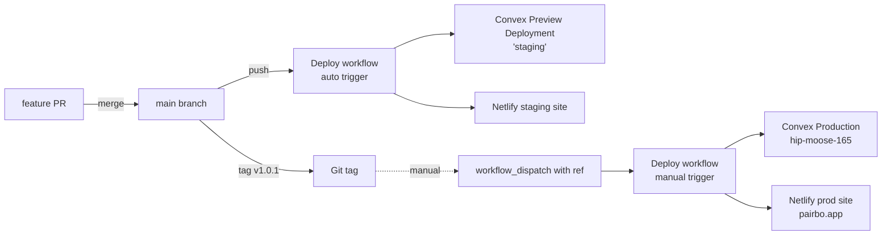

# Overview

Pairbo に **staging 環境** を導入する。これまで「ローカル開発 ←→ 本番」しか選択肢がなく、外部 API 連携や課金フローを本番投入前に検証する場が無かった問題を解消する。

## 採用するフロー

```
feature/* ──merge──→ main ──auto deploy──→ staging
                       ↓
                   git tag v1.0.1
                       ↓
              gh actions UI で workflow_dispatch
                       ↓
                    production
```

- **main = staging**（push されたら自動 deploy）
- **production は明示的な手動 dispatch のみ**（タグを ref に指定して GitHub Actions UI から実行）
- `staging` ブランチは作らない（main がその役割を兼ねる）
- タグフォーマット: **`v<MAJOR>.<MINOR>.<PATCH>`**（例: `v1.0.1`）

# Purpose

- **本番前に外部連携を試せる場を作る**: レシート OCR (OpenAI API) / Stripe / Sheets 等は本番に直接出すと事故リスクが高い
- **リリースを明示的なアクションに**: 「main に merge したら本番」だとうっかりリリースが起きやすい。タグ + dispatch で承認の意思を明確化
- **タグでリリース履歴を残す**: ロールバック時に「どのコミットが何月何日に本番だったか」を tag で追跡可

# What to Do

## 機能要件

- `main` への push → staging Convex / Netlify へ自動デプロイ
- `workflow_dispatch`（タグ ref を入力）→ production Convex / Netlify へデプロイ
- 失敗時は通常通り GitHub Actions の通知 / ログで把握

## 非機能要件

- **コスト**: 追加月額コストを最小化（Convex Preview Deployment は Starter プラン無料枠を活用）
- **Stripe Webhook**: staging では受信しない（本番のみ）。staging で課金状態の自動更新は走らない（手動で `planOverride` を使う）
- **カスタムドメイン**: staging には不要、Netlify 標準 URL（例: `pairbo-staging.netlify.app`）で OK

# How to Do It

## Architecture



## デプロイ判定ロジック

`Deploy` workflow は `event_name` で target を決める:

| トリガー            | target env | ref                       |
| ------------------- | ---------- | ------------------------- |
| `push` to `main`    | staging    | `github.sha`（main HEAD） |
| `workflow_dispatch` | production | `inputs.ref`（タグ名）    |

Convex / Netlify secret を target に応じて切り替える:

```yaml
CONVEX_DEPLOY_KEY: ${{ target == 'production' && secrets.CONVEX_DEPLOY_KEY || secrets.CONVEX_DEPLOY_KEY_STAGING }}
```

## マニュアル セットアップ手順（あなたが実施）

### 1. Convex Preview Deploy Key 発行

- [Convex Dashboard](https://dashboard.convex.dev/) → Pairbo プロジェクト → Settings → Deploy Keys
- `Generate Preview Deploy Key` を作成
- 名前は `staging` 等わかりやすく
- 生成されたキーを控える（後で GitHub secret に入れる）

→ 既存の production deploy key (`hip-moose-165` 用) は別物として残す

### 2. Netlify staging サイト作成

- Netlify Dashboard → "Add new site" → "Import an existing project"
- 既存の Pairbo リポジトリを選択
- **Production branch を `main` 以外** に設定（例: `__never_used__`）— main push で自動ビルドさせず、後述の Deploy Hook 経由でのみビルドさせるため
- Build command: `pnpm build`
- Publish directory: `.next`
- Plugin: `@netlify/plugin-nextjs`（既存と同じ）
- Site settings → Build & deploy → Deploy notifications → Build hook を作成、URL を控える

#### Netlify staging 用環境変数

Site settings → Environment variables で以下を設定:

| 変数                                                            | 値                                           |
| --------------------------------------------------------------- | -------------------------------------------- |
| `NEXT_PUBLIC_CONVEX_URL`                                        | staging Convex deployment の URL             |
| `NEXT_PUBLIC_CONVEX_SITE_URL`                                   | staging Convex の HTTP actions URL           |
| `NEXT_PUBLIC_CLERK_PUBLISHABLE_KEY`                             | Clerk dev instance の `pk_test_...`          |
| `CLERK_SECRET_KEY`                                              | Clerk dev instance の `sk_test_...`          |
| `NEXT_PUBLIC_CLERK_SIGN_IN_URL`, `_SIGN_UP_URL`, `_AFTER_*_URL` | prod と同じ                                  |
| Stripe 系                                                       | 設定不要（staging では課金フロー検証しない） |
| Sentry 系                                                       | 不要（staging からはエラー送らない方針）     |

### 3. Convex staging 環境変数

`pnpm exec convex env` を `staging` deployment 向けに実行して、本番と同じ env vars を設定:

```bash
pnpm exec convex env set CLERK_ISSUER_URL "<Clerk dev instance issuer>" --preview-name staging
# 他、Stripe 関連は staging では不要
# Google OAuth 関連は OCR / Sheets 機能を staging で試したいなら設定
```

または Convex Dashboard の staging deployment → Settings → Environment Variables で UI から設定。

### 4. GitHub Secrets 整備

リポジトリの Settings → Secrets and variables → Actions で **追加だけ** 行う（既存はそのまま）:

| Secret                                 | 用途                                              |
| -------------------------------------- | ------------------------------------------------- |
| `CONVEX_DEPLOY_KEY` （既存）           | prod 用、変更なし                                 |
| `NETLIFY_DEPLOY_HOOK` （既存）         | prod 用、変更なし                                 |
| `CONVEX_DEPLOY_KEY_STAGING` （新規）   | Step 1 で発行した Development deployment 用キー   |
| `NETLIFY_DEPLOY_HOOK_STAGING` （新規） | Step 2 で作成した staging サイトの Build Hook URL |

既存 secret を rotate しなくて済むので prod に影響なし。

### 5. ワークフロー PR をマージ

上記 1〜4 が完了したら、この設計と対応する Deploy workflow 変更 PR をマージ。
マージすると `main` への push が staging への自動 deploy を起動する。

### 6. 初回動作確認

- ローカルで `git push origin main` 系の動きをエミュレートする小さな変更（README 更新等）を main へマージ
- GitHub Actions → Deploy workflow が staging deploy を実行
- Netlify staging site にアクセスして変更が反映されていることを確認

### 7. 初回 production deploy

- main で git tag v0.X.0（適切なバージョン） を作成
- `git push origin v0.X.0`
- GitHub Actions → Deploy workflow → "Run workflow" → ref に `v0.X.0` を指定して実行
- Convex prod + Netlify prod に反映されることを確認

## 開発フローの変更点

| 旧                                          | 新                                                          |
| ------------------------------------------- | ----------------------------------------------------------- |
| main マージ → 即本番デプロイ                | main マージ → staging デプロイ、本番は明示的タグ + dispatch |
| HANDOVER.md の "PR マージで本番反映" の記述 | 「main = staging、tag dispatch = 本番」に更新               |
| CLAUDE.md の deploy フロー記述              | 同上                                                        |

# What We Won't Do

- **Convex 課金プラン アップグレード**: Preview Deployment 無料枠で staging を運用
- **Stripe Webhook の staging 側受信**: staging で課金フロー検証は当面しない。必要になったらその時点で Stripe test mode webhook を staging Convex URL に向ける
- **staging カスタムドメイン**: `pairbo-staging.netlify.app` 等の標準 URL で運用
- **Clerk staging instance 新規作成**: Clerk dev instance を staging でも流用
- **staging ブランチ作成**: main をそのまま staging として扱う
- **タグ push 自動 prod deploy**: タグを push しただけでは本番に行かない（GitHub Actions UI からの dispatch が必須）
- **rollback workflow**: 旧タグを指定して再 dispatch するだけで rollback 相当が可能なので専用ワークフローは作らない

# Concerns

## 検証が必要な事項

### 1. Convex Preview Deploy Key と persistent staging 名

- **想定**: Preview Deploy Key で `convex deploy --yes` を実行すると、CI 環境変数に基づいた preview deployment が作成される
- **不確実性**: 持続的に同じ "staging" 名で deployment を更新するか、毎回 ephemeral になるかは Convex の挙動に依存
- **対処**: 初回 deploy 後に Convex Dashboard で deployment が作られていることを確認。毎回新規になる場合は `--preview-create staging` 等のフラグ追加を検討

### 2. Netlify ビルドの ENV 切替

- **想定**: 別 Netlify サイトとして staging を作るので env vars は完全分離
- **不確実性**: 同一の `next.config.ts` を使うので env 由来の挙動差異が想定通り出るか
- **対処**: 初回 deploy 後、staging site から Convex staging に繋がっていること、Clerk dev で sign in できることを確認

### 3. Convex schema 差分の運用

- staging で schema 変更 → main マージ → staging に反映
- production は古い schema のまま動いている
- → 次の prod deploy 時に schema migration が走る
- **不確実性**: schema 変更を含む PR が複数積み重なると、prod deploy 時に複合的なマイグレーションになる
- **対処**: schema 変更を含む PR の後は早めに tag を打って prod に反映する運用にする

## 設計上の悩み

### 4. staging データのシード

- staging Convex は空 → 認可・データ周りの検証ができない
- **対処**: 既存の `pnpm exec convex run seed:seedTestData --preview-name staging` で staging にもシード可能。手順に追加

### 5. Stripe webhook が staging に届かない件の運用補完

- staging で Premium 動作を試したい場合、`planOverride` を Convex Dashboard で手動 set する（既存の admin 機能経由でも可）
- 制約として明文化する

### 6. 「うっかり main マージで staging が壊れる」のリスク許容

- staging を共有環境として使う以上、PR レビュー中の壊れたコードが staging を壊す可能性
- **対処**: solo dev なので許容。staging が壊れたら main を revert すれば自動で復旧

# Reference Materials/Information

- [Convex Preview Deployments](https://docs.convex.dev/production/hosting/preview-deployments)
- [Convex Deploy Keys](https://docs.convex.dev/production/hosting#deploy-keys)
- [Netlify Build Hooks](https://docs.netlify.com/configure-builds/build-hooks/)
- [GitHub Actions workflow_dispatch](https://docs.github.com/en/actions/using-workflows/manually-running-a-workflow)
- 既存ワークフロー: `.github/workflows/deploy.yml`（この PR で変更）
- [HANDOVER.md](../HANDOVER.md): 既存デプロイフローの記述
