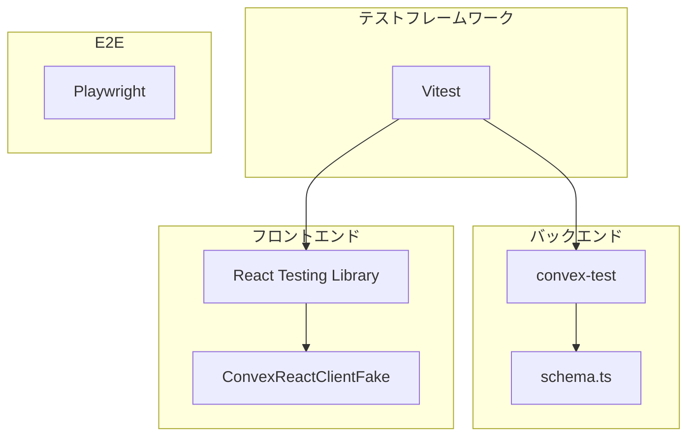
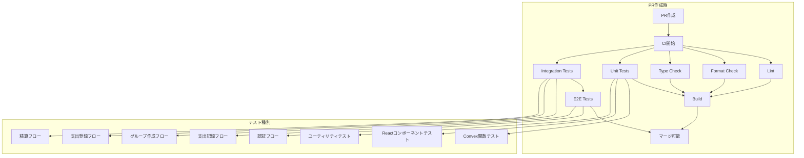

# Oaiko テスト設計書

> 作成日: 2024-12-30
> ステータス: 設計中

---

## 概要

Oaiko（おあいこ）プロジェクトにおける自動テストの設計書。
バックエンド（Convex関数）、フロントエンド（Reactコンポーネント）、E2Eの各レイヤーでのテスト戦略と、CI/CDへの統合方針を定義する。

---

## 目的

### なぜテストが必要か

1. **ドメインロジックの品質保証**
   - 精算計算、負担配分計算など、金銭に関わるロジックのバグは致命的
   - 均等分割の端数処理、傾斜分割の合計チェック等、エッジケースが多い

2. **リファクタリングの安全性確保**
   - MVP後の機能追加・改善時にリグレッションを防止
   - 認証ミドルウェア変更時の影響範囲を自動検証

3. **開発速度の維持**
   - 手動テストの削減による開発効率向上
   - PRマージ前の自動検証でレビュー負荷軽減

4. **ドキュメントとしての役割**
   - テストコードが仕様書の役割を果たす
   - 新規メンバー参加時の理解促進

---

## やること（機能要件・非機能要件）

### 機能要件

#### 1. ユニットテスト（バックエンド）

**対象**: Convex関数（mutation / query）

| テスト対象           | テスト内容                       | 優先度 |
| -------------------- | -------------------------------- | ------ |
| 精算計算ロジック     | 均等分割、傾斜分割、端数処理     | 高     |
| 負担配分計算         | splitMethod別の計算正確性        | 高     |
| 認証ミドルウェア     | 未認証時エラー、ユーザー自動作成 | 高     |
| グループ権限チェック | メンバー/オーナー権限の検証      | 中     |
| バリデーション       | 入力値の検証（金額、日付等）     | 中     |
| 招待トークン         | 有効期限、使用済みチェック       | 中     |

#### 2. ユニットテスト（フロントエンド）

**対象**: Reactコンポーネント、カスタムフック

| テスト対象             | テスト内容            | 優先度 |
| ---------------------- | --------------------- | ------ |
| フォームバリデーション | Zodスキーマによる検証 | 高     |
| 金額フォーマット       | 通貨表示、入力変換    | 中     |
| 日付操作               | 締め日計算、期間表示  | 中     |
| UIコンポーネント       | 基本的なレンダリング  | 低     |

#### 3. 統合テスト

**対象**: 複数Convex関数の連携

| テスト対象         | テスト内容                                  | 優先度 |
| ------------------ | ------------------------------------------- | ------ |
| グループ作成フロー | グループ作成 → プリセットカテゴリ自動追加   | 高     |
| 支出登録フロー     | 支出作成 → ExpenseSplit自動生成             | 高     |
| 精算フロー         | 精算作成 → SettlementPayment生成 → 完了遷移 | 高     |
| 招待フロー         | 招待作成 → トークン使用 → メンバー追加      | 中     |

#### 4. E2Eテスト

**対象**: ユーザーシナリオ全体

| テスト対象     | テスト内容                                | 優先度 |
| -------------- | ----------------------------------------- | ------ |
| 認証フロー     | サインアップ → ログイン → ログアウト      | 高     |
| 支出記録フロー | グループ選択 → 支出入力 → 保存確認        | 高     |
| 精算フロー     | 精算画面 → プレビュー → 確定 → 支払い完了 | 中     |

### 非機能要件

| 項目           | 要件                                          |
| -------------- | --------------------------------------------- |
| テスト実行時間 | ユニットテスト: 30秒以内、統合テスト: 2分以内 |
| カバレッジ目標 | ドメインロジック: 80%以上、UI: 50%以上        |
| CI実行         | 全PRでテスト実行、失敗時はマージブロック      |
| 並列実行       | テスト間の独立性を保証、並列実行可能に        |

---

## どうやるか（実装詳細）

### 技術選定



| レイヤー             | ツール                | 理由                                   |
| -------------------- | --------------------- | -------------------------------------- |
| テストランナー       | Vitest                | 高速、TypeScript対応、Viteエコシステム |
| バックエンドテスト   | convex-test           | Convex公式推奨、モック実装提供         |
| フロントエンドテスト | React Testing Library | コンポーネントテストの標準             |
| E2E                  | Playwright            | クロスブラウザ対応、高速、Clerk統合可  |
| カバレッジ           | @vitest/coverage-v8   | V8エンジンベース、高精度               |

### 依存パッケージ

```json
{
  "devDependencies": {
    "vitest": "^3.2.0",
    "convex-test": "^0.0.41",
    "@edge-runtime/vm": "^5.0.1",
    "@testing-library/react": "^16.3.0",
    "@testing-library/jest-dom": "^6.6.3",
    "@testing-library/user-event": "^14.6.1",
    "@vitest/coverage-v8": "^3.2.0",
    "jsdom": "^26.1.0",
    "playwright": "^1.52.0",
    "@playwright/test": "^1.52.0"
  }
}
```

### ディレクトリ構成

```
/Users/ron/Dev/oaiko/
├── convex/
│   ├── __tests__/              # Convex関数テスト
│   │   ├── groups.test.ts
│   │   ├── expenses.test.ts
│   │   ├── settlements.test.ts
│   │   ├── categories.test.ts
│   │   └── lib/
│   │       ├── auth.test.ts
│   │       └── splitCalculation.test.ts
│   └── ...
├── app/
│   └── __tests__/              # Reactコンポーネントテスト
│       ├── components/
│       │   ├── ExpenseForm.test.tsx
│       │   └── SettlementPreview.test.tsx
│       └── hooks/
│           └── useSettlement.test.ts
├── lib/
│   └── __tests__/              # ユーティリティテスト
│       ├── formatCurrency.test.ts
│       └── dateUtils.test.ts
├── e2e/                        # E2Eテスト
│   ├── auth.spec.ts
│   ├── expense.spec.ts
│   └── settlement.spec.ts
├── vitest.config.ts            # Vitest設定
├── vitest.workspace.ts         # ワークスペース設定
└── playwright.config.ts        # Playwright設定
```

### 設定ファイル

#### vitest.config.ts

```typescript
import { defineConfig } from "vitest/config";
import react from "@vitejs/plugin-react";
import path from "path";

export default defineConfig({
  plugins: [react()],
  test: {
    globals: true,
    environment: "jsdom",
    setupFiles: ["./vitest.setup.ts"],
    include: ["**/*.test.{ts,tsx}"],
    exclude: ["node_modules", "convex/__tests__/**"],
    coverage: {
      provider: "v8",
      reporter: ["text", "json", "html"],
      include: ["app/**/*.{ts,tsx}", "lib/**/*.ts"],
      exclude: ["**/*.test.{ts,tsx}", "**/*.d.ts"],
    },
  },
  resolve: {
    alias: {
      "@": path.resolve(__dirname, "./"),
    },
  },
});
```

#### vitest.workspace.ts

```typescript
import { defineWorkspace } from "vitest/config";

export default defineWorkspace([
  // フロントエンドテスト
  {
    extends: "./vitest.config.ts",
    test: {
      name: "frontend",
      environment: "jsdom",
      include: ["app/**/*.test.{ts,tsx}", "lib/**/*.test.ts"],
    },
  },
  // Convexバックエンドテスト
  {
    test: {
      name: "convex",
      environment: "edge-runtime",
      include: ["convex/__tests__/**/*.test.ts"],
      server: {
        deps: {
          inline: ["convex-test"],
        },
      },
    },
  },
]);
```

#### vitest.setup.ts

```typescript
import "@testing-library/jest-dom/vitest";
import { cleanup } from "@testing-library/react";
import { afterEach } from "vitest";

// 各テスト後にクリーンアップ
afterEach(() => {
  cleanup();
});
```

#### playwright.config.ts

```typescript
import { defineConfig, devices } from "@playwright/test";

export default defineConfig({
  testDir: "./e2e",
  fullyParallel: true,
  forbidOnly: !!process.env.CI,
  retries: process.env.CI ? 2 : 0,
  workers: process.env.CI ? 1 : undefined,
  reporter: "html",
  use: {
    baseURL: "http://localhost:3000",
    trace: "on-first-retry",
  },
  projects: [
    {
      name: "chromium",
      use: { ...devices["Desktop Chrome"] },
    },
    {
      name: "Mobile Safari",
      use: { ...devices["iPhone 13"] },
    },
  ],
  webServer: {
    command: "pnpm dev",
    url: "http://localhost:3000",
    reuseExistingServer: !process.env.CI,
  },
});
```

### テストコード例

#### 1. Convex関数テスト（convex-test使用）

```typescript
// convex/__tests__/lib/splitCalculation.test.ts
import { convexTest } from "convex-test";
import { describe, expect, test } from "vitest";
import schema from "../schema";

describe("splitEqually - 均等分割", () => {
  test("3人で1000円を均等分割すると333, 333, 334（端数は支払者負担）", async () => {
    const result = splitEqually(1000, ["userA", "userB", "userC"], "userA");

    expect(result).toEqual([
      { userId: "userA", amount: 334 },
      { userId: "userB", amount: 333 },
      { userId: "userC", amount: 333 },
    ]);
    expect(result.reduce((sum, r) => sum + r.amount, 0)).toBe(1000);
  });

  test("2人で999円を均等分割すると500, 499", async () => {
    const result = splitEqually(999, ["userA", "userB"], "userA");

    expect(result).toEqual([
      { userId: "userA", amount: 500 },
      { userId: "userB", amount: 499 },
    ]);
  });

  test("1人の場合は全額負担", async () => {
    const result = splitEqually(1000, ["userA"], "userA");

    expect(result).toEqual([{ userId: "userA", amount: 1000 }]);
  });
});

describe("splitByRatio - 傾斜分割（割合指定）", () => {
  test("50:30:20で1000円を分割", async () => {
    const splits = [
      { userId: "userA", value: 50 },
      { userId: "userB", value: 30 },
      { userId: "userC", value: 20 },
    ];
    const result = splitByRatio(1000, splits);

    expect(result).toEqual([
      { userId: "userA", amount: 500 },
      { userId: "userB", amount: 300 },
      { userId: "userC", amount: 200 },
    ]);
  });

  test("割合の合計が100%でない場合はエラー", async () => {
    const splits = [
      { userId: "userA", value: 50 },
      { userId: "userB", value: 30 },
    ];

    expect(() => splitByRatio(1000, splits)).toThrow(
      "割合の合計は100%である必要があります",
    );
  });
});
```

#### 2. Convex mutation/queryテスト

```typescript
// convex/__tests__/expenses.test.ts
import { convexTest } from "convex-test";
import { describe, expect, test, beforeEach } from "vitest";
import { api } from "../_generated/api";
import schema from "../schema";

describe("expenses mutation", () => {
  test("支出を作成するとExpenseSplitも自動生成される", async () => {
    const t = convexTest(schema);

    // テストデータのセットアップ
    const userId = await t.run(async (ctx) => {
      return await ctx.db.insert("users", {
        clerkId: "test_clerk_id",
        displayName: "テストユーザー",
        createdAt: Date.now(),
        updatedAt: Date.now(),
      });
    });

    const groupId = await t.run(async (ctx) => {
      return await ctx.db.insert("groups", {
        name: "テストグループ",
        closingDay: 25,
        createdAt: Date.now(),
        updatedAt: Date.now(),
      });
    });

    // グループメンバー追加
    await t.run(async (ctx) => {
      await ctx.db.insert("groupMembers", {
        groupId,
        userId,
        role: "owner",
        joinedAt: Date.now(),
      });
    });

    // カテゴリ追加
    const categoryId = await t.run(async (ctx) => {
      return await ctx.db.insert("categories", {
        groupId,
        name: "食費",
        icon: "🍽️",
        isPreset: true,
        sortOrder: 1,
        createdAt: Date.now(),
      });
    });

    // 認証をシミュレート
    const asUser = t.withIdentity({ subject: "test_clerk_id" });

    // 支出作成
    const expenseId = await asUser.mutation(api.expenses.create, {
      groupId,
      amount: 1000,
      categoryId,
      paidBy: userId,
      date: "2024-12-30",
      splitMethod: "equal",
    });

    // ExpenseSplitが作成されていることを確認
    const splits = await t.run(async (ctx) => {
      return await ctx.db
        .query("expenseSplits")
        .withIndex("by_expense", (q) => q.eq("expenseId", expenseId))
        .collect();
    });

    expect(splits).toHaveLength(1);
    expect(splits[0].amount).toBe(1000);
  });

  test("グループメンバーでない場合はエラー", async () => {
    const t = convexTest(schema);

    // 別ユーザーのセットアップ
    const userId = await t.run(async (ctx) => {
      return await ctx.db.insert("users", {
        clerkId: "other_user",
        displayName: "他のユーザー",
        createdAt: Date.now(),
        updatedAt: Date.now(),
      });
    });

    const groupId = await t.run(async (ctx) => {
      return await ctx.db.insert("groups", {
        name: "テストグループ",
        closingDay: 25,
        createdAt: Date.now(),
        updatedAt: Date.now(),
      });
    });

    const categoryId = await t.run(async (ctx) => {
      return await ctx.db.insert("categories", {
        groupId,
        name: "食費",
        icon: "🍽️",
        isPreset: true,
        sortOrder: 1,
        createdAt: Date.now(),
      });
    });

    const asUser = t.withIdentity({ subject: "other_user" });

    // メンバーでないのでエラーになるはず
    await expect(
      asUser.mutation(api.expenses.create, {
        groupId,
        amount: 1000,
        categoryId,
        paidBy: userId,
        date: "2024-12-30",
        splitMethod: "equal",
      }),
    ).rejects.toThrow("グループのメンバーではありません");
  });
});
```

#### 3. 認証ミドルウェアテスト

```typescript
// convex/__tests__/lib/auth.test.ts
import { convexTest } from "convex-test";
import { describe, expect, test } from "vitest";
import { api } from "../_generated/api";
import schema from "../schema";

describe("authQuery", () => {
  test("未認証の場合はエラー", async () => {
    const t = convexTest(schema);

    // 認証なしでqueryを実行
    await expect(t.query(api.groups.list)).rejects.toThrow("認証が必要です");
  });

  test("ユーザーが存在しない場合はエラー", async () => {
    const t = convexTest(schema);
    const asUser = t.withIdentity({ subject: "nonexistent_user" });

    await expect(asUser.query(api.groups.list)).rejects.toThrow(
      "ユーザーが見つかりません",
    );
  });
});

describe("authMutation", () => {
  test("未認証の場合はエラー", async () => {
    const t = convexTest(schema);

    await expect(
      t.mutation(api.groups.create, { name: "テスト", closingDay: 25 }),
    ).rejects.toThrow("認証が必要です");
  });

  test("ユーザーが存在しない場合は自動作成", async () => {
    const t = convexTest(schema);
    const asUser = t.withIdentity({
      subject: "new_user_clerk_id",
      name: "新規ユーザー",
      email: "new@example.com",
    });

    // グループ作成（初回mutation）
    await asUser.mutation(api.groups.create, {
      name: "テストグループ",
      closingDay: 25,
    });

    // ユーザーが自動作成されていることを確認
    const user = await t.run(async (ctx) => {
      return await ctx.db
        .query("users")
        .withIndex("by_clerk_id", (q) => q.eq("clerkId", "new_user_clerk_id"))
        .unique();
    });

    expect(user).not.toBeNull();
    expect(user?.displayName).toBe("新規ユーザー");
  });
});
```

#### 4. Reactコンポーネントテスト

```typescript
// app/__tests__/components/ExpenseForm.test.tsx
import { render, screen, waitFor } from "@testing-library/react";
import userEvent from "@testing-library/user-event";
import { describe, expect, test, vi } from "vitest";
import { ExpenseForm } from "@/components/ExpenseForm";

// Convexクライアントのモック
vi.mock("convex/react", () => ({
  useMutation: () => vi.fn().mockResolvedValue("expense_id"),
  useQuery: () => [
    { _id: "cat1", name: "食費", icon: "🍽️" },
    { _id: "cat2", name: "日用品", icon: "🧴" },
  ],
}));

describe("ExpenseForm", () => {
  test("フォームがレンダリングされる", () => {
    render(<ExpenseForm groupId="group1" />);

    expect(screen.getByLabelText("金額")).toBeInTheDocument();
    expect(screen.getByLabelText("カテゴリ")).toBeInTheDocument();
    expect(screen.getByLabelText("日付")).toBeInTheDocument();
    expect(screen.getByRole("button", { name: "登録" })).toBeInTheDocument();
  });

  test("金額が0以下の場合はエラー表示", async () => {
    const user = userEvent.setup();
    render(<ExpenseForm groupId="group1" />);

    const amountInput = screen.getByLabelText("金額");
    await user.type(amountInput, "-100");
    await user.click(screen.getByRole("button", { name: "登録" }));

    await waitFor(() => {
      expect(screen.getByText("1以上の値を入力してください")).toBeInTheDocument();
    });
  });

  test("必須項目が空の場合はエラー表示", async () => {
    const user = userEvent.setup();
    render(<ExpenseForm groupId="group1" />);

    await user.click(screen.getByRole("button", { name: "登録" }));

    await waitFor(() => {
      expect(screen.getByText("金額を入力してください")).toBeInTheDocument();
    });
  });
});
```

#### 5. E2Eテスト

```typescript
// e2e/expense.spec.ts
import { test, expect } from "@playwright/test";

test.describe("支出登録フロー", () => {
  test.beforeEach(async ({ page }) => {
    // Clerk認証をバイパス（テスト用設定が必要）
    await page.goto("/");
    // ログイン処理...
  });

  test("支出を登録できる", async ({ page }) => {
    // グループページに移動
    await page.goto("/groups/test-group");

    // 支出登録ボタンをクリック
    await page.click("button:has-text('支出を追加')");

    // フォーム入力
    await page.fill('input[name="amount"]', "1500");
    await page.selectOption('select[name="category"]', "食費");
    await page.fill('input[name="date"]', "2024-12-30");
    await page.fill('textarea[name="memo"]', "ランチ代");

    // 送信
    await page.click('button[type="submit"]');

    // 成功メッセージを確認
    await expect(page.locator("text=支出を登録しました")).toBeVisible();

    // 一覧に表示されていることを確認
    await expect(page.locator("text=¥1,500")).toBeVisible();
    await expect(page.locator("text=ランチ代")).toBeVisible();
  });
});
```

### CI/CD統合

#### GitHub Actions ワークフロー更新

```yaml
# .github/workflows/ci.yml
name: CI

on:
  pull_request:
    branches: [main]

concurrency:
  group: ${{ github.workflow }}-${{ github.ref }}
  cancel-in-progress: true

jobs:
  lint:
    name: Lint
    runs-on: ubuntu-latest
    steps:
      - uses: actions/checkout@v4
      - uses: ./.github/actions/setup
      - run: pnpm lint

  format:
    name: Format
    runs-on: ubuntu-latest
    steps:
      - uses: actions/checkout@v4
      - uses: ./.github/actions/setup
      - run: pnpm format:check

  typecheck:
    name: Type Check
    runs-on: ubuntu-latest
    steps:
      - uses: actions/checkout@v4
      - uses: ./.github/actions/setup
      - run: pnpm typecheck

  test-unit:
    name: Unit Tests
    runs-on: ubuntu-latest
    steps:
      - uses: actions/checkout@v4
      - uses: ./.github/actions/setup
      - run: pnpm test:unit
      - name: Upload coverage
        uses: codecov/codecov-action@v5
        with:
          files: ./coverage/coverage-final.json
          fail_ci_if_error: false

  test-integration:
    name: Integration Tests
    runs-on: ubuntu-latest
    steps:
      - uses: actions/checkout@v4
      - uses: ./.github/actions/setup
      - run: pnpm test:integration

  test-e2e:
    name: E2E Tests
    runs-on: ubuntu-latest
    needs: [lint, typecheck, test-unit]
    steps:
      - uses: actions/checkout@v4
      - uses: ./.github/actions/setup
      - name: Install Playwright Browsers
        run: pnpm exec playwright install --with-deps chromium
      - name: Run E2E tests
        run: pnpm test:e2e
        env:
          NEXT_PUBLIC_CONVEX_URL: ${{ secrets.NEXT_PUBLIC_CONVEX_URL }}
          NEXT_PUBLIC_CLERK_PUBLISHABLE_KEY: ${{ secrets.NEXT_PUBLIC_CLERK_PUBLISHABLE_KEY }}
      - name: Upload test results
        uses: actions/upload-artifact@v4
        if: always()
        with:
          name: playwright-report
          path: playwright-report/
          retention-days: 7

  build:
    name: Build
    runs-on: ubuntu-latest
    needs: [test-unit]
    env:
      NEXT_PUBLIC_CONVEX_URL: ${{ secrets.NEXT_PUBLIC_CONVEX_URL }}
      NEXT_PUBLIC_CLERK_PUBLISHABLE_KEY: ${{ secrets.NEXT_PUBLIC_CLERK_PUBLISHABLE_KEY }}
    steps:
      - uses: actions/checkout@v4
      - uses: ./.github/actions/setup
      - run: pnpm build
```

#### package.json スクリプト追加

```json
{
  "scripts": {
    "test": "vitest",
    "test:unit": "vitest run --project frontend --project convex",
    "test:integration": "vitest run convex/__tests__/integration",
    "test:e2e": "playwright test",
    "test:e2e:ui": "playwright test --ui",
    "test:coverage": "vitest run --coverage",
    "test:watch": "vitest --watch"
  }
}
```

### テストフロー図



### テストケース一覧

#### バックエンド（Convex）

| 機能                 | テストケース                  | 種別        |
| -------------------- | ----------------------------- | ----------- |
| **均等分割**         | 3人で1000円→333,333,334       | Unit        |
|                      | 2人で999円→500,499            | Unit        |
|                      | 1人の場合は全額               | Unit        |
| **傾斜分割（割合）** | 50:30:20で正しく分割          | Unit        |
|                      | 割合合計≠100%でエラー         | Unit        |
|                      | 端数処理（四捨五入）          | Unit        |
| **傾斜分割（金額）** | 指定金額通りに分割            | Unit        |
|                      | 金額合計≠支出額でエラー       | Unit        |
| **全額負担**         | 指定者が全額負担              | Unit        |
| **認証**             | 未認証でエラー                | Unit        |
|                      | ユーザー不在でエラー（Query） | Unit        |
|                      | ユーザー自動作成（Mutation）  | Unit        |
| **グループ作成**     | 作成成功                      | Integration |
|                      | プリセットカテゴリ自動追加    | Integration |
|                      | オーナーとして追加される      | Integration |
| **支出登録**         | 作成成功                      | Integration |
|                      | ExpenseSplit自動生成          | Integration |
|                      | 非メンバーはエラー            | Integration |
| **招待**             | トークン生成                  | Unit        |
|                      | 期限切れでエラー              | Unit        |
|                      | 使用済みでエラー              | Unit        |
|                      | 参加成功                      | Integration |
| **精算**             | 精算額計算                    | Unit        |
|                      | Settlement作成                | Integration |
|                      | 支払い完了で自動遷移          | Integration |

#### フロントエンド（React）

| コンポーネント        | テストケース             | 種別 |
| --------------------- | ------------------------ | ---- |
| **ExpenseForm**       | レンダリング             | Unit |
|                       | バリデーションエラー表示 | Unit |
|                       | 送信成功                 | Unit |
| **SettlementPreview** | 精算額表示               | Unit |
|                       | 支払い方向表示           | Unit |
| **CategorySelector**  | カテゴリ一覧表示         | Unit |
|                       | 選択状態                 | Unit |

#### E2E

| シナリオ     | テストケース         |
| ------------ | -------------------- |
| **認証**     | サインアップ完了     |
|              | ログイン・ログアウト |
| **支出記録** | 支出登録→一覧表示    |
|              | 支出編集             |
|              | 支出削除             |
| **精算**     | 精算プレビュー表示   |
|              | 精算確定             |
|              | 支払い完了マーク     |

---

## やらないこと

### MVP外のテスト

| 項目                           | 理由                                |
| ------------------------------ | ----------------------------------- |
| ビジュアルリグレッションテスト | MVP後に検討                         |
| パフォーマンステスト           | MVP後に検討                         |
| 負荷テスト                     | 個人利用想定のため不要              |
| セキュリティテスト（ペネトレ） | 専門知識が必要、MVP後に検討         |
| モバイルネイティブテスト       | Web版のみのためブラウザテストで代用 |

### テスト範囲外

| 項目                        | 理由                     |
| --------------------------- | ------------------------ |
| Convex内部のテスト          | convex-testがモック提供  |
| Clerk認証のテスト           | 外部サービスのため       |
| Tailwind CSSのテスト        | スタイリングは目視確認   |
| Next.jsルーティングのテスト | フレームワーク機能のため |

---

## 懸念事項

### 1. convex-testの制限

**問題**: convex-testはモック実装であり、本番のConvexバックエンドと挙動が異なる可能性がある

**対応**:

- 重要なビジネスロジックは手動テストも併用
- 本番デプロイ前にステージング環境で確認
- convex-testの更新に追従する

### 2. Clerk認証のE2Eテスト

**問題**: Clerkの認証フローをE2Eでテストする場合、実際のOAuth/メール認証が必要

**対応**:

- Clerkのテストモード機能を使用
- テスト用のBypassトークンを設定
- 認証部分はモックしてUI部分のみテスト

### 3. テストデータの管理

**問題**: 統合テストで使用するテストデータの整合性維持

**対応**:

- 各テストで独立したデータをセットアップ
- `beforeEach`でクリーンな状態を確保
- ファクトリ関数でテストデータ生成を共通化

### 4. CI実行時間

**問題**: テスト数増加に伴うCI実行時間の増大

**対応**:

- ユニットテストと統合テストを分離
- 並列実行の活用
- E2Eは必要最小限に抑える
- キャッシュの活用（node_modules、Playwright browsers）

### 5. フレイキーテスト

**問題**: E2Eテストでのタイミング依存による不安定なテスト

**対応**:

- 明示的な待機（`waitFor`、`expect.poll`）を使用
- リトライ設定（CI環境で2回まで）
- 不安定なテストは修正するまでスキップ

---

## 参考資料・情報

### Convex公式

- [Testing | Convex Developer Hub](https://docs.convex.dev/testing) - Convexのテスト戦略概要
- [convex-test | Convex Developer Hub](https://docs.convex.dev/testing/convex-test) - convex-testの使い方
- [convex-test - npm](https://www.npmjs.com/package/convex-test) - パッケージ情報
- [Testing React Components with Convex](https://stack.convex.dev/testing-react-components-with-convex) - Reactコンポーネントテスト

### テストフレームワーク

- [Vitest](https://vitest.dev/) - テストランナー
- [React Testing Library](https://testing-library.com/docs/react-testing-library/intro/) - Reactコンポーネントテスト
- [Playwright](https://playwright.dev/) - E2Eテスト

### ベストプラクティス

- [Testing Trophy](https://kentcdodds.com/blog/the-testing-trophy-and-testing-classifications) - テストピラミッドの考え方
- [Convex Community - Testing](https://discord-questions.convex.dev/m/1337830309475127417) - コミュニティでのテスト議論

---

## 次のステップ

1. [ ] この設計書のレビュー・承認
2. [ ] テスト依存パッケージのインストール
3. [ ] Vitest設定ファイル作成
4. [ ] 精算計算ロジックのユニットテスト作成（最優先）
5. [ ] 認証ミドルウェアのユニットテスト作成
6. [ ] CI/CDワークフロー更新
7. [ ] Playwright設定・E2Eテスト作成

---

## 変更履歴

| 日付       | 変更内容 | 変更者 |
| ---------- | -------- | ------ |
| 2024-12-30 | 初版作成 | Claude |
