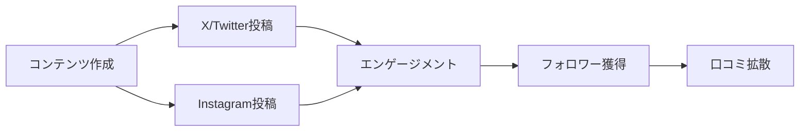

# Oaiko マーケティング戦略

## 概要

Oaiko（おあいこ）のリリースに向けたマーケティング戦略をまとめる。
個人開発のため、無料または低コストで実施可能な施策を中心に検討。

## ターゲット層

### プライマリターゲット

- **同棲カップル・新婚夫婦**: 収入差があり傾斜折半が必要なケースが多い
- **シェアハウス住人**: 複数人での家計管理が必要
- **ルームメイト**: 光熱費や日用品の割り勘ニーズ

### ペルソナ例

```
名前: 田中さん（28歳）& 鈴木さん（26歳）
状況: 同棲開始3ヶ月目
課題:
- 収入差があるので50:50は不公平感がある
- スプレッドシートは面倒で続かない
- 相手にアプリをインストールさせるのはハードルが高い
```

## 差別化ポイント

### 競合比較

| 特徴             |   Oaiko    |  Shareroo   | スプレッドシート |
| ---------------- | :--------: | :---------: | :--------------: |
| プラットフォーム | Web（PWA） | iOS/Android |       Web        |
| インストール     |    不要    |    必要     |       不要       |
| URL招待          |     ○      |      ×      |        △         |
| 傾斜折半         |     ○      |      ○      |       手動       |
| リアルタイム同期 |     ○      |      ○      |        ○         |
| オフライン対応   |  △(将来)   |      ○      |        ×         |
| ホーム画面追加   |   ○(PWA)   |      ○      |        ×         |

### Oaikoの強み

1. **Web版（PWA対応）**
   - アプリストアからのインストール不要
   - ホーム画面に追加でネイティブアプリ感覚
   - ストレージを圧迫しない

2. **URL招待**
   - 相手にURLを送るだけで即参加可能
   - 「アプリ入れて」のハードルがない
   - 同棲開始直後でもすぐ使い始められる

3. **傾斜折半対応**
   - 収入差があるカップルに最適
   - 割合指定・金額指定・全額負担に対応

## マーケティング施策

### Phase 1: 認知獲得（無料施策）

#### SNSマーケティング



**X/Twitter**

- ターゲットハッシュタグ: #同棲 #同棲カップル #新婚 #シェアハウス #家計管理 #割り勘
- 投稿内容:
  - 「同棲あるある」共感系コンテンツ
  - 割り勘の悩みに対するソリューション提示
  - 使い方Tips

**Instagram**

- ストーリーズでの使い方紹介
- リール動画（短尺デモ）
- カルーセル投稿（Before/After）

#### 技術ブログ

- **Zenn**: 開発過程の記事化（既存の `my-zenn-articles` を活用）
- **Qiita**: 技術スタック紹介でエンジニア層にリーチ
- 記事テーマ例:
  - 「個人開発で共有家計簿を作った話」
  - 「Convex + Next.js で実現するリアルタイム同期」
  - 「PWA対応でネイティブアプリ風Webアプリを作る」

#### プロダクト紹介サイト

| サイト       | 対象                  | 優先度 |
| ------------ | --------------------- | :----: |
| Product Hunt | 海外ユーザー          |   中   |
| JEEP         | 日本のプロダクト紹介  |   高   |
| ヨミトク     | 日本のWebサービス紹介 |   高   |

#### コミュニティ投稿

- Reddit: r/japanlife, r/relationships
- 同棲・シェアハウス系Discord/Slackコミュニティ
- 個人開発者コミュニティでの紹介

### Phase 2: ユーザー獲得

#### SEO対策

- ランディングページの作成
- ターゲットキーワード:
  - 「同棲 家計簿」
  - 「カップル 割り勘 アプリ」
  - 「シェアハウス 家計管理」
  - 「傾斜折半 アプリ」

#### ASO（App Store風最適化）

PWAはストアに出さないが、検索での発見性を意識:

- OGP画像の最適化
- メタディスクリプションの最適化

### Phase 3: リテンション・口コミ

- 使い続けてもらうためのUX改善
- シェア機能の強化
- ユーザーフィードバックの収集と反映

## キャッチコピー案

### メインコピー

- 「アプリ不要。URLだけで、今日から割り勘」
- 「インストールなし、登録30秒」
- 「お相子（おあいこ）で、貸し借りなし」

### サブコピー

- 「同棲カップルのための共有家計簿」
- 「収入差があっても、フェアに」
- 「相手にURL送るだけ。すぐ始められる」

## KPI案

### 認知フェーズ

- SNSフォロワー数
- ブログ記事PV
- プロダクト紹介サイトでのインプレッション

### 獲得フェーズ

- 新規ユーザー登録数
- グループ作成数
- 招待リンク発行数

### リテンションフェーズ

- WAU（週間アクティブユーザー）
- 支出登録数/ユーザー
- 精算完了率

## 今後の検討事項

- [ ] ランディングページのデザイン・実装
- [ ] OGP画像の作成
- [ ] SNSアカウントの開設
- [ ] ローンチ日の決定
- [ ] プレスリリースの作成（必要に応じて）

## 参考情報

### 類似サービス

- Shareroo: https://shareroo.com/
- Splitwise: https://www.splitwise.com/

### マーケティング参考

- Product Hunt: https://www.producthunt.com/
- JEEP: https://and-and.jp/
